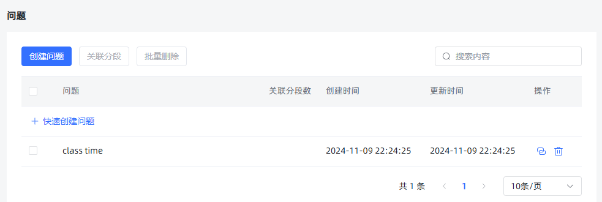
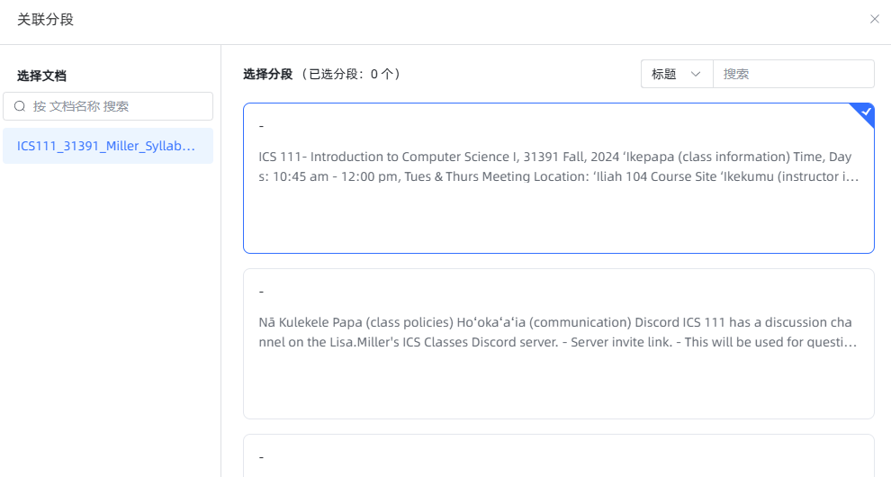

# 问题管理

[[toc]]

## 项目目标

本项目旨在构建一个功能完备的 RAG（Retrieval-Augmented Generation）系统，主要目标包括：

- **知识库管理**：支持创建、更新和删除知识库，便于用户高效维护内容。
- **文档处理**：包括文档的拆分、片段的向量化处理，以提升检索效率和准确性。
- **问答系统**：提供高效的向量检索和实时生成回答的能力，支持复杂汇总类问题的处理。
- **系统优化**：通过统计分析和推理问答调试，不断优化系统性能和用户体验。

## 系统核心概念

在 RAG 系统中，以下是几个核心概念：

- **应用**：知识库的集合。每个应用可以自定义提示词，以满足不同的个性化需求。
- **知识库**：由多个文档组成，便于用户对内容进行分类和管理。
- **文档**：系统中对应的真实文档内容。
- **片段**：文档经过拆分后的最小内容单元，用于更高效的处理和检索。

## 功能实现步骤

1. **数据库设计** [查看 01.md](./01.md)  
   设计并实现项目所需的数据表结构与数据库方案，为后续的数据操作打下坚实基础。

2. **用户登录** [查看 02.md](./02.md)  
   实现了安全可靠的用户认证系统，保护用户数据并限制未经授权的访问。

3. **模型管理** [查看 03.md](./03.md)  
   支持针对不同平台的模型（如 OpenAI、Google Gemini、Claude）进行管理与配置。

4. **知识库管理** [查看 04.md](./04.md)  
   提供创建、更新及删除知识库的功能，方便用户维护与管理文档内容。

5. **文档拆分** [查看 05.md](./05.md)  
   可将文档拆分为多个片段，便于后续向量化和检索操作。

6. **片段向量** [查看 06.md](./06.md)  
   将文本片段进行向量化处理，以便进行语义相似度计算及高效检索。

7. **命中率测试** [查看 07.md](./07.md)  
   通过语义相似度和 Top-N 算法，检索并返回与用户问题最相关的文档片段，用于评估检索的准确性。

8. **文档管理** [查看 08.md](./08.md)  
   提供上传和管理文档的功能，上传后可自动拆分为片段便于进一步处理。

9. **片段管理** [查看 09.md](./09.md)  
   允许对已拆分的片段进行增、删、改、查等操作，确保内容更新灵活可控。

10. **问题管理** [查看 10.md](./10.md)  
    为片段指定相关问题，以提升检索时的准确性与关联度。

11. **应用管理** [查看 11.md](./11.md)  
    提供创建和配置应用（智能体）的功能，并可关联指定模型和知识库。

12. **向量检索** [查看 12.md](./12.md)  
    基于语义相似度，在知识库中高效检索与用户问题最匹配的片段。

13. **推理问答调试** [查看 13.md](./13.md)  
    提供检索与问答性能的评估工具，帮助开发者进行系统优化与调试。

14. **对话问答** [查看 14.md](./14.md)  
    为用户提供友好的人机交互界面，结合检索到的片段与用户问题实时生成回答。

15. **统计分析** [查看 15.md](./15.md)  
    对用户的提问与系统回答进行数据化分析，并以可视化图表的形式呈现系统使用情况。

16. **用户管理** [查看 16.md](./16.md)  
    提供多用户管理功能，包括用户的增删改查及权限控制。

17. **API 管理** [查看 17.md](./17.md)  
    对外提供标准化 API，便于外部系统集成和调用本系统的功能。

18. **存储文件到 S3** [查看 18.md](./18.md)  
    将用户上传的文件存储至 S3 等对象存储平台，提升文件管理的灵活性与可扩展性。

19. **文档解析优化** [查看 19.md](./19.md)  
    介绍与对比常见的文档解析方案，并提供提升文档解析速度和准确性的优化建议。

20. **片段汇总** [查看 20.md](./20.md)  
    对片段内容进行汇总，以提升总结类问题的查询与回答效率。

21. **文档多分块与检索** [查看 21.md](./21.md)  
    将片段进一步拆分为句子并进行向量检索，提升检索的准确度与灵活度。

22. **多文档支持** [查看 22.md](./22.md)  
    兼容多种文档格式，包括 `.doc`, `.docx`, `.xls`, `.xlsx`, `.ppt`, `.pptx` 等。

23. **对话日志** [查看 23.md](./23.md)  
    记录并展示对话日志，用于后续分析和问题回溯。

24. **检索性能优化** [查看 24.md](./24.md)  
    提供整库扫描和分区检索等多种方式，进一步提高检索速度和效率。

25. **Milvus** [查看 25.md](./25.md)  
    将向量数据库切换至 Milvus，以在大规模向量检索场景中获得更佳的性能与可扩展性。

26. **文档解析方案和费用对比** [查看 26.md](./26.md)  
    对比不同文档解析方案在成本、速度、稳定性等方面的差异，为用户提供更加经济高效的选择。

27. **爬取网页数据** [查看 27.md](./27.md)  
    支持从网页中抓取所需内容，后续处理流程与本地文档一致：分段、向量化、存储与检索。

## 概述

在当前的功能模块中，我们已经完成了多个核心功能，包括数据库设计、用户登录、知识库管理、文件拆分、片段向量化、命中率测试、文档管理以及片段管理。这些功能为存储、管理和处理数据提供了坚实的基础。

接下来，我们将实现 **问题管理** 功能，该功能旨在为片段指定问题，为大模型推理提供参考依据。通过问题管理，用户可以更高效地组织和利用知识库中的信息，提高系统的智能化水平。

## 已完成的核心功能

- **数据库设计**：提供结构化的支持，确保片段数据的高效存储与管理。
- **用户登录**：确保数据访问和操作的安全性，防止未经授权的访问。
- **知识库管理**：支持知识库的创建、更新和删除，方便用户维护知识库内容。
- **文件拆分**：将上传的文件拆分为多个片段，便于内容的精细化管理。
- **片段向量化**：通过向量化技术，将片段内容转换为可计算的向量，便于进行相似度计算。
- **命中率测试**：通过计算用户查询与片段的相似度，评估系统的匹配效果。
- **文档管理**：实现对不同文档内容的管理，支持多文档的高效处理。
- **片段管理**：实现对不同文档片段的管理，支持片段的增删改查操作。

## 问题管理功能

### 功能介绍

问题管理功能主要用于给知识库中的片段指定相关问题。这些问题将作为大模型推理的参考依据，提升系统的智能化和响应准确性。通过问题管理，用户可以为每个片段关联一个或多个问题，便于后续的数据分析和处理。

### 接口设计

#### 1. 创建问题

- **请求方式**：`POST`
- **URL**：`http://localhost:3000/api/dataset/{datasetId}/problem`
- **请求负载**：

  ```json
  ["office hour"]
  ```

- **响应示例**：

  ```json
  {
    "message": null,
    "data": ["444834872039501824"],
    "code": 200
  }
  ```

#### 2. 获取问题列表

- **请求方式**：`GET`
- **URL**：`http://localhost:3000/api/dataset/{datasetId}/problem/{pageNo}/{pageSize}`
- **响应示例**：

  ```json
  {
    "message": null,
    "data": {
      "size": 10,
      "total": 2,
      "records": [
        {
          "tenant_id": "0",
          "creator": "",
          "update_time": 1731132193047,
          "deleted": 0,
          "create_time": 1731132193047,
          "dataset_id": "443309276048408576",
          "id": "444831888056446976",
          "content": "class time",
          "hit_num": 0,
          "updater": ""
        },
        {
          "tenant_id": "0",
          "creator": "",
          "update_time": 1731132904550,
          "deleted": 0,
          "create_time": 1731132904550,
          "dataset_id": "443309276048408576",
          "id": "444834872039501824",
          "content": "office hour",
          "hit_num": 0,
          "updater": ""
        }
      ],
      "current": 1
    },
    "code": 200
  }
  ```

#### 3. 关联问题与段落

- **请求方式**：`PUT`
- **URL**：

  ```
  http://localhost:3000/api/dataset/{datasetId}/document/{documentId}/paragraph/{paragraphId}/problem/{problemId}/association
  ```

- **请求负载**：

  ```json
  {}
  ```

- **响应示例**：

  ```json
  {
    "message": null,
    "data": null,
    "code": 200
  }
  ```

#### 4. 取消关联问题与段落

- **请求方式**：`PUT`
- **URL**：

  ```
  http://localhost:3000/api/dataset/{datasetId}/document/{documentId}/paragraph/{paragraphId}/problem/{problemId}/un_association
  ```

- **响应示例**：

  ```json
  {
    "message": null,
    "data": null,
    "code": 200
  }
  ```

#### 5. 批量添加问题与段落的关联

- **请求方式**：`POST`
- **URL**：

  ```
  http://localhost:3000/api/dataset/{datasetId}/problem/_batch
  ```

- **请求负载**：

  ```json
  {
    "problem_id_list": ["444831888056446976", "444834872039501824"],
    "paragraph_list": [
      {
        "paragraph_id": "443662146835439616",
        "document_id": "443662133182980096"
      }
    ]
  }
  ```

- **响应示例**：

  ```json
  {
    "message": null,
    "data": null,
    "code": 200
  }
  ```

#### 6. 删除单个问题

- **请求方式**：`DELETE`
- **URL**：

  ```
  http://localhost:3000/api/dataset/{datasetId}/problem/{problemId}
  ```

- **响应示例**：

  ```json
  {
    "message": null,
    "data": null,
    "code": 200
  }
  ```

#### 7. 批量删除问题

- **请求方式**：`DELETE`
- **URL**：

  ```
  http://localhost:3000/api/dataset/{datasetId}/problem/_batch
  ```

- **请求负载**：

  ```json
  ["445226726791389184", "445226726791389185"]
  ```

- **响应示例**：

  ```json
  {
    "message": null,
    "data": null,
    "code": 200
  }
  ```

#### 8. 根据问题 ID 获取关联的段落

- **请求方式**：`GET`
- **URL**：

  ```
  http://localhost:3000/api/dataset/{datasetId}/problem/{problemId}/paragraph
  ```

- **响应示例**：

  ```json
  {
    "message": null,
    "data": [{ "id": "443662143056371712" }],
    "code": 200
  }
  ```

### 代码实现

以下是问题管理功能的代码实现，包括 API 控制器和服务层。

#### API 控制器

```java
@RequestPath("/api/dataset")
public class ApiDatasetController {

  @Post("/{datasetId}/problem")
  public ResultVo createProblem(Long datasetId, HttpRequest request) {
    String bodyString = request.getBodyString();
    List<String> problems = JsonUtils.parseArray(bodyString, String.class);
    return Aop.get(MaxKbProblemService.class).create(datasetId, problems);
  }

  @Delete("/{datasetId}/problem/_batch")
  public ResultVo deleteProblemBatch(Long datasetId, HttpRequest request) {
    String bodyString = request.getBodyString();
    List<Long> problems = JsonUtils.parseArray(bodyString, Long.class);
    return Aop.get(MaxKbProblemService.class).delete(datasetId, problems);
  }

  @Get("/{datasetId}/problem/{pageNo}/{pageSize}")
  public ResultVo pageDatasetProbleam(Long datasetId, Integer pageNo, Integer pageSize) {
    return Aop.get(MaxKbProblemService.class).page(datasetId, pageNo, pageSize);
  }

  @Get("/{datasetId}/problem/{problemId}/paragraph")
  public ResultVo listParagraphByProblemId(Long datasetId, Long problemId) {
    return Aop.get(MaxKbProblemService.class).listParagraphByProblemId(datasetId, problemId);
  }

  @Put("/{datasetId}/document/{documentId}/paragraph/{paragraphId}/problem/{problemId}/association")
  public ResultVo association(Long datasetId, Long documentId, Long paragraphId, Long problemId) {
    return Aop.get(MaxKbProblemService.class).association(datasetId, documentId, paragraphId, problemId);
  }

  @Put("/{datasetId}/document/{documentId}/paragraph/{paragraphId}/problem/{problemId}/un_association")
  public ResultVo unAssociation(Long datasetId, Long documentId, Long paragraphId, Long problemId) {
    return Aop.get(MaxKbProblemService.class).unAssociation(datasetId, documentId, paragraphId, problemId);
  }

  @Post("/{datasetId}/problem/_batch")
  public ResultVo addProblems(Long datasetId, HttpRequest request) {
    String bodyString = request.getBodyString();
    ProbrolemCreateBatch batchRequest = JsonUtils.parse(bodyString, ProbrolemCreateBatch.class);
    return Aop.get(MaxKbProblemService.class).addProblems(datasetId, batchRequest);
  }

  @Delete("/{datasetId}/problem/{problemId}")
  public ResultVo deleteProblem(Long datasetId, Long problemId) {
    return Aop.get(MaxKbProblemService.class).delete(datasetId, problemId);
  }
}
```

#### 服务层实现

```java
package com.litongjava.maxkb.service;

import java.util.ArrayList;
import java.util.List;

import com.jfinal.kit.Kv;
import com.litongjava.db.TableInput;
import com.litongjava.db.TableResult;
import com.litongjava.db.activerecord.Db;
import com.litongjava.db.activerecord.Row;
import com.litongjava.kit.RecordUtils;
import com.litongjava.maxkb.constant.TableNames;
import com.litongjava.maxkb.model.MaxKbParagraphId;
import com.litongjava.maxkb.model.ProbrolemCreateBatch;
import com.litongjava.maxkb.model.ResultPage;
import com.litongjava.model.page.Page;
import com.litongjava.model.result.ResultVo;
import com.litongjava.table.services.ApiTable;
import com.litongjava.tio.utils.snowflake.SnowflakeIdUtils;

public class MaxKbProblemService {

  /**
   * 创建问题
   *
   * @param datasetId 数据集ID
   * @param problems  问题内容列表
   * @return 结果VO
   */
  public ResultVo create(Long datasetId, List<String> problems) {
    List<Long> ids = new ArrayList<>();
    List<Row> records = new ArrayList<>();

    for (String string : problems) {
      long id = SnowflakeIdUtils.id();
      records.add(Row.by("id", id)
                        .set("content", string)
                        .set("dataset_id", datasetId)
                        .set("hit_num", 0));
      ids.add(id);
    }

    Db.batchSave(TableNames.max_kb_problem, records, 2000);
    return ResultVo.ok(ids);
  }

  /**
   * 分页获取问题列表
   *
   * @param datasetId 数据集ID
   * @param pageNo    页码
   * @param pageSize  页大小
   * @return 结果VO
   */
  public ResultVo page(Long datasetId, Integer pageNo, Integer pageSize) {
    TableInput tableInput = TableInput.create()
                                      .setPageNo(pageNo)
                                      .setPageSize(pageSize);
    TableResult<Page<Row>> page = ApiTable.page(TableNames.max_kb_problem, tableInput);
    int totalRow = page.getData().getTotalRow();
    List<Row> list = page.getData().getList();
    List<Kv> kvs = RecordUtils.recordsToKv(list, false);
    ResultPage<Kv> resultPage = new ResultPage<>(pageNo, pageSize, totalRow, kvs);
    return ResultVo.ok(resultPage);
  }

  /**
   * 批量删除问题
   *
   * @param datasetId 数据集ID
   * @param ids       问题ID列表
   * @return 结果VO
   */
  public ResultVo delete(Long datasetId, List<Long> ids) {
    ApiTable.deleteByIds(TableNames.max_kb_problem, ids);
    ApiTable.deleteByIds(TableNames.max_kb_problem_paragraph_mapping, "problem_id", ids);
    return ResultVo.ok();
  }

  /**
   * 删除单个问题
   *
   * @param datasetId 数据集ID
   * @param problemId 问题ID
   * @return 结果VO
   */
  public ResultVo delete(Long datasetId, Long problemId) {
    ApiTable.delById(TableNames.max_kb_problem, problemId);
    ApiTable.delById(TableNames.max_kb_problem_paragraph_mapping, "problem_id", problemId);
    return ResultVo.ok();
  }

  /**
   * 根据问题ID列出关联的段落
   *
   * @param datasetId  数据集ID
   * @param problemId 问题ID
   * @return 结果VO
   */
  public ResultVo listParagraphByProblemId(Long datasetId, Long problemId) {
    List<Kv> datas = new ArrayList<>();
    TableInput tableInput = TableInput.by("dataset_id", datasetId)
                                      .set("problem_id", problemId)
                                      .columns("paragraph_id as id");
    TableResult<List<Row>> tableResult = ApiTable.list(TableNames.max_kb_problem_paragraph_mapping, tableInput);
    List<Row> records = tableResult.getData();
    if (records != null) {
      datas = RecordUtils.recordsToKv(records, false);
    }
    return ResultVo.ok(datas);
  }

  /**
   * 关联问题与段落
   *
   * @param datasetId   数据集ID
   * @param documentId  文档ID
   * @param paragraphId 段落ID
   * @param problemId   问题ID
   * @return 结果VO
   */
  public ResultVo association(Long datasetId, Long documentId, Long paragraphId, Long problemId) {
    long id = SnowflakeIdUtils.id();
    Row row = Row.by("id", id)
                          .set("dataset_id", datasetId)
                          .set("document_id", documentId)
                          .set("paragraph_id", paragraphId)
                          .set("problem_id", problemId);
    boolean save = Db.save(TableNames.max_kb_problem_paragraph_mapping, row);
    if (save) {
      return ResultVo.ok();
    } else {
      return ResultVo.fail();
    }
  }

  /**
   * 取消关联问题与段落
   *
   * @param datasetId   数据集ID
   * @param documentId  文档ID
   * @param paragraphId 段落ID
   * @param problemId   问题ID
   * @return 结果VO
   */
  public ResultVo unAssociation(Long datasetId, Long documentId, Long paragraphId, Long problemId) {
    Row row = Row.by("dataset_id", datasetId)
                          .set("document_id", documentId)
                          .set("paragraph_id", paragraphId)
                          .set("problem_id", problemId);
    boolean ok = Db.delete(TableNames.max_kb_problem_paragraph_mapping, row);
    if (ok) {
      return ResultVo.ok();
    } else {
      return ResultVo.fail();
    }
  }

  /**
   * 批量添加问题与段落的关联
   *
   * @param datasetId     数据集ID
   * @param batchRequest 批量请求对象
   * @return 结果VO
   */
  public ResultVo addProblems(Long datasetId, ProbrolemCreateBatch batchRequest) {
    List<MaxKbParagraphId> paragraphList = batchRequest.getParagraph_list();
    List<Long> problemIdList = batchRequest.getProblem_id_list();

    List<Row> mappings = new ArrayList<>();
    for (MaxKbParagraphId maxKbParagraphId : paragraphList) {
      Long documentId = maxKbParagraphId.getDocument_id();
      Long paragraphId = maxKbParagraphId.getParagraph_id();

      for (Long problemId : problemIdList) {
        long id = SnowflakeIdUtils.id();
        Row row = Row.by("id", id)
                              .set("dataset_id", datasetId)
                              .set("document_id", documentId)
                              .set("paragraph_id", paragraphId)
                              .set("problem_id", problemId);
        mappings.add(row);
      }
    }

    Db.batchSave(TableNames.max_kb_problem_paragraph_mapping, mappings, 2000);
    return ResultVo.ok();
  }
}
```

### 关键功能解析

1. **创建问题**：

   - 接收问题内容列表，通过雪花算法生成唯一 ID，并保存到 `max_kb_problem` 表中。
   - 返回创建成功的所有问题 ID。

2. **分页获取问题列表**：

   - 根据提供的页码和页大小，从 `max_kb_problem` 表中分页查询问题。
   - 返回包含问题详细信息的分页结果。

3. **关联问题与段落**：

   - 在 `max_kb_problem_paragraph_mapping` 表中插入关联记录，实现问题与段落的关联。
   - 关联成功返回成功响应，失败则返回失败信息。

4. **取消关联问题与段落**：

   - 根据提供的关联信息，从 `max_kb_problem_paragraph_mapping` 表中删除对应的记录。
   - 取消关联成功返回成功响应，失败则返回失败信息。

5. **批量添加问题与段落的关联**：

   - 接收批量问题 ID 和段落列表，生成对应的关联记录，并批量插入到 `max_kb_problem_paragraph_mapping` 表中。
   - 返回操作成功的响应。

6. **删除单个问题**：

   - 根据问题 ID，从 `max_kb_problem` 表中删除对应的问题记录。
   - 同时删除与该问题关联的段落记录，确保数据一致性。
   - 返回操作成功的响应。

7. **批量删除问题**：

   - 接收问题 ID 列表，批量删除 `max_kb_problem` 表中的问题记录。
   - 同时批量删除与这些问题关联的段落记录。
   - 返回操作成功的响应。

8. **根据问题 ID 获取关联的段落**：
   - 根据提供的问题 ID，从 `max_kb_problem_paragraph_mapping` 表中查询关联的段落 ID。
   - 返回关联段落的列表。

## 前端示例




## 总结

通过上述问题管理功能的全面实现，系统能够更高效地管理知识库中的问题与片段的关联关系，为大模型推理提供精准的参考依据。这不仅提升了系统的智能化水平，也为用户提供了更加便捷的数据管理工具。
