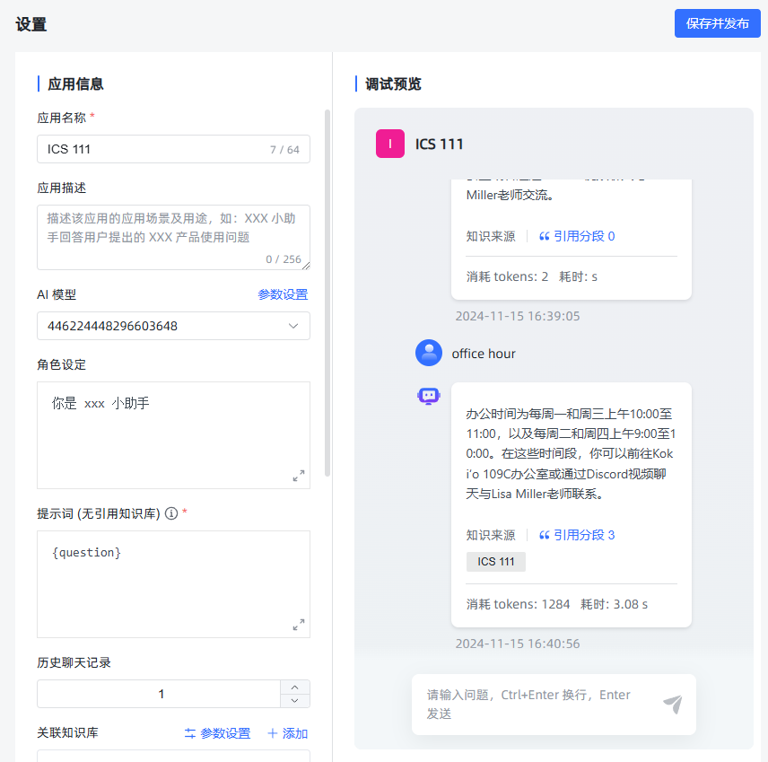

# 推理问答

[[toc]]

## 项目目标

本项目旨在构建一个功能完备的 RAG（Retrieval-Augmented Generation）系统，主要目标包括：

- **知识库管理**：支持创建、更新和删除知识库，便于用户高效维护内容。
- **文档处理**：包括文档的拆分、片段的向量化处理，以提升检索效率和准确性。
- **问答系统**：提供高效的向量检索和实时生成回答的能力，支持复杂汇总类问题的处理。
- **系统优化**：通过统计分析和推理问答调试，不断优化系统性能和用户体验。

## 系统核心概念

在 RAG 系统中，以下是几个核心概念：

- **应用**：知识库的集合。每个应用可以自定义提示词，以满足不同的个性化需求。
- **知识库**：由多个文档组成，便于用户对内容进行分类和管理。
- **文档**：系统中对应的真实文档内容。
- **片段**：文档经过拆分后的最小内容单元，用于更高效的处理和检索。

## 功能实现步骤

1. **数据库设计** [查看 01.md](./01.md)  
   设计并实现项目所需的数据表结构与数据库方案，为后续的数据操作打下坚实基础。

2. **用户登录** [查看 02.md](./02.md)  
   实现了安全可靠的用户认证系统，保护用户数据并限制未经授权的访问。

3. **模型管理** [查看 03.md](./03.md)  
   支持针对不同平台的模型（如 OpenAI、Google Gemini、Claude）进行管理与配置。

4. **知识库管理** [查看 04.md](./04.md)  
   提供创建、更新及删除知识库的功能，方便用户维护与管理文档内容。

5. **文档拆分** [查看 05.md](./05.md)  
   可将文档拆分为多个片段，便于后续向量化和检索操作。

6. **片段向量** [查看 06.md](./06.md)  
   将文本片段进行向量化处理，以便进行语义相似度计算及高效检索。

7. **命中率测试** [查看 07.md](./07.md)  
   通过语义相似度和 Top-N 算法，检索并返回与用户问题最相关的文档片段，用于评估检索的准确性。

8. **文档管理** [查看 08.md](./08.md)  
   提供上传和管理文档的功能，上传后可自动拆分为片段便于进一步处理。

9. **片段管理** [查看 09.md](./09.md)  
   允许对已拆分的片段进行增、删、改、查等操作，确保内容更新灵活可控。

10. **问题管理** [查看 10.md](./10.md)  
    为片段指定相关问题，以提升检索时的准确性与关联度。

11. **应用管理** [查看 11.md](./11.md)  
    提供创建和配置应用（智能体）的功能，并可关联指定模型和知识库。

12. **向量检索** [查看 12.md](./12.md)  
    基于语义相似度，在知识库中高效检索与用户问题最匹配的片段。

13. **推理问答调试** [查看 13.md](./13.md)  
    提供检索与问答性能的评估工具，帮助开发者进行系统优化与调试。

14. **对话问答** [查看 14.md](./14.md)  
    为用户提供友好的人机交互界面，结合检索到的片段与用户问题实时生成回答。

15. **统计分析** [查看 15.md](./15.md)  
    对用户的提问与系统回答进行数据化分析，并以可视化图表的形式呈现系统使用情况。

16. **用户管理** [查看 16.md](./16.md)  
    提供多用户管理功能，包括用户的增删改查及权限控制。

17. **API 管理** [查看 17.md](./17.md)  
    对外提供标准化 API，便于外部系统集成和调用本系统的功能。

18. **存储文件到 S3** [查看 18.md](./18.md)  
    将用户上传的文件存储至 S3 等对象存储平台，提升文件管理的灵活性与可扩展性。

19. **文档解析优化** [查看 19.md](./19.md)  
    介绍与对比常见的文档解析方案，并提供提升文档解析速度和准确性的优化建议。

20. **片段汇总** [查看 20.md](./20.md)  
    对片段内容进行汇总，以提升总结类问题的查询与回答效率。

21. **文档多分块与检索** [查看 21.md](./21.md)  
    将片段进一步拆分为句子并进行向量检索，提升检索的准确度与灵活度。

22. **多文档支持** [查看 22.md](./22.md)  
    兼容多种文档格式，包括 `.doc`, `.docx`, `.xls`, `.xlsx`, `.ppt`, `.pptx` 等。

23. **对话日志** [查看 23.md](./23.md)  
    记录并展示对话日志，用于后续分析和问题回溯。

24. **检索性能优化** [查看 24.md](./24.md)  
    提供整库扫描和分区检索等多种方式，进一步提高检索速度和效率。

25. **Milvus** [查看 25.md](./25.md)  
    将向量数据库切换至 Milvus，以在大规模向量检索场景中获得更佳的性能与可扩展性。

26. **文档解析方案和费用对比** [查看 26.md](./26.md)  
    对比不同文档解析方案在成本、速度、稳定性等方面的差异，为用户提供更加经济高效的选择。

27. **爬取网页数据** [查看 27.md](./27.md)  
    支持从网页中抓取所需内容，后续处理流程与本地文档一致：分段、向量化、存储与检索。

## 推理问答模块

### 功能描述

推理问答模块是系统的核心部分，负责接收用户的问题，检索知识库中相关的片段，并基于这些片段生成自动化的自然语言回答。该模块包括以下主要功能：

1. **用户问题处理**：接收并优化用户输入的问题，提高问题的明确性和可处理性。
2. **片段检索**：利用语义嵌入技术，在知识库中检索与用户问题最相关的片段。
3. **生成式回答**：基于检索到的片段和用户问题，调用生成模型（如 GPT）生成高质量的自然语言回答。
4. **实时流式输出**：通过 SSE（Server-Sent Events）技术实现回答的实时流式输出，提升用户体验。

### 主要流程

1. **初始化聊天会话**：用户启动一个新的聊天会话，系统为其创建独立的上下文。
2. **用户提交问题**：用户在聊天界面输入问题，系统接收并处理该问题。
3. **检索相关片段**：系统基于用户的问题，在知识库中检索出与之语义相关的片段。
4. **生成回答**：系统调用生成模型，结合检索到的片段和用户的问题，生成自然语言回答。
5. **实时输出回答**：通过 SSE 技术，系统将生成的回答实时推送给用户，确保流畅的互动体验。
6. **记录与管理**：系统记录每次问答的详细信息，支持用户后续查询和分析。

### 接口设计

#### 接口 1：初始化聊天会话

- **地址**：`POST /api/application/chat/open`
- **功能**：初始化聊天会话，为每次问答创建独立的上下文。
- **请求示例**：

  ```json
  {
    "tenant_id": "0",
    "code": null,
    "icon": null,
    "remark": null,
    "type": "SIMPLE",
    "dataset_id_list": ["446225135519784960"],
    "model_params_setting": {
      "version": null
    },
    "tts_type": "BROWSER",
    "updater": "",
    "update_time": 1731472300513,
    "problem_optimization_prompt": "()里面是用户问题,根据上下文回答揣测用户问题({question}) 要求: 输出一个补全问题,并且放在<data></data>标签中",
    "model_setting": {
      "system": "你是 xxx 小助手",
      "no_references_prompt": "{question}",
      "prompt": "已知信息：{data}\n用户问题：{question}\n回答要求：\n - 请使用中文回答用户问题"
    },
    "model": "446224448296603648",
    "id": "446258395820601344",
    "state": null,
    "problem_optimization": false,
    "dataset_setting": {
      "max_paragraph_char_number": 5000,
      "no_references_setting": {
        "value": "{question}",
        "status": "ai_questioning"
      },
      "search_mode": "embedding",
      "similarity": 0.6,
      "top_n": 3
    },
    "prologue": "您好，我是 XXX 小助手，您可以向我提出 XXX 使用问题。\n- XXX 主要功能有什么？\n- XXX 如何收费？\n- 需要转人工服务",
    "tts_model_params_setting": null,
    "creator": "",
    "owner_name": null,
    "tts_model_enable": false,
    "create_time": 1731472300513,
    "course_name": null,
    "work_flow": null,
    "dialogue_number": 1,
    "deleted": 0,
    "user_id": "1",
    "stt_model_enable": false,
    "name": "ICS 111",
    "prompt": null,
    "clean_time": null,
    "desc": "",
    "model_id": "446224448296603648"
  }
  ```

- **响应示例**：

  ```json
  { "message": null, "data": "447317217454948352", "code": 200 }
  ```

#### 接口 2：提交用户问题

- **地址**：`POST /api/application/chat_message/{chatId}`
- **功能**：用户输入问题后，系统接收并生成回答。
- **请求示例**：

  ```json
  { "message": "office hour", "re_chat": false, "form_data": {} }
  ```

- **响应示例**：

  ```
  data:{"id":"447317217580777472","content":"根据","chat_id":"447317217454948352","is_end":false,"operate":true}
  ...
  data:{"id":"447317217580777472","content":"","chat_id":"447317217454948352","is_end":true,"operate":true}
  ```

#### 接口 3：获取聊天记录详情

- **地址**：`GET /api/application/chat/{chatId}/chat_record/{recordId}`
- **功能**：支持用户查询历史记录，返回完整的问答详情。
- **响应示例**：

  ```json
  {
    "message": null,
    "data": {
      "answer_text": "办公时间为每周一和周三上午10:00至11:00，以及每周二和周四上午9:00至10:00。在这些时间段，你可以前往Koki‘o 109C办公室或通过Discord视频聊天与Lisa Miller老师联系。",
      "tenant_id": "0",
      "creator": "",
      "const": 0,
      "improve_paragraph_id_list": null,
      "run_time": 3.077,
      "create_time": 1731724856577,
      "paragraph_list": [
        {
          "id": "446228832295108608",
          "content": "I reserve the right to be offline after 6 pm and on Saturdays.\n\nYou may email or message me later than 6, but I most likely will not respond until the next morning.\n\nYou may also message me on Saturday but I may not respond until Sunday.\n\n- Office phone messages are checked infrequently.\n\nDon’t use the office phone number except to check to see if I’m in my office.\n\nNā Kuleana Koʻikoʻi A Me Kaha ʻIla (participation and grades)\n- Starting the second week of classes, for every class session, the lecture notes should be read, the example code examined and run, and the quiz completed BEFORE the class meeting time.\n  - Every quiz will allow you to retake it as many times as you need to get a good score, up until the start of class time.\n- In class, it will be assumed that you have read the material. We will have a short question and demonstration time and then every student will work on programming tasks related to the lecture material in class.\n\nAttendance/Participation\n- Quiz 1 will be used to verify your initial participation in the class. If you do not complete the quiz you will be marked as non-participating and be dropped from the class.\n- We will be working on programming projects in class in most every class meeting. This work will be worth points so attendance and participation will be crucial to your success.",
          "title": "",
          "status": "1",
          "document_id": "446228810887380992",
          "dataset_id": "446225135519784960",
          "dataset_name": "ICS 111",
          "document_name": "ICS111_31391_Miller_Syllabus_F24.pdf",
          "active": null,
          "hit_num": 0
        },
        {
          "id": "446228827400355840",
          "content": "- We will not use the exercises or example code from the book.\n\nOther recommended reference:\n- Free online book Java Programming Wikibook.\n\nSoftware (all free, required):\nWe will work on installing it the first week\n- Java OpenJDK 17.0.2 or higher\n- JGrasp software development environment\n- JUnit JGrasp plugin (files in class Laulima Resources)\n- Checkstyle JGrasp plugin (files in class Laulima Resources)\n\nComputer requirements:\n- All software for this class will work with any full-fledged laptop or desktop, any Windows, Mac, or Linux operating systems is fully supported.\n- You must install all software on a computer that you will bring to class.\n  - The required software is installed on the desktop computers in the STEM center.\n  - The library will loan laptops and MAY allow you to install required software on them.\n  - A really, really old laptop is available for use in class if you absolutely need it.\n- You cannot program on devices that run Android or iPhone operating systems! (such as Chromebooks, Android tablets or iPads)\n  - Chromebooks can be made to work but you have to install a Linux operating system.\n\nNā Kulekele Papa (class policies)\n\nHoʻokaʻaʻike (communication)\nDiscord\nICS 111 has a discussion channel on the Lisa.Miller’s ICS Classes Discord server.\n- Server invite link.\n- This will be used for questions and discussion outside of class time.\nThere is also an Office Hours video/voice channel that can be used to communicate with me during office hours.\n\nContacting the Instructor\n- If you have any questions about class topics (assignments, software, due dates, etc) outside of class, post it to the ICS111-discussion on Discord right away.\n- If the question is of a personal nature you may email or message me directly on Discord.- Message response time will usually be within a couple of hours. I reserve the right to be offline after 6 pm and on Saturdays. You may email or message me later than 6, but I most likely will not respond until the next morning. You may also message me on Saturday but I may not respond until Sunday.\n- Office phone messages are checked infrequently. Don’t use the office phone number except to check to see if I’m in my office.",
          "title": "",
          "status": "1",
          "document_id": "446228810887380992",
          "dataset_id": "446225135519784960",
          "dataset_name": "ICS 111",
          "document_name": "ICS111_31391_Miller_Syllabus_F24.pdf",
          "active": null,
          "hit_num": 0
        },
        {
          "id": "446228817254334464",
          "content": "ICS 111- Introduction to Computer Science I, 31391\nFall, 2024\n\n‘ Ike Papa (class information)\nTime, Days: 10:45 am - 12:00 pm, Tues & Thurs\nMeeting Location: ʻIliahi 104\nCourse Site\n\n‘ Ike Kumu (instructor information)\nInstructor: Lisa Miller\nOffice: Koki‘o 109C or Discord video chat\nOffice Hours: 10:00 - 11:00 am Mon & Wed\n9:00 - 10:00 am Tues & Thurs\nE-mail: jmiller@hawaii.edu\nPhone: 808 934-7388\nDiscord: https://discord.gg/E595YbYrW\n\nKulekele No Ka Ho‘ololi ʻOloke‘a Koina Papa (policy for changing the syllabus)\nInformation contained in the course syllabus may be subject to change with reasonable advance notice, as deemed appropriate by the instructor. Updates to the syllabus will be communicated via Laulima class announcements.\n\nE Pili Ana I Keia Papa (about this class)\nICS 111 offers an overview of the fundamentals of computer science emphasizing problem solving, algorithm development, implementation, and debugging/testing using an object-oriented programming language.\n\nNā Hopena Aʻo Haumāna (student learning outcomes)\nAfter successfully completing this course, you will be able to:\n1. Use an appropriate programming environment to design, code, compile, run and debug computer programs.\n2. Demonstrate basic problem solving skills: analyzing problems, modeling a problem as a system of objects, creating algorithms, and implementing models and algorithms in an object-oriented computing language.\n3. Illustrate basic programming concepts such as program flow and syntax of a high-level general purpose language and basic security practices.\n4. Demonstrate working with primitive data types, strings and arrays.",
          "title": "",
          "status": "1",
          "document_id": "446228810887380992",
          "dataset_id": "446225135519784960",
          "dataset_name": "ICS 111",
          "document_name": "ICS111_31391_Miller_Syllabus_F24.pdf",
          "active": null,
          "hit_num": 0
        }
      ],
      "index": null,
      "answer_tokens": 78,
      "problem_text": "office hour",
      "chat_id": "447317217454948352",
      "updater": "",
      "update_time": 1731724856577,
      "deleted": 0,
      "dataset_list": [
        {
          "name": "ICS 111",
          "id": "446225135519784960"
        }
      ],
      "id": "447317685426028544",
      "vote_status": "-1",
      "message_tokens": 1206
    },
    "code": 200
  }
  ```

### 代码实现详解

以下是系统中各个关键模块的代码实现部分，包含控制器和服务层的代码。我们将逐一解析这些代码，以帮助读者理解系统的内部工作机制。

#### 1. `ApiApplicationChatController.java`

**功能**：处理聊天会话的初始化请求。

```java
package com.litongjava.maxkb.controller;

import com.litongjava.annotation.RequestPath;
import com.litongjava.jfinal.aop.Aop;
import com.litongjava.maxkb.service.MaxKbApplicationChatService;
import com.litongjava.maxkb.vo.MaxKbApplicationVo;
import com.litongjava.model.result.ResultVo;
import com.litongjava.tio.http.common.HttpRequest;
import com.litongjava.tio.utils.json.JsonUtils;

@RequestPath("/api/application/chat")
public class ApiApplicationChatController {

  public ResultVo open(HttpRequest request) {
    String bodyString = request.getBodyString();
    MaxKbApplicationVo vo = JsonUtils.parse(bodyString, MaxKbApplicationVo.class);
    return Aop.get(MaxKbApplicationChatService.class).open(bodyString, vo);
  }
}
```

**解释**：

- **`@RequestPath("/api/application/chat")`**：定义了该控制器处理的请求路径前缀。
- **`open` 方法**：接收初始化聊天会话的请求，解析请求体为 `MaxKbApplicationVo` 对象，并调用 `MaxKbApplicationChatService` 的 `open` 方法处理业务逻辑。
- **依赖注入**：通过 `Aop.get` 获取 `MaxKbApplicationChatService` 的实例，实现业务逻辑的解耦。

#### 2. `MaxKbParagraphSearchService`

```java
package com.litongjava.maxkb.service.kb;

import java.util.ArrayList;
import java.util.Arrays;
import java.util.List;

import com.litongjava.db.activerecord.Db;
import com.litongjava.db.activerecord.Row;
import com.litongjava.jfinal.aop.Aop;
import com.litongjava.maxkb.vo.MaxKbRetrieveResult;
import com.litongjava.maxkb.vo.ParagraphSearchResultVo;
import com.litongjava.openai.consts.OpenAiModels;
import com.litongjava.template.SqlTemplates;

import lombok.extern.slf4j.Slf4j;

@Slf4j
public class MaxKbParagraphSearchService {

  public MaxKbRetrieveResult search(Long[] datasetIdArray, Float similarity, Integer top_n, String quesiton) {
    MaxKbRetrieveResult maxKbSearchStep = new MaxKbRetrieveResult();
    long start = System.currentTimeMillis();
    List<ParagraphSearchResultVo> results = search0(datasetIdArray, similarity, top_n, quesiton);
    long end = System.currentTimeMillis();
    maxKbSearchStep.setStep_type("step_type")
        //
        .setModel_name("text_embedding_3_large").setProblem_text("problem_text")
        //
        .setCost(0).setRun_time(((double) (end - start)) / 1000)
        //
        .setParagraph_list(results);
    return maxKbSearchStep;
  }

  public List<ParagraphSearchResultVo> search0(Long[] datasetIdArray, Float similarity, Integer top_n,
      //
      String quesiton) {
    Long vectorId = Aop.get(MaxKbEmbeddingService.class).getVectorId(quesiton, OpenAiModels.text_embedding_3_large);
    String sql = SqlTemplates.get("kb.search_paragraph_with_dataset_ids");

    List<Row> records = Db.find(sql, vectorId, datasetIdArray, similarity, top_n);

    log.info("search_paragraph:{},{},{},{},{}", vectorId, Arrays.toString(datasetIdArray), similarity, top_n, records.size());
    List<ParagraphSearchResultVo> results = new ArrayList<>();
    for (Row record : records) {
      ParagraphSearchResultVo vo = record.toBean(ParagraphSearchResultVo.class);
      results.add(vo);
    }
    return results;
  }
}
```

#### 3. `MaxKbApplicationChatService.java`

**功能**：处理聊天会话的初始化业务逻辑，保存聊天会话的配置信息，并生成唯一的聊天会话 ID。

```java
package com.litongjava.maxkb.service;

import org.postgresql.util.PGobject;

import com.litongjava.db.activerecord.Db;
import com.litongjava.db.activerecord.Row;
import com.litongjava.kit.PGJsonUtils;
import com.litongjava.maxkb.model.MaxKbApplicationChat;
import com.litongjava.maxkb.model.MaxKbApplicationTempSetting;
import com.litongjava.maxkb.vo.MaxKbApplicationVo;
import com.litongjava.model.result.ResultVo;
import com.litongjava.tio.utils.snowflake.SnowflakeIdUtils;

public class MaxKbApplicationChatService {

  public ResultVo open(String bodyString, MaxKbApplicationVo vo) {
    Long id = vo.getId();
    PGobject jsonb = PGJsonUtils.jsonb(bodyString);
    Row row = Row.by("id", id).set("setting", jsonb);
    if (Db.exists(MaxKbApplicationTempSetting.tableName, "id", id)) {
      Db.update(MaxKbApplicationTempSetting.tableName, row);
    } else {
      Db.save(MaxKbApplicationTempSetting.tableName, row);
    }

    long chatId = SnowflakeIdUtils.id();
    new MaxKbApplicationChat().setId(chatId).setApplicationId(id).setChatType(1).save();
    return ResultVo.ok(chatId);
  }
}
```

**解释**：

- **保存设置**：将聊天会话的配置信息保存到数据库中的 `MaxKbApplicationTempSetting` 表。如果记录已存在，则更新，否则创建新记录。
- **生成聊天 ID**：利用 `SnowflakeIdUtils` 生成一个唯一的聊天会话 ID (`chatId`)。
- **保存聊天会话信息**：在 `MaxKbApplicationChat` 表中保存新的聊天会话记录，包含 `chatId`、`applicationId` 和 `chatType`。
- **返回结果**：通过 `ResultVo.ok(chatId)` 返回生成的聊天会话 ID，供前端使用。

#### 4. `ApiApplicationChatMessageController.java`

**功能**：处理用户提交问题的请求，启动问答流程，并通过 SSE 实时推送回答。

```java
package com.litongjava.maxkb.controller;

import com.litongjava.annotation.Post;
import com.litongjava.annotation.RequestPath;
import com.litongjava.jfinal.aop.Aop;
import com.litongjava.maxkb.service.MaxKbApplicationChatMessageService;
import com.litongjava.maxkb.vo.MaxKbChatRequestVo;
import com.litongjava.model.result.ResultVo;
import com.litongjava.tio.boot.http.TioRequestContext;
import com.litongjava.tio.core.Tio;
import com.litongjava.tio.http.common.HeaderName;
import com.litongjava.tio.http.common.HeaderValue;
import com.litongjava.tio.http.common.HttpRequest;
import com.litongjava.tio.http.common.HttpResponse;
import com.litongjava.tio.server.ServerChannelContext;
import com.litongjava.tio.utils.json.JsonUtils;

@RequestPath("/api/application/chat_message")
public class ApiApplicationChatMessageController {

  @Post("/{chatId}")
  public HttpResponse ask(Long chatId, HttpRequest request, ServerChannelContext channelContext) {
    String bodyString = request.getBodyString();
    MaxKbChatRequestVo maxKbChatRequestVo = JsonUtils.parse(bodyString, MaxKbChatRequestVo.class);
    HttpResponse httpResponse = TioRequestContext.getResponse();
    // 设置 SSE 请求头
    httpResponse.addServerSentEventsHeader();
    // 设置响应头
    httpResponse.addHeader(HeaderName.Transfer_Encoding, HeaderValue.from("chunked"));
    httpResponse.addHeader(HeaderName.Keep_Alive, HeaderValue.from("timeout=60"));
    // 手动发送消息到客户端，因为已经设置了 SSE 的请求头，所以客户端的连接不会关闭
    Tio.bSend(channelContext, httpResponse);
    httpResponse.setSend(false);
    ResultVo resultVo = Aop.get(MaxKbApplicationChatMessageService.class).ask(channelContext, chatId, maxKbChatRequestVo);
    return httpResponse.setJson(resultVo);
  }
}
```

**解释**：

- **`@Post("/{chatId}")`**：定义该方法处理带有 `chatId` 路径参数的 POST 请求。
- **处理流程**：
  1. **解析请求体**：将请求体解析为 `MaxKbChatRequestVo` 对象，包含用户提交的问题信息。
  2. **设置 SSE 请求头**：通过 `addServerSentEventsHeader` 方法设置响应头，以支持 Server-Sent Events。
  3. **设置其他响应头**：包括 `Transfer-Encoding: chunked` 和 `Keep-Alive`，确保连接的持续性和数据的分块传输。
  4. **发送初始响应**：使用 `Tio.bSend` 方法将初始响应发送给客户端，并设置 `send(false)` 以保持连接。
  5. **调用业务逻辑**：通过 `MaxKbApplicationChatMessageService` 的 `ask` 方法处理用户的问题，并生成回答。
  6. **返回响应**：将业务逻辑处理的结果以 JSON 格式返回给客户端。

#### 5. `MaxKbApplicationChatMessageService.java`

**功能**：处理用户问题，检索相关知识片段，调用生成模型生成回答，并通过 SSE 实时推送回答内容。

```java
package com.litongjava.maxkb.service;

import java.util.ArrayList;
import java.util.List;

import org.postgresql.util.PGobject;

import com.litongjava.db.activerecord.Db;
import com.litongjava.db.activerecord.Row;
import com.litongjava.jfinal.aop.Aop;
import com.litongjava.kit.PGJsonUtils;
import com.litongjava.maxkb.constant.TableNames;
import com.litongjava.maxkb.model.MaxKbApplicationChat;
import com.litongjava.maxkb.model.MaxKbApplicationChatRecord;
import com.litongjava.maxkb.model.MaxKbApplicationTempSetting;
import com.litongjava.maxkb.stream.ChatStreamCallbackImpl;
import com.litongjava.maxkb.utils.TokenCounter;
import com.litongjava.maxkb.vo.CredentialVo;
import com.litongjava.maxkb.vo.MaxKbApplicationVo;
import com.litongjava.maxkb.vo.MaxKbChatRequestVo;
import com.litongjava.maxkb.vo.MaxKbChatStep;
import com.litongjava.maxkb.vo.MaxKbDatasetSettingVo;
import com.litongjava.maxkb.vo.MaxKbModelSetting;
import com.litongjava.maxkb.vo.MaxKbRetrieveResult;
import com.litongjava.maxkb.vo.ParagraphSearchResultVo;
import com.litongjava.model.result.ResultVo;
import com.litongjava.openai.chat.ChatMessage;
import com.litongjava.openai.chat.OpenAiChatRequestVo;
import com.litongjava.openai.client.OpenAiClient;
import com.litongjava.openai.consts.OpenAiConstants;
import com.litongjava.openai.consts.OpenAiModels;
import com.litongjava.tio.core.ChannelContext;
import com.litongjava.tio.utils.environment.EnvUtils;
import com.litongjava.tio.utils.hutool.StrUtil;
import com.litongjava.tio.utils.json.JsonUtils;
import com.litongjava.tio.utils.snowflake.SnowflakeIdUtils;

import lombok.extern.slf4j.Slf4j;
import okhttp3.Call;
import okhttp3.Callback;

@Slf4j
public class MaxKbApplicationChatMessageService {

  MaxKbParagraphSearchService maxKbParagraphSearchService = Aop.get(MaxKbParagraphSearchService.class);

  public ResultVo ask(ChannelContext channelContext, Long chatId, MaxKbChatRequestVo vo) {
    String quesiton = vo.getMessage();
    if (StrUtil.isBlank(quesiton)) {
      return ResultVo.fail("The quesiton cannot be empty");
    }

    // 确定聊天类型
    Row quereyRecord = Row.by("id", chatId).set("is_deleted", false);
    Row row = Db.findFirst(MaxKbApplicationChat.tableName, "application_id,chat_type", quereyRecord);
    Long application_id = row.getLong("application_id");
    Integer chat_type = row.getInt("chat_type");
    log.info("application_id:{},chat_type:{}", application_id, chat_type);

    MaxKbApplicationVo applicationVo = null;
    if (chat_type == 1) {
      PGobject pgObject = Db.queryPGobjectById(MaxKbApplicationTempSetting.tableName, "setting", application_id);
      applicationVo = PGJsonUtils.toBean(pgObject, MaxKbApplicationVo.class);
    } else {
      // 其他聊天类型的处理逻辑
    }

    long messageId = SnowflakeIdUtils.id();
    // 保存历史记录
    int countTokens = TokenCounter.countTokens(quesiton);
    Row chatRecord = Row.by("id", messageId).set("problem_text", quesiton).set("message_tokens", countTokens).set("chat_id", chatId);
    Db.save(MaxKbApplicationChatRecord.tableName, chatRecord);

    // 搜索相关片段，并拼接
    List<Long> dataset_id_list = applicationVo.getDataset_id_list();
    MaxKbDatasetSettingVo dataset_setting = applicationVo.getDataset_setting();
    Float similarity = 0.0f;
    Integer top_n = 10;
    if (dataset_setting != null) {
      similarity = dataset_setting.getSimilarity();
      top_n = dataset_setting.getTop_n();
    } else {
      log.error("dataset_setting is null:{}", applicationVo.getId());
    }

    Long[] datasetIdArray = dataset_id_list.toArray(new Long[0]);

    MaxKbRetrieveResult maxKbSearchStep = maxKbParagraphSearchService.search(datasetIdArray, similarity, top_n, quesiton);
    chatWichApplication(channelContext, quesiton, applicationVo, chatId, messageId, maxKbSearchStep);

    return ResultVo.ok("");
  }

  private void chatWichApplication(ChannelContext channelContext, String quesiton, MaxKbApplicationVo applicationVo, Long chatId, long messageId, MaxKbRetrieveResult maxKbSearchStep) {
    List<ParagraphSearchResultVo> records = maxKbSearchStep.getParagraph_list();
    log.info("records size:{}", records.size());
    StringBuffer data = new StringBuffer();
    data.append("<data>");
    for (ParagraphSearchResultVo paragraphSearchResultVo : records) {
      String content = paragraphSearchResultVo.getContent();
      data.append(content);
    }
    data.append("</data>");

    MaxKbModelSetting model_setting = applicationVo.getModel_setting();

    String prompt = model_setting.getPrompt();
    String userPrompt = prompt.replace("{data}", data.toString()).replace("{question}", quesiton);

    StringBuffer messageText = new StringBuffer();
    String systemPrompt = model_setting.getSystem();
    messageText.append(systemPrompt);
    messageText.append(userPrompt);

    OpenAiChatRequestVo openAiChatRequestVo = new OpenAiChatRequestVo();
    ChatMessage systemMessage = new ChatMessage("system", systemPrompt);
    ChatMessage userMessage = new ChatMessage("user", userPrompt);

    List<ChatMessage> messages = new ArrayList<>();
    messages.add(systemMessage);
    messages.add(userMessage);
    openAiChatRequestVo.setMessages(messages);
    openAiChatRequestVo.setModel(systemPrompt);

    // 获取模型
    Long model_id = applicationVo.getModel_id();
    Row modelRecord = Db.findById(TableNames.max_kb_model, model_id);
    CredentialVo crdentianlVo = null;
    String api_key = null;
    String api_base = null;
    String modelName = null;
    if (modelRecord != null) {
      Object credential = modelRecord.getColumns().remove("credential");
      if (credential instanceof String) {
        String credentialStr = (String) credential;
        crdentianlVo = JsonUtils.parse(credentialStr, CredentialVo.class);
        api_key = crdentianlVo.getApi_key();
        api_base = crdentianlVo.getApi_base();
      }
      if (api_base == null || api_key == null) {
        api_key = EnvUtils.get("OPENAI_API_KEY");
        api_base = OpenAiConstants.api_perfix_url;
      }

      modelName = modelRecord.getStr("model_name");
    } else {
      api_key = EnvUtils.get("OPENAI_API_KEY");
      api_base = OpenAiConstants.api_perfix_url;
      modelName = OpenAiModels.gpt_4o_mini;
    }

    openAiChatRequestVo.setModel(modelName);
    openAiChatRequestVo.setStream(true);

    MaxKbChatStep maxKbChatStep = new MaxKbChatStep();
    int message_tokens = TokenCounter.countTokens(messageText.toString());
    maxKbChatStep.setStep_type("step_type").setCost(0).setModel_id(model_id)
        //
        .setMessage_list(messages).setMessage_tokens(message_tokens);

    long start = System.currentTimeMillis();
    Callback callback = new ChatStreamCallbackImpl(chatId, messageId, start, maxKbSearchStep, maxKbChatStep, channelContext);
    Call call = OpenAiClient.chatCompletions(api_base, api_key, openAiChatRequestVo, callback);
    ChatStreamCallCan.put(chatId, call);
  }
}
```

**解释**：

- **问题验证**：首先检查用户提交的问题是否为空，如果为空则返回失败信息。
- **确定聊天类型**：根据 `chatId` 查询聊天记录，获取对应的 `application_id` 和 `chat_type`，不同的聊天类型可能对应不同的处理逻辑。
- **保存历史记录**：为每个用户问题生成一个唯一的 `messageId`，并保存问题文本及相关信息到 `MaxKbApplicationChatRecord` 表中。
- **检索相关片段**：
  - 获取应用配置中的 `dataset_id_list` 和 `dataset_setting`，确定检索的相似度阈值 `similarity` 和返回的顶级结果数 `top_n`。
  - 调用 `MaxKbParagraphSearchService` 的 `search` 方法，根据用户问题在指定的数据集中检索相关片段。
- **生成回答**：
  - 将检索到的片段内容拼接在 `<data></data>` 标签中，替换提示模板中的 `{data}` 和 `{question}`。
  - 构建 OpenAI 的聊天请求 `OpenAiChatRequestVo`，包含系统消息和用户消息。
  - 获取模型配置信息，包括 API 密钥、API 基础 URL 和模型名称。
  - 调用 `OpenAiClient.chatCompletions` 方法发送请求，并通过 `ChatStreamCallbackImpl` 处理生成的回答。

#### 6. `ChatStreamCallbackImpl.java`

**功能**：处理 OpenAI 生成模型的流式响应，实时将回答内容推送给客户端，并记录回答的详细信息。

```java
package com.litongjava.maxkb.stream;

import java.io.IOException;
import java.util.List;

import org.postgresql.util.PGobject;

import com.litongjava.db.activerecord.Db;
import com.litongjava.db.activerecord.Row;
import com.litongjava.kit.JsonFieldUtils;
import com.litongjava.maxkb.constant.TableNames;
import com.litongjava.maxkb.service.ChatStreamCallCan;
import com.litongjava.maxkb.utils.TokenCounter;
import com.litongjava.maxkb.vo.MaxKbChatRecordDetail;
import com.litongjava.maxkb.vo.MaxKbChatStep;
import com.litongjava.maxkb.vo.MaxKbRetrieveResult;
import com.litongjava.maxkb.vo.MaxKbStreamChatVo;
import com.litongjava.openai.chat.ChatResponseVo;
import com.litongjava.openai.chat.Choice;
import com.litongjava.openai.chat.Delta;
import com.litongjava.tio.core.ChannelContext;
import com.litongjava.tio.core.Tio;
import com.litongjava.tio.http.common.sse.SsePacket;
import com.litongjava.tio.http.server.util.SseEmitter;
import com.litongjava.tio.utils.json.FastJson2Utils;
import com.litongjava.tio.utils.json.JsonUtils;

import lombok.extern.slf4j.Slf4j;
import okhttp3.Call;
import okhttp3.Callback;
import okhttp3.Response;
import okhttp3.ResponseBody;

@Slf4j
public class ChatStreamCallbackImpl implements Callback {

  private final Long chatId;
  private final Long messageId;
  private final long start;
  private final MaxKbRetrieveResult searchStep;
  private final MaxKbChatStep chatStep;
  private final ChannelContext channelContext;

  public ChatStreamCallbackImpl(Long chatId, Long messageId, long start, MaxKbRetrieveResult searchStep, MaxKbChatStep chatStep,
      //
      ChannelContext channelContext) {
    this.chatId = chatId;
    this.messageId = messageId;
    this.start = start;
    this.searchStep = searchStep;
    this.chatStep = chatStep;
    this.channelContext = channelContext;

  }

  @Override
  public void onResponse(Call call, Response response) throws IOException {
    if (!response.isSuccessful()) {
      String message = "chatgpt response an unsuccessful message:" + response.body().string();
      SsePacket ssePacket = new SsePacket("error", message);
      Tio.send(channelContext, ssePacket);
      cleanup(chatId);
      return;
    }

    try (ResponseBody responseBody = response.body()) {
      if (responseBody == null) {
        String message = "response body is null";
        log.error(message);
        SseEmitter.pushSSEChunk(channelContext, "error", message);
        cleanup(chatId);
        return;
      }
      StringBuffer completionContent = processResponseBody(chatId, messageId, channelContext, responseBody);
      long elpased = System.currentTimeMillis() - start;
      double runTime = ((double) elpased) / 1000;
      int answer_tokens = TokenCounter.countTokens(completionContent.toString());
      chatStep.setRun_time(runTime).setAnswer_tokens(answer_tokens);

      MaxKbChatRecordDetail detail = new MaxKbChatRecordDetail(chatStep, searchStep);
      String json = JsonUtils.toJson(detail);
      PGobject pgobject = JsonFieldUtils.json(json);
      Row row = Row.by("id", messageId).set("run_time", runTime).set("answer_text", completionContent.toString())
          //
          .set("answer_tokens", answer_tokens).set("message_tokens", chatStep.getMessage_tokens())
          //
          .set("details", pgobject);
      Db.update(TableNames.max_kb_application_chat_record, row);

    }
    cleanup(chatId);
    SseEmitter.closeChunkConnection(channelContext);
  }

  @Override
  public void onFailure(Call call, IOException e) {
    String message = "error: " + e.getMessage();
    SseEmitter.pushSSEChunk(channelContext, "error", message);
    cleanup(chatId);
    SseEmitter.closeChunkConnection(channelContext);
  }

  public StringBuffer processResponseBody(Long chatId, Long messageId, ChannelContext channelContext, ResponseBody responseBody) throws IOException {
    StringBuffer completionContent = new StringBuffer();
    StringBuffer fnCallName = new StringBuffer();
    StringBuffer fnCallArgs = new StringBuffer();

    String line;
    while ((line = responseBody.source().readUtf8Line()) != null) {
      if (line.length() < 1) {
        continue;
      }

      // 因为原始数据是data:开头
      if (line.length() > 6) {
        processResponseChunk(chatId, messageId, channelContext, completionContent, line);
      }
    }

    // 发送一个大小为 0 的 chunk 以表示消息结束
    if (fnCallName.length() > 0) {
      // 获取数据
      String functionCallResult = functionCall(fnCallName, fnCallArgs);
      // 再次发送到大模型
      if (functionCallResult != null) {
        // 处理 functionCallResult 的逻辑
        // 例如，可以重新调用 stream 方法
      } else {
        long end = System.currentTimeMillis();
        log.info("finish llm in {} (ms):", (end - start));
        SseEmitter.closeChunkConnection(channelContext);
      }
    }
    return completionContent;
  }

  private void processResponseChunk(Long chatId, Long messageId, ChannelContext channelContext, StringBuffer completionContent, String line) {
    String data = line.substring(6);
    if (data.endsWith("}")) {
      ChatResponseVo chatResponse = FastJson2Utils.parse(data, ChatResponseVo.class);
      List<Choice> choices = chatResponse.getChoices();
      if (choices.size() > 0) {
        Delta delta = choices.get(0).getDelta();
        String part = delta.getContent();
        if (part != null && part.length() > 0) {
          completionContent.append(part);
          MaxKbStreamChatVo maxKbStreamChatVo = new MaxKbStreamChatVo();
          maxKbStreamChatVo.setContent(part);
          maxKbStreamChatVo.setChat_id(chatId).setId(messageId);
          maxKbStreamChatVo.setOperate(true).setIs_end(false);

          String message = JsonUtils.toJson(maxKbStreamChatVo);
          SseEmitter.pushSSEChunk(channelContext, message);
        }
      }
    } else {
      // [done]
      MaxKbStreamChatVo maxKbStreamChatVo = new MaxKbStreamChatVo();
      maxKbStreamChatVo.setContent("");
      maxKbStreamChatVo.setChat_id(chatId).setId(messageId);
      maxKbStreamChatVo.setOperate(true).setIs_end(true);
      String message = JsonUtils.toJson(maxKbStreamChatVo);
      SseEmitter.pushSSEChunk(channelContext, message);
      log.info("data not end with }:{}", line);
    }
  }

  private String functionCall(StringBuffer fnCallName, StringBuffer fnCallArgs) {
    // 实现你的 functionCall 逻辑
    return null;
  }

  public void cleanup(Long chatId) {
    ChatStreamCallCan.remove(chatId);
  }
}

```

**解释**：

- **处理响应**：
  - **成功响应**：
    - **检查响应有效性**：如果响应不成功或响应体为空，则通过 SSE 推送错误信息，并清理资源。
    - **处理响应体**：读取响应体中的每一行数据，解析生成的回答内容，并实时推送给客户端。
    - **记录回答信息**：计算回答的运行时间和 token 数量，保存详细的回答记录到数据库中。
  - **失败响应**：通过 SSE 推送错误信息，并关闭连接。
- **`processResponseBody` 方法**：
  - 逐行读取响应体，处理每个数据块。
  - 解析每个数据块中的内容，并将其拼接成完整的回答。
  - 处理完成后，记录回答的详细信息。
- **`processResponseChunk` 方法**：
  - 解析每个数据块的内容。
  - 如果数据块以 `}` 结尾，表示是有效的 JSON 数据，解析出生成的内容并通过 SSE 推送给客户端。
  - 否则，表示数据流结束，发送结束标志并记录日志。

#### 7. `ApiApplicationController.java`

**功能**：提供获取聊天记录详情的接口，允许用户查询特定聊天会话中的历史记录。

```java
package com.litongjava.maxkb.controller;

import com.litongjava.annotation.Get;
import com.litongjava.annotation.RequestPath;
import com.litongjava.jfinal.aop.Aop;
import com.litongjava.maxkb.service.MaxKbApplicationCharRecordService;
import com.litongjava.model.result.ResultVo;

@RequestPath("/api/application")
public class ApiApplicationController {
  @Get("/{applicationId}/chat/{chatId}/chat_record/{recordId}")
  public ResultVo getRecord(Long applicationId, Long chatId, Long recordId) {
    Long userId = TioRequestContext.getUserIdLong();
    return Aop.get(MaxKbApplicationCharRecordService.class).get(userId, applicationId, chatId, recordId);
  }
}
```

**解释**：

- **`@Get` 注解**：定义该方法处理带有 `applicationId`、`chatId` 和 `recordId` 的 GET 请求。
- **`getRecord` 方法**：
  - 获取当前用户的 `userId`。
  - 调用 `MaxKbApplicationCharRecordService` 的 `get` 方法，传递用户 ID、应用 ID、聊天 ID 和记录 ID，获取特定聊天记录的详情。
  - 返回查询结果给客户端。

#### 8. `MaxKbApplicationCharRecordService.java`

**功能**：实现获取聊天记录详情的业务逻辑，解析详细信息并返回给用户。

```java
package com.litongjava.maxkb.service;

import java.util.ArrayList;
import java.util.HashSet;
import java.util.List;
import java.util.Set;

import org.postgresql.util.PGobject;

import com.jfinal.kit.Kv;
import com.litongjava.db.activerecord.Db;
import com.litongjava.db.activerecord.Row;
import com.litongjava.maxkb.constant.TableNames;
import com.litongjava.maxkb.vo.MaxKbChatRecordDetail;
import com.litongjava.maxkb.vo.ParagraphSearchResultVo;
import com.litongjava.model.result.ResultVo;
import com.litongjava.tio.utils.hutool.StrUtil;
import com.litongjava.tio.utils.json.JsonUtils;

public class MaxKbApplicationCharRecordService {

  public ResultVo get(Long userId, Long applicationId, Long chatId, Long recordId) {
    Row queryRecord = Row.by("id", recordId).set("chat_id", chatId);
    Row row = Db.findFirst(TableNames.max_kb_application_chat_record, queryRecord);
    if (row != null) {
      Object object = row.get("details");
      row.remove("details");
      MaxKbChatRecordDetail detail = null;
      if (object instanceof PGobject) {
        PGobject pgObject1 = (PGobject) object;
        String value = pgObject1.getValue();
        if (StrUtil.isNotBlank(value)) {
          detail = JsonUtils.parse(value, MaxKbChatRecordDetail.class);
        }
      }

      Kv kv = row.toKv();
      if (detail != null) {
        List<ParagraphSearchResultVo> paragraph_list = detail.getSearch_step().getParagraph_list();
        List<Kv> dataset_list = new ArrayList<>();
        Set<Long> seenIds = new HashSet<>();
        for (ParagraphSearchResultVo paragraphSearchResultVo : paragraph_list) {
          Long dataset_id = paragraphSearchResultVo.getDataset_id();
          String dataset_name = paragraphSearchResultVo.getDataset_name();

          if (seenIds.add(dataset_id)) {
            dataset_list.add(Kv.by("id", dataset_id).set("name", dataset_name));
          }
        }
        kv.set("paragraph_list", paragraph_list);
        kv.set("dataset_list", dataset_list);
      }
      return ResultVo.ok(kv);

    }

    return ResultVo.ok();
  }
}
```

**解释**：

- **`get` 方法**：
  - 根据 `recordId` 和 `chatId` 查询对应的聊天记录。
  - 如果记录存在，提取 `details` 字段中的详细信息，并解析为 `MaxKbChatRecordDetail` 对象。
  - 构建返回的结果集，包含回答文本、相关片段列表和数据集信息。
  - 返回结果给客户端。
- **数据处理**：
  - 通过 `Set` 确保每个数据集 ID 只出现一次，避免重复展示。
  - 将解析后的片段列表和数据集列表加入返回结果中，供前端展示使用。

## 测试说明

在开发过程中，我们设计了直观的测试界面，以确保系统功能的正确性和用户体验的流畅性。

- **左侧**：应用配置界面，用户可以在此设置应用名称、角色设定、提示模板等核心参数。通过直观的表单和输入框，用户能够方便地自定义问答机器人的行为和回答风格。
- **右侧**：问答测试界面，展示了用户提问与生成回答的实时效果。当用户在右侧输入问题后，系统会立即在下方显示生成的回答，通过流式输出技术，确保回答的实时性和连贯性。

  

  _图 1：问答测试界面示意图_

## 总结

本推理问答系统通过多层次的功能模块，实现了从用户问题的接收、知识片段的检索，到回答生成和实时推送的完整流程。系统采用高效的数据库设计和现代化的技术架构，确保了数据处理的高效性和系统的可扩展性。

通过详细的接口设计和代码实现，系统不仅能够满足当前的需求，还具备良好的扩展性，能够适应未来可能的功能扩展和技术升级。同时，通过直观的测试界面，用户能够方便地配置和测试问答功能，提升了整体的用户体验。

未来，我们将继续优化系统性能，提升回答的准确性和智能化水平，同时扩展更多的功能模块，以满足更广泛的应用场景和用户需求。
