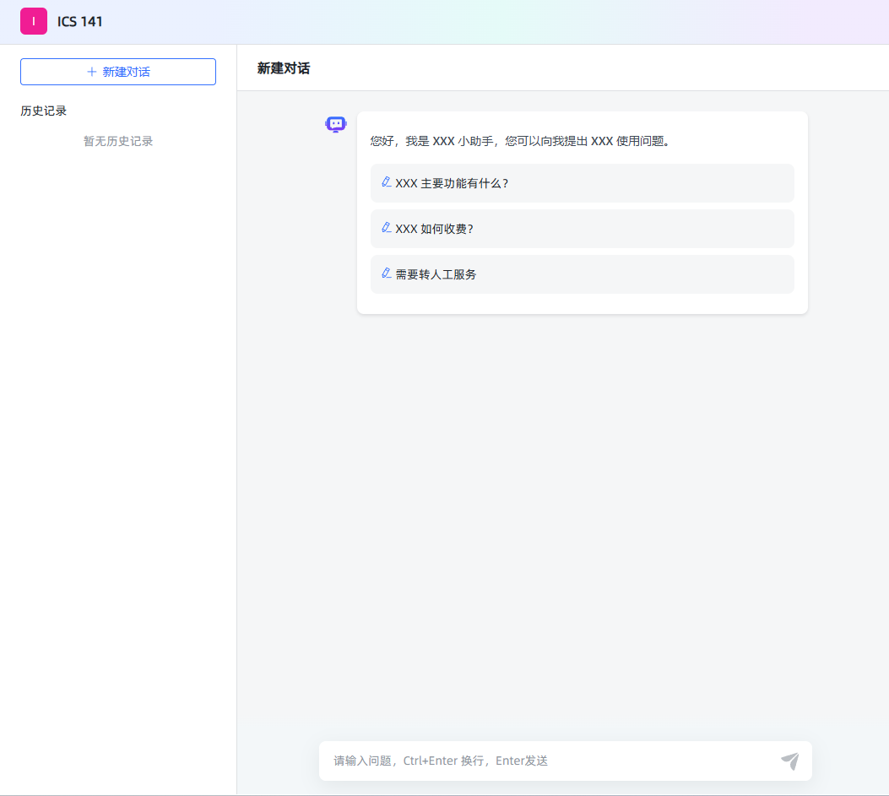

# 问答模块

[[toc]]

## 项目目标

本项目旨在构建一个功能完备的 RAG（Retrieval-Augmented Generation）系统，主要目标包括：

- **知识库管理**：支持创建、更新和删除知识库，便于用户高效维护内容。
- **文档处理**：包括文档的拆分、片段的向量化处理，以提升检索效率和准确性。
- **问答系统**：提供高效的向量检索和实时生成回答的能力，支持复杂汇总类问题的处理。
- **系统优化**：通过统计分析和推理问答调试，不断优化系统性能和用户体验。

## 系统核心概念

在 RAG 系统中，以下是几个核心概念：

- **应用**：知识库的集合。每个应用可以自定义提示词，以满足不同的个性化需求。
- **知识库**：由多个文档组成，便于用户对内容进行分类和管理。
- **文档**：系统中对应的真实文档内容。
- **片段**：文档经过拆分后的最小内容单元，用于更高效的处理和检索。

## 功能实现步骤

1. **数据库设计** [查看 01.md](./01.md)  
   设计并实现项目所需的数据表结构与数据库方案，为后续的数据操作打下坚实基础。

2. **用户登录** [查看 02.md](./02.md)  
   实现了安全可靠的用户认证系统，保护用户数据并限制未经授权的访问。

3. **模型管理** [查看 03.md](./03.md)  
   支持针对不同平台的模型（如 OpenAI、Google Gemini、Claude）进行管理与配置。

4. **知识库管理** [查看 04.md](./04.md)  
   提供创建、更新及删除知识库的功能，方便用户维护与管理文档内容。

5. **文档拆分** [查看 05.md](./05.md)  
   可将文档拆分为多个片段，便于后续向量化和检索操作。

6. **片段向量** [查看 06.md](./06.md)  
   将文本片段进行向量化处理，以便进行语义相似度计算及高效检索。

7. **命中率测试** [查看 07.md](./07.md)  
   通过语义相似度和 Top-N 算法，检索并返回与用户问题最相关的文档片段，用于评估检索的准确性。

8. **文档管理** [查看 08.md](./08.md)  
   提供上传和管理文档的功能，上传后可自动拆分为片段便于进一步处理。

9. **片段管理** [查看 09.md](./09.md)  
   允许对已拆分的片段进行增、删、改、查等操作，确保内容更新灵活可控。

10. **问题管理** [查看 10.md](./10.md)  
    为片段指定相关问题，以提升检索时的准确性与关联度。

11. **应用管理** [查看 11.md](./11.md)  
    提供创建和配置应用（智能体）的功能，并可关联指定模型和知识库。

12. **向量检索** [查看 12.md](./12.md)  
    基于语义相似度，在知识库中高效检索与用户问题最匹配的片段。

13. **推理问答调试** [查看 13.md](./13.md)  
    提供检索与问答性能的评估工具，帮助开发者进行系统优化与调试。

14. **对话问答** [查看 14.md](./14.md)  
    为用户提供友好的人机交互界面，结合检索到的片段与用户问题实时生成回答。

15. **统计分析** [查看 15.md](./15.md)  
    对用户的提问与系统回答进行数据化分析，并以可视化图表的形式呈现系统使用情况。

16. **用户管理** [查看 16.md](./16.md)  
    提供多用户管理功能，包括用户的增删改查及权限控制。

17. **API 管理** [查看 17.md](./17.md)  
    对外提供标准化 API，便于外部系统集成和调用本系统的功能。

18. **存储文件到 S3** [查看 18.md](./18.md)  
    将用户上传的文件存储至 S3 等对象存储平台，提升文件管理的灵活性与可扩展性。

19. **文档解析优化** [查看 19.md](./19.md)  
    介绍与对比常见的文档解析方案，并提供提升文档解析速度和准确性的优化建议。

20. **片段汇总** [查看 20.md](./20.md)  
    对片段内容进行汇总，以提升总结类问题的查询与回答效率。

21. **文档多分块与检索** [查看 21.md](./21.md)  
    将片段进一步拆分为句子并进行向量检索，提升检索的准确度与灵活度。

22. **多文档支持** [查看 22.md](./22.md)  
    兼容多种文档格式，包括 `.doc`, `.docx`, `.xls`, `.xlsx`, `.ppt`, `.pptx` 等。

23. **对话日志** [查看 23.md](./23.md)  
    记录并展示对话日志，用于后续分析和问题回溯。

24. **检索性能优化** [查看 24.md](./24.md)  
    提供整库扫描和分区检索等多种方式，进一步提高检索速度和效率。

25. **Milvus** [查看 25.md](./25.md)  
    将向量数据库切换至 Milvus，以在大规模向量检索场景中获得更佳的性能与可扩展性。

26. **文档解析方案和费用对比** [查看 26.md](./26.md)  
    对比不同文档解析方案在成本、速度、稳定性等方面的差异，为用户提供更加经济高效的选择。

27. **爬取网页数据** [查看 27.md](./27.md)  
    支持从网页中抓取所需内容，后续处理流程与本地文档一致：分段、向量化、存储与检索。

## api 接口

打开问答页面例如http://127.0.0.1:3000/ui/chat/abe8055668fb480f会发送下面的请求和得到下面的响应


### profile

GET /api/profile

```json
{
  "code": 200,
  "message": "成功",
  "data": {
    "version": "v1.7.0 (build at 2024-10-31T12:49, commit: 44b3aed5)",
    "IS_XPACK": false,
    "XPACK_LICENSE_IS_VALID": false
  }
}
```

### authentication

- 1.验证前端传递的 短 token 是否合法,
- 2.如果合法创建长 token 并返回,创建 client
- 3.如果浏览器传递时是长 token,解析长 token,判断用户是否存在,如果不存在,重复步骤 2,如果存在直接返回长 token

POST /api/application/authentication

header

```
authorization:eyJhcHBsaWNhdGlvbl9pZCI6Ijc3NzNiNjY4LTlmM2QtMTFlZi04MjI0LTAyNDJhYzExMDAwNSIsInVzZXJfaWQiOiJmMGRkOGY3MS1lNGVlLTExZWUtOGM4NC1hOGExNTk1ODAxYWIiLCJhY2Nlc3NfdG9rZW4iOiJhYmU4MDU1NjY4ZmI0ODBmIiwidHlwZSI6IkFQUExJQ0FUSU9OX0FDQ0VTU19UT0tFTiIsImNsaWVudF9pZCI6IjhkNTc5ZmY0LWQ2MzItMTFlZi05ZDkxLTAyNDJhYzExMDAwNSIsImF1dGhlbnRpY2F0aW9uIjp7fX0:1tZPaz:Mt0Ncr-U6YHSo_0G7V271HwWL8o6RyVr4HNh610FDo4
```

post

```json
{ "access_token": "abe8055668fb480f" }
```

```json
{
  "code": 200,
  "message": "成功",
  "data": "eyJhcHBsaWNhdGlvbl9pZCI6Ijc3NzNiNjY4LTlmM2QtMTFlZi04MjI0LTAyNDJhYzExMDAwNSIsInVzZXJfaWQiOiJmMGRkOGY3MS1lNGVlLTExZWUtOGM4NC1hOGExNTk1ODAxYWIiLCJhY2Nlc3NfdG9rZW4iOiJhYmU4MDU1NjY4ZmI0ODBmIiwidHlwZSI6IkFQUExJQ0FUSU9OX0FDQ0VTU19UT0tFTiIsImNsaWVudF9pZCI6ImIyMTJiMDJjLWQ2MGEtMTFlZi04NjVhLTAyNDJhYzExMDAwNSIsImF1dGhlbnRpY2F0aW9uIjp7fX0:1tZKmf:fkqrwQpjDRRs9-vHnhT7RKOKcRwTGwz3Yi6NC7xucHM"
}
```

1.浏览器在 local storage 中存储的 accessToken 用户 chat 页面聊天 2.浏览器在 local storage 中存储的 token 后台管理页面

### application/profile

验证通过后 调用 application/profile 获取应用的信息

- 1.从请求中获取 token,解析 token 中的 id (拦截器会自动进行)
- 2.查询表获取应用 id
- 3.返回应用信息

GET /api/application/profile
authorization:{上面获取的 token}

```json
{
  "code": 200,
  "message": "成功",
  "data": {
    "id": "7773b668-9f3d-11ef-8224-0242ac110005",
    "name": "ICS 141",
    "desc": "ics 141 课程助手",
    "prologue": "您好，我是 XXX 小助手，您可以向我提出 XXX 使用问题。\n- XXX 主要功能有什么？\n- XXX 如何收费？\n- 需要转人工服务",
    "dialogue_number": 1,
    "icon": "/ui/favicon.ico",
    "type": "SIMPLE",
    "stt_model_id": null,
    "tts_model_id": null,
    "stt_model_enable": false,
    "tts_model_enable": false,
    "tts_type": "BROWSER",
    "work_flow": {},
    "show_source": false,
    "multiple_rounds_dialogue": true
  }
}
```

GET /api/application/7773b668-9f3d-11ef-8224-0242ac110005/chat/client/1/20

```json
{
  "code": 200,
  "message": "成功",
  "data": {
    "total": 0,
    "records": [],
    "current": 1,
    "size": 20
  }
}
```

### 开启回话

客户端调用 GET /api/application/{application_id}/chat/open 接口时，服务端为此次会话生成了一个新的会话标识（这里返回的是 chat_id，如 "c2c9530c-d60b-11ef-865a-0242ac110005"）。此时，虽然主要返回的是会话 ID，但服务端内部可能已经初始化了与该会话关联的各类信息，包括生成一个唯一的客户端标识。

get /api/application/7773b668-9f3d-11ef-8224-0242ac110005/chat/open

```
{
  "code": 200,
  "message": "成功",
  "data": "c2c9530c-d60b-11ef-865a-0242ac110005"
}
```

### 问答

POST /api/application/chat_message/c2c9530c-d60b-11ef-865a-0242ac110005

```
{"message":"when is the office hours","re_chat":false,"form_data":{}}
```

response event response 和项目的相同

get /api/application/7773b668-9f3d-11ef-8224-0242ac110005/chat/client/1/20

```json
{
  "code": 200,
  "message": "成功",
  "data": {
    "total": 1,
    "records": [
      {
        "id": "c2c9530c-d60b-11ef-865a-0242ac110005",
        "application_id": "7773b668-9f3d-11ef-8224-0242ac110005",
        "abstract": "when is the office hours",
        "client_id": "b212b02c-d60a-11ef-865a-0242ac110005"
      }
    ],
    "current": 1,
    "size": 20
  }
}
```

## 开发接口

### InterceptorConfiguration

InterceptorConfiguration 开放/api/profile

```java
package com.litongjava.maxkb.config;

import com.litongjava.annotation.AConfiguration;
import com.litongjava.annotation.Initialization;
import com.litongjava.maxkb.inteceptor.AuthInterceptor;
import com.litongjava.tio.boot.http.interceptor.HttpInteceptorConfigure;
import com.litongjava.tio.boot.http.interceptor.HttpInterceptorModel;
import com.litongjava.tio.boot.server.TioBootServer;

@AConfiguration
public class InterceptorConfiguration {

  @Initialization
  public void config() {
    AuthInterceptor UserTokenInterceptor = new AuthInterceptor();
    HttpInterceptorModel model = new HttpInterceptorModel();
    model.setInterceptor(UserTokenInterceptor);

    model.addBlockUrl("/**");

    model.addAllowUrls("", "/");
    model.addAllowUrls("/ui/**");
    model.addAllowUrls("/register/*", "/api/login/account", "/api/login/outLogin", "/api/user/login");
    model.addAllowUrl("/sse");

    model.addAllowUrls("/api/application/chat_message/*", "/api/profile","/api/application/authentication");

    HttpInteceptorConfigure configure = new HttpInteceptorConfigure();
    configure.add(model);

    TioBootServer.me().setHttpInteceptorConfigure(configure);
  }
}
```
