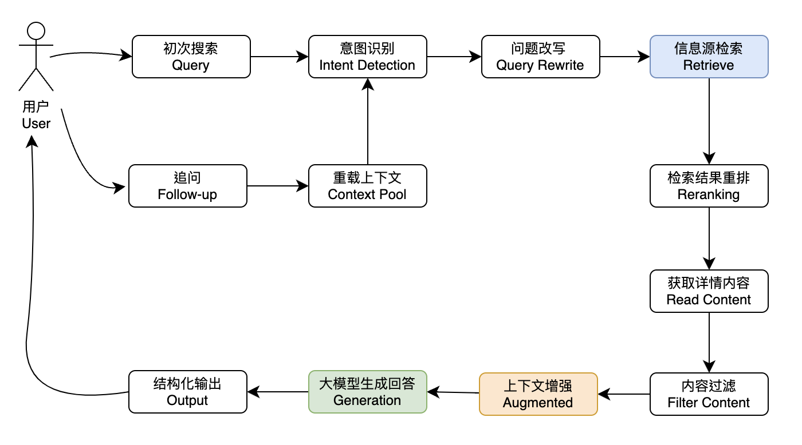

# ai-search 项目简介

[[toc]]
本文档介绍了一个 AI 搜索项目的设计与实现方案，前端采用 Next.js 框架，后端基于 Java 开发。项目旨在通过整合先进的检索技术和大模型能力，提升搜索问答系统的准确度和用户体验。下文详细阐述了项目的整体流程、关键技术以及优化策略。

---

## 1. AI 搜索的标准流程

AI 搜索一般可分为两个主要流程：**初次检索** 和 **检索后追问**。

### 1.1 初次检索流程

初次检索流程遵循大多数 AI 搜索引擎产品的通用步骤，如上图所示。主要流程包括：

- 用户提交查询
- 对查询进行预处理与意图识别
- 通过联网检索获取相关信息
- 结合上下文信息和模型知识库进行回答

### 1.2 检索后追问流程

不同的 AI 搜索产品在追问流程上可能会有所不同：

- **Perplexity 模式：** 追问时继续进行联网检索，获取最新信息后进行回答。
- **ThinkAny 模式：** 仅在初次搜索时联网检索，后续追问直接利用已获取的信息与大模型进行问答。
- **本项目方案：** 在用户提交问题后，界面下方提供一个开关键。用户可以根据需要选择是否开启联网检索：开启后进行实时联网检索，关闭后仅依靠大模型与预先缓存的信息进行对话。

---

## 2. 提升 AI 搜索准确度的关键策略

准确度是 AI 搜索系统的首要指标。影响准确度的两个关键因素为：

- **上下文信息的密度**
- **基座模型的智能程度**

在本项目中，选择了 deepseek r1 作为基座模型，并通过多种手段不断提高上下文信息的密度。以下详细介绍主要的优化措施。

### 2.1 意图识别 (Intent Detection)

在联网检索之前，对用户查询进行意图识别是提升准确度的第一步。主要包括：

- **判断是否需要联网检索：**  
  对于诸如“你好”、“你是谁”等问题，可以直接调用模型内置知识库回答，无需联网检索。实现方案包括构建内置问题库以及利用大模型进行判断。
- **搜索意图分类：**  
  将用户查询按照不同类型进行分类（例如导航类、信息查询类、交易类、本地信息类等），从而匹配最合适的信息源和回复提示词。  
  例如，在搜索“笔记本电脑”时，如果识别出“shopping”意图，则优先检索电商平台信息。目前主要通过提示词请求大模型进行识别，但准确度仍有待进一步提升，Function Calling 也可视为一种意图识别方式。

### 2.2 问题改写 (Query Rewrite)

完成意图识别后，对用户原始查询进行改写有助于提高检索的召回率。主要通过大模型和提示词工程实现：

- **更精准或专业的表达：**  
  例如，将“ThinkAny”改写为“ThinkAny 是什么？”，并翻译成英文以便进行更广泛的检索。
- **补全上下文与指代消解：**  
  例如，将“它有什么特点？”改写为“ThinkAny 有什么特点？”。
- **名词提取：**  
  例如，从“ThinkAny 和 Perplexity 有什么区别？”中提取“ThinkAny”和“Perplexity”，分别进行检索以确保信息完整。

### 2.3 搜索 (Search)

针对问题“ThinkAny 和 Perplexity 的区别是什么？”，本项目采用 [SearxNG](https://searx.github.io/searx/) 作为聚合搜索引擎，通过多数据源并行检索相关信息，提升搜索的广度和深度。

### 2.4 搜索结果重排 (Reranking)

对来自不同信息源的检索结果进行重排，过滤无关内容并根据相关性排序，确保最终截取 top_k 条高质量记录作为上下文信息。重排策略包括：

- 基于向量数据库的相似度计算
- FlashRank 等排序算法
- 结合大模型进行二次判断

本项目介绍了两种重排方案：基于 PostgreSQL 数据库和基于大模型的重排方式。

### 2.5 搜索内容读取 (Read Content)

为了进一步提升上下文信息密度，从检索结果中的链接获取详细内容十分关键。项目中采用以下方法：

- **无头浏览器 (Playwright)：**  
  利用 Playwright 模拟浏览器环境并行读取 top_k 条结果。
- **第三方 Reader (Jina)：**  
  结合第三方解决方案，实现对网页内容的提取。

### 2.6 搜索内容转换 (Markdown)

由于读取的内容通常为 HTML 格式，为了更好地与大模型对接，需要将其转换为 Markdown 格式。项目采用 [jina-reader-llm-v2](https://github.com/jina-ai/jina-reader-llm-v2) 进行格式转换，确保上下文信息在提示词工程中的良好展现。

### 2.7 提示词工程 (Prompt Engineering)

提示词在整个 AI 搜索流程中扮演着至关重要的角色。无论是在意图识别、问题改写，还是在最终回答生成中，提示词工程都需要不断调试和优化，以充分激发大模型的能力并提升问答准确度。

### 2.8 多模态检索 (Multi Mode)

为了进一步丰富搜索结果，本项目支持多模态检索，涵盖图片、视频、音频等内容。通过调用谷歌多模态检索 API，并结合 OCR 技术和音视频转录技术，将非文本信息转换为文本，从而实现统一处理和检索。

### 2.9 记录 (History)

为了改善用户体验和提升系统响应的连续性，本项目会记录用户的每次查询、搜索返回的网页内容以及大模型的回答。在后续对话中，如果用户未主动开启实时联网检索，系统可以利用历史记录信息对上下文进行重载，从而提供更为准确和连续的回答。

### 2.10 缓存 (Cache)

为提高系统性能和减少重复读取开销，本项目会对每次的网页内容读取和格式转换结果进行缓存处理。缓存机制既提高了检索效率，也有助于节约网络资源。

---

## 3. 总结

提升 AI 搜索系统的准确度是一个复杂且综合的工程任务，需要在以下几个方面进行不断优化：

- **上下文信息密度：** 通过意图识别、问题改写、多模态检索等手段不断丰富信息源；
- **基座模型的智能程度：** 选择先进的大模型（如 deepseek r1）并通过提示词工程不断挖掘其潜力；
- **流程优化：** 包括检索结果的重排、网页内容读取及缓存机制等。

本项目通过整合前沿技术和工程实践，旨在构建一个高效、准确、智能的 AI 搜索系统，为用户提供优质的信息查询和问答体验。未来，我们还将不断探索新技术，并在实际应用中持续优化和改进。
