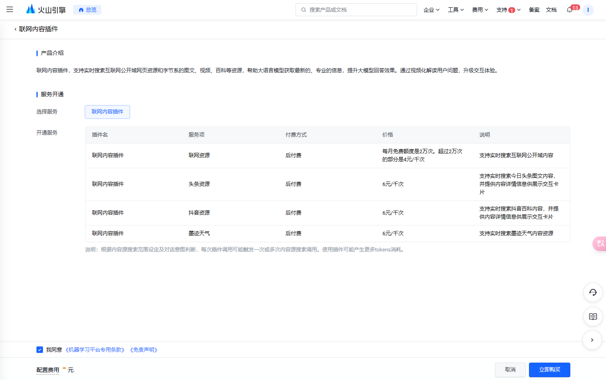
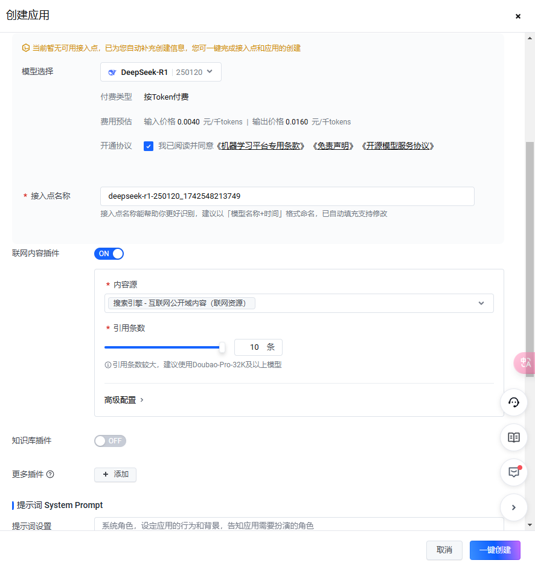

# 火山引擎 DeepSeek

[[toc]]

## 开通火山引擎联网搜索

登录火山引擎-->选择火山方舟 开通 deepseek r1 和 deepseek r1 联网搜索版




添加应用,添加联网插件


## Api 接入

### 模型请求示例

```curl
curl https://ark.cn-beijing.volces.com/api/v3/chat/completions \
  -H "Content-Type: application/json" \
  -H "Authorization: Bearer $ARK_API_KEY" \
  -d '{
    "model": "deepseek-r1-250120",
    "messages": [
      {"role": "system","content": "你是人工智能助手."},
      {"role": "user","content": "常见的十字花科植物有哪些？"}
    ]
  }'
```

### 调用联网搜索版本请求示例

#### 请求

```curl
curl 'https://ark.cn-beijing.volces.com/api/v3/bots/chat/completions' \
-H "Authorization: Bearer $ARK_API_KEY"  \
-H 'Content-Type: application/json' \
-d '{
    "model": "bot-20250321171413-b8rn7",
    "stream": true,
    "stream_options": {"include_usage": true},
    "messages": [
        {
            "role": "system",
            "content": "You are a helpful assistant."
        },
        {
          "role": "user",
          "content": "2025春晚名单"
        }
    ]
}'
```

#### 响应

```json
{
  "id": "02174254925432961f4f3920d13b6b4795da25f480604e779542b",
  "choices": [
    {
      "finish_reason": "stop",
      "index": 0,
      "message": {
        "content": "\n\n根据权威信源发布的2025年央视春晚节目单，以下是主要亮点及嘉宾阵容的整理：\n\n### 一、语言类节目\n1. **沈腾 & 马丽**：再度搭档出演小品，延续黄金组合的喜剧风格[1][2]。\n2. **岳云鹏 & 孙越**：带来全新相声表演，延续传统相声的幽默特色[2][7]。\n3. **赵雅芝 & 叶童**：合作古风小品《借伞》，以《新白娘子传奇》情怀为亮点[1][5][7]。\n4. **漫才兄弟（谭湘文 & 徐浩伦）**：创新“对口白话”表演，笑点密集[5]。\n\n### 二、歌舞类节目\n1. **周深**：与秘鲁国宝级男高音合作《山鹰和兰花花》，融合中国民歌与秘鲁名曲，展现文化交融[2][3]。\n2. **王菲**：献唱新歌《世界赠予我的》，清澈嗓音唤醒时光记忆[3][4]。\n3. **陈奕迅 & 张雨霏**：奥运冠军与歌手合唱《孤勇者》，点燃现场氛围[3][7]。\n4. **梁静茹**：经典情歌新编，引发观众共鸣[2][4]。\n5. **谭维维**：演绎非遗主题歌曲《英歌舞》，推广传统文化[2]。\n6. **刘惜君 & 蒋欣**：分别参与粤语歌曲串烧《湾区乐好》及独唱表演，展现多元风格[5][7]。\n\n### 三、其他亮点节目\n1. **魔术表演**：刘谦回归春晚舞台，带来全新魔术互动[2][4]。\n2. **非遗文化展示**：舞蹈《中华形》结合AI技术与古典舞，呈现建筑美学[6]。\n3. **分会场联动**：重庆、武汉、拉萨、无锡四地分会场，展示地方特色年俗[3]。\n\n### 四、播出信息\n- **时间**：2025年1月28日（除夕）20:00  \n- **平台**：央视多频道、央视频等新媒体及全球2900余家媒体同步直播，首次推出无障碍转播（视障/听障版）[1][3][8]。\n\n---\n\n**参考资料**：  \n[1] 《2025年春节联欢晚会》节目单正式发布:沈腾、岳云鹏、赵雅芝都来了  \n[2] 2025年央视蛇年春晚节目单 沈腾马丽周深刘谦王菲梁静茹大咖云集  \n[3] 2025年央视春晚节目单大揭秘!众多明星轮番上场，熟悉的味道来了  \n[5] 2025年春晚上的十二位美女，白鹿排在第六位，蒋欣排在第十位  \n[7] 央视总台春晚官宣!2025蛇年春晚节目名单来啦，李子柒...  \n[8] 2025年央视春晚节目单来了!-手机新浪网",
        "role": "assistant",
        "reasoning_content": "好的，我需要回答用户关于2025年春晚名单的问题。首先，查看提供的参考内容，尤其是摘要1到摘要8，这些都是最新的信息，发布时间都在2025年1月，符合时效性要求。\n\n摘要1和摘要2都提到节目单正式发布，包括沈腾、马丽、岳云鹏、赵雅芝、周深、刘谦、王菲、梁静茹等明星。摘要3补充了陈奕迅和张雨霏合唱《孤勇者》，还有舞台设计和分会场信息。摘要4虽然较早，但嘉宾名单与后续摘要一致，确认了白鹿等名字。摘要5和摘要7提到了赵雅芝和叶童的小品《借伞》，以及蒋欣的参与。摘要6是关于网络春晚的节目单，可能和主春晚不同，所以暂时不考虑。摘要8是官方节目单的链接，但内容已涵盖在其他摘要里。\n\n需要整合这些信息，分节目类型列出主要演员和节目名称。注意引用对应的摘要编号，比如沈腾和马丽的小品参考摘要1和2，周深的合作节目参考摘要2，陈奕迅的合唱参考摘要3等。最后确保所有参考资料正确列出。\n"
      }
    }
  ],
  "created": 1742549298,
  "model": "deepseek-r1-250120",
  "object": "chat.completion",
  "bot_usage": {
    "model_usage": [
      {
        "name": "ep-20250321171413-8fx8j",
        "prompt_tokens": 3971,
        "completion_tokens": 1265,
        "total_tokens": 5236
      }
    ],
    "action_usage": [
      {
        "action_name": "content_plugin",
        "count": 1
      }
    ],
    "action_details": [
      {
        "name": "content_plugin",
        "count": 1,
        "tool_details": [
          {
            "name": "search",
            "input": {
              "queries": ["2025央视春晚演员名单"],
              "source_type": ["search_engine"],
              "offset": 0,
              "count": 10,
              "account_id": 2104516050,
              "video_token": ""
            },
            "output": {
              "type": "tool",
              "data": {
                "status_code": 200,
                "data": {
                  "has_more": false,
                  "results": [
                    {
                      "id": "da9459f592805546-f1c7ffeef362f66d",
                      "source_type": "search_engine",
                      "site_name": "搜索引擎-网易手机网",
                      "title": "《2025年春节联欢晚会》节目单正式发布:沈腾、岳云鹏、赵雅芝都来了|",
                      "summary": "《2025年春节联欢晚会》节目单正式发布：沈腾、岳云鹏、赵雅芝都来了 1月28日晚8点，中央广播电视总台《2025年春节联欢晚会》将在央视综合频道、综艺频道、中文国际频道、国防军事频道、少儿频道、音乐频道、农业农村频道、4K超高清频道、8K超高清频道等电视频道，中国之声、音乐之声、经典音乐广播、文艺之声、粤港澳大湾区之声、台海之声、华语环球广播、南海之声和中国交通广播等广播频率，央视新闻、央视频、云听、央视网、央广网、国际在线等新媒体平台以及“百城千屏”8K超高清传播平台同步直播。总台蛇年春晚还首次推出无障碍转播。视障人士可通过云听、央广网在线收听春晚直播；听障人士可在央视新闻、央视频观看听障版转播。CGTN(中国国际电视台)英语、西班牙语、法语、阿拉伯语、俄语频道和82种语言对外传播平台，将联动全球200多个国家和地区的2900多家媒体对春晚进行直播和报道。总台还首次联合亚洲-太平洋广播联盟、阿拉伯国家广播联盟、非洲广播联盟、欧洲新闻交换联盟和拉美新闻联盟等全球五大新闻联盟推介总台春晚。除夕夜，与您相约，共迎乙巳蛇年新春！",
                      "publish_time": 1738053180,
                      "url": "http://m.163.com/dy/article/JN0L3T4T0545BKTK.html",
                      "cover_image": {
                        "url": "https://p3-search.byteimg.com/img/labis/a9053e75682fa3fa3f7fc25d86c7188d~tplv-26tn0yjwph-cspd-v1:312:208.webp",
                        "width": 0,
                        "height": 0
                      },
                      "search_plugin_data": {
                        "doc_id": "da9459f592805546-f1c7ffeef362f66d",
                        "logo_url": "https://p3-search.byteimg.com/img/labis/9e710df58c92dd503378e729289f9abb~noop.jpeg",
                        "auth_info": "非常权威",
                        "auth_score": 0.994554,
                        "rel_info": "强相关",
                        "rel_score": 0.800012,
                        "freshness_info": "非常满足时效需求",
                        "freshness_score": 0.999257,
                        "final_ref": "",
                        "final_ref_len": 0,
                        "author_name": "",
                        "duration": 0
                      },
                      "smart_content_data": null,
                      "ruyi_data": null
                    },
                    {
                      "id": "ddbe48051dd71d1a-f034bc23873e0479",
                      "source_type": "search_engine",
                      "site_name": "搜索引擎-网易手机网",
                      "title": "2025年央视蛇年春晚节目单 沈腾马丽周深刘谦王菲梁静茹大咖云集",
                      "summary": "2025年央视蛇年春晚节目单 沈腾马丽周深刘谦王菲梁静茹大咖云集 2025年央视蛇年春晚的节目单新鲜出炉啦！快来看看今年春晚陪伴大家的年终盛典里，有没有你喜爱的小品或歌舞？今年的央视春晚节目单可谓惊喜连连：语言类节目，沈腾 马丽再次搭档演小品，小岳岳也将再次为大家献上相声，更有许多“喜人”新秀在春晚上献出自己的新作品。歌舞类节目，青年歌手周深将与秘鲁国宝级男高音...2025年央视蛇年春晚节目单 沈腾马丽周深刘谦王菲梁静茹大咖云集 2025年央视蛇年春晚的节目单新鲜出炉啦！快来看看今年春晚陪伴大家的年终盛典里，有没有你喜爱的小品或歌舞？今年的央视春晚节目单可谓惊喜连连：语言类节目，沈腾 马丽再次搭档演小品，小岳岳也将再次为大家献上相声，更有许多“喜人”新秀在春晚上献出自己的新作品。歌舞类节目，青年歌手周深将与秘鲁国宝级男高音合作《山鹰和兰花花》，当中国民歌《兰花花》遇上世界文化遗产、秘鲁名曲《山鹰之歌》，中国歌手与秘鲁歌手以歌会友，展现中外合作的友谊，向世界宣扬中华民歌，体现我国的文化自信、民族自信；歌手谭维维将献唱非遗歌曲《英歌舞》，这是春晚申遗后举行的第一届，非遗文化源远流长，宣传非遗任重道远；还有王菲、梁静茹等老牌歌手的新歌首唱，情怀拉满。你最期待谁的节目呢？2024年龙年春晚，歌舞类节目则总体质量较高，绝美舞蹈《锦鲤》惊艳众人，高潮的变奏《大鱼》更是美出新境界；周深演唱的歌曲《健康到到令》风格活泼，3D投影的熊猫花花可爱极了，以打八段锦入手，宣扬全民健身，强健体魄，这个节目也是2024年龙年春晚收视率第一的节目；刘谦的魔术更是成为了春晚当晚最高讨论度的节目，小尼穿帮后“天塌了”的表情令人捧腹。今年春晚是春晚申请非遗后的第一年。春晚申遗成功为我们树立了文化自信，春晚从此也更多了许多面向海外的文化意义。今年农历正月期间，秘鲁国家电视台、美洲电视台、拉丁电视台、《共和国报》等多家主流媒体将面向秘鲁观众，播出央视蛇年春晚西班牙语精编版，让秘鲁观众在喜庆红火的年味中感受中国春节、中华文化的魅力。",
                      "publish_time": 1738053720,
                      "url": "http://m.163.com/news/article/JMTTP0JS05564EPN.html",
                      "cover_image": {
                        "url": "https://p3-search.byteimg.com/img/labis/49da15f3d55bf2c216c3b2ad12d1808a~tplv-26tn0yjwph-cspd-v1:312:208.webp",
                        "width": 0,
                        "height": 0
                      },
                      "search_plugin_data": {
                        "doc_id": "ddbe48051dd71d1a-f034bc23873e0479",
                        "logo_url": "https://p3-search.byteimg.com/img/labis/9e710df58c92dd503378e729289f9abb~noop.jpeg",
                        "auth_info": "非常权威",
                        "auth_score": 0.994554,
                        "rel_info": "强相关",
                        "rel_score": 0.814655,
                        "freshness_info": "非常满足时效需求",
                        "freshness_score": 0.99926,
                        "final_ref": "",
                        "final_ref_len": 0,
                        "author_name": "",
                        "duration": 0
                      },
                      "smart_content_data": null,
                      "ruyi_data": null
                    },
                    {
                      "id": "7206fe105c71a46f-9f5ad71beb741640",
                      "source_type": "search_engine",
                      "site_name": "搜索引擎-搜狐网",
                      "title": "2025年央视春晚节目单大揭秘!众多明星轮番上场，熟悉的味道来了",
                      "summary": "2025年央视春晚节目单大揭秘！众多明星轮番上场，熟悉的味道来了 每年除夕夜，春晚都成为了千家万户共同期待的文化盛宴，而2025年的春晚更是备受瞩目。就在1月28日，中央广播电视总台正式发布了《2025年春节联欢晚会》的节目单。今年的春晚以“巳巳如意，生生不息”为主题，贯穿了欢乐和吉祥的主基调，涵盖了歌曲、舞蹈、相声、小品、戏曲等多种艺术形式，向观众展现出一个丰富多彩的新春庆典。无疑，今年的春晚明星阵容可以说是亮眼无比。王菲、陈奕迅、蒋欣、罗嘉豪、毛不易、梁静茹等当红歌手和演员将悉数登场，为观众献上精彩的表演。尤其是陈奕迅的演出，搭档奥运冠军张雨霏合唱的《孤勇者》定会点燃现场气氛。此外，王菲也将带来她的《世界赠予我的》，用她清澈的嗓音诉说对时光的感激，让人仿佛瞬间回到了往昔的美好。节目方面，春晚力求丰富多样，以满足不同年龄段观众的口味。从动听的歌曲到活泼的舞蹈，再到幽默的小品和相声，甚至还有戏曲、武术与魔术等综合性艺术节目。这不仅展现了中华文化的底蕴与魅力，也让每位观众都能找到属于自己的快乐元素。今年春晚的另一个亮点是舞台设计。北京主会场的舞美设计围绕“巳巳如意，生生不息”主题展开，巧妙地将舞台打造成为如意的形态，增加了文化内涵与视觉体验。而在四个分会场，重庆、湖北武汉、西藏拉萨和江苏无锡均展现了各自的地方特色，为观众呈现了全国各地的年节习俗，展现了中国幅员辽阔的山河佳景。值得一提的是，今年的春晚首次推出了视障版和听障版的无障碍转播，运用AR虚拟技术的手语表演，让更多无法直接享受晚会的朋友也能感受到春晚的魅力。这一创新的举措，彰显了春晚的包容性与前瞻性，进一步推动了文化的普及与发展。在全球化的今天，春晚也不再是孤立的一场表演。2025年春晚将首次通过五大国际新闻联盟对外传播，全球2900多家媒体将同时进行直播，让世界各国共庆这个文化盛宴。伴随着央视的华语频道，英语、西班牙语及其他语言的传播，将会吸引无数海外华人的目光，让大家遥寄新年的祝福。总的来说，2025年的春晚无疑是一场备受期待的文化派对，各种明星的精彩表演、丰富的节目安排、创新的技术呈现都让人期待不已。",
                      "publish_time": 1738060020,
                      "url": "https://www.sohu.com/a/854153060_122118475",
                      "cover_image": {
                        "url": "https://p3-search.byteimg.com/img/labis/36ccb57331bf39160632bb78d8d4b177~tplv-26tn0yjwph-cspd-v1:312:208.webp",
                        "width": 0,
                        "height": 0
                      },
                      "search_plugin_data": {
                        "doc_id": "7206fe105c71a46f-9f5ad71beb741640",
                        "logo_url": "",
                        "auth_info": "正常权威",
                        "auth_score": 0.525434,
                        "rel_info": "强相关",
                        "rel_score": 0.866353,
                        "freshness_info": "非常满足时效需求",
                        "freshness_score": 0.999293,
                        "final_ref": "",
                        "final_ref_len": 0,
                        "author_name": "",
                        "duration": 0
                      },
                      "smart_content_data": null,
                      "ruyi_data": null
                    },
                    {
                      "id": "e0bfa22f76482c2e-bcb8eadb072dedbf",
                      "source_type": "search_engine",
                      "site_name": "搜索引擎-搜狐网",
                      "title": "2025央视春晚嘉宾名单曝光，沈腾、周深、白鹿加盟-手机搜狐网",
                      "summary": "2025央视春晚将会在1月28日周二除夕晚8点播出。各位看官可以在电视上安装当贝市场下载央视频一起和家人边吃年夜饭边收看2025央视春晚。2025央视春晚嘉宾名单 沈腾、马丽、乔杉、李雪琴、“漫才兄弟”组合（谭湘文和徐浩伦）、张小婉、管乐、毛不易、汪苏泷、周深、李宇春、苏有朋、宋雨琦、阿如那、曾比特、胡先煦、蒋奇明、焦迈奇、李斯丹妮、梁静茹、刘惜君、孟佳、任敏、孙千、万妮达、吴莫愁、姚晓棠、张含韵、周柏豪、陈楚生、王栎鑫、陆虎、王铮亮、苏醒、萧敬腾、张艺兴、丁禹兮、许凯、白鹿、张新成、刘学义、王宝强、王安宇、黄子弘凡、宋佳、吴磊等人纷纷现身央视大楼参与彩排。官方最终的嘉宾阵容还得再等等了。2025央视春晚观看方法 智能电视可以在电视上安装当贝市场，搜索YSP，下载央视频TV版后收看2025央视春晚。2025央视春晚节目单 央视春晚向来是众星云集，今年亦不例外，各路嘉宾大咖齐聚一堂，星光熠熠，令人满怀期待。目前，节目单虽暂未正式公布，但请各位看官持续关注，后续将为大家一一揭晓，精彩不容错过 。发布于：浙江省",
                      "publish_time": 1737083940,
                      "url": "https://www.sohu.com/a/849982071_213569",
                      "cover_image": {
                        "url": "https://p3-search.byteimg.com/img/labis/1dfe31ae2631d2fa6681e109658797a9~tplv-26tn0yjwph-cspd-v1:312:208.webp",
                        "width": 0,
                        "height": 0
                      },
                      "search_plugin_data": {
                        "doc_id": "e0bfa22f76482c2e-bcb8eadb072dedbf",
                        "logo_url": "",
                        "auth_info": "非常权威",
                        "auth_score": 0.815315,
                        "rel_info": "强相关",
                        "rel_score": 0.939206,
                        "freshness_info": "一般满足时效需求",
                        "freshness_score": 0.538252,
                        "final_ref": "",
                        "final_ref_len": 0,
                        "author_name": "",
                        "duration": 0
                      },
                      "smart_content_data": null,
                      "ruyi_data": null
                    },
                    {
                      "id": "5d925a3afcbc8eef-b09d989a8b4cfe2a",
                      "source_type": "search_engine",
                      "site_name": "搜索引擎-网易手机网",
                      "title": "2025年春晚上的十二位美女，白鹿排在第六位，蒋欣排在第十位",
                      "summary": "所以今年央视春晚的看点还是集中在歌舞节目上面，而撑起歌舞节目的自然少不了大量的俊男靓女。下面就简单盘点一下，2025年央视春晚舞台上的十大美女。第十二名：赵雅芝＆叶童 第十一名：刘惜君 第八名：张含韵 第七名：关晓彤 第六名：白鹿 第五名：程潇 第四名：毛晓彤 毛晓彤也是以甜美为标签，她已经不是第一次上春晚...2025年春晚上的十二位美女，白鹿排在第六位，蒋欣排在第十位 最近这几年的央视春节联欢晚会，语言类节目一直饱受诟病，所以很多喜欢看春晚的观众只能把希望寄托在歌舞类节目上面。今年也不例外，整台湾晚会一共八个语言类节目，只有“漫才兄弟”的对口白话算是有些笑点。就连沈腾和马丽这对中生代的黄金搭档，都表现得差强人意。像岳云鹏和孙越的相声简直让人不忍直视，很难想象什么人看到这样的表演能够笑得出来，普通观众可能看两眼就换台，或者只是当成背景音，而相声爱好者则有可能直接“骂街”。所以今年央视春晚的看点还是集中在歌舞节目上面，而撑起歌舞节目的自然少不了大量的俊男靓女。下面就简单盘点一下，2025年央视春晚舞台上的十大美女。第十二名：赵雅芝＆叶童 尽管最近这几年，赵雅芝和叶童没少一起出现在镜头面前，但是在蛇年的春晚舞台上，她们俩的确还是非常应景的。《借伞》这个小品前面的部分几乎是一个笑点都没有，尽管形式还不错，但如果把它归入语言类节目评分，很有可能是垫底作品。但是由于有了赵雅芝和叶童的加入，最后情怀一下子就上来了。虽然两人年纪都很大了，不过保养的确实很好，看起来状态不输之前亮相的年轻人。第十一名：刘惜君 刘惜君这次在央视春晚上表演的节目是《湾区乐好》，跟几位香港的明星，一起唱些经典的粤语歌曲。由于是几个人一起演唱，所以也听不出有谁唱得特别突出，但是从外形上来看，刘惜君差不多是最漂亮的一个。旗袍加大波浪的发型，让刘惜君演唱《万水千山总是情》的时候看起来风情万种。第十名：蒋欣 蒋欣去年凭借在《小巷人家》里的出色表演，又火了一次。在这部剧中，她扮演的角色是一位“厂花”，从外形上来看，可以说是名副其实。",
                      "publish_time": 1738128300,
                      "url": "http://m.163.com/dy/article/JN2HNS4O0552R76G.html",
                      "cover_image": {
                        "url": "https://p3-search.byteimg.com/img/labis/b7599075da295e3e446162cee9fcb914~tplv-26tn0yjwph-cspd-v1:312:208.webp",
                        "width": 0,
                        "height": 0
                      },
                      "search_plugin_data": {
                        "doc_id": "5d925a3afcbc8eef-b09d989a8b4cfe2a",
                        "logo_url": "https://p3-search.byteimg.com/img/labis/9e710df58c92dd503378e729289f9abb~noop.jpeg",
                        "auth_info": "非常权威",
                        "auth_score": 0.994469,
                        "rel_info": "相关",
                        "rel_score": 0.709117,
                        "freshness_info": "非常满足时效需求",
                        "freshness_score": 0.99957,
                        "final_ref": "",
                        "final_ref_len": 0,
                        "author_name": "",
                        "duration": 0
                      },
                      "smart_content_data": null,
                      "ruyi_data": null
                    },
                    {
                      "id": "11861c15beed0d53-40bba0f0f50b057c",
                      "source_type": "search_engine",
                      "site_name": "搜索引擎-网易手机网",
                      "title": "2025央视网络春晚节目单(完整版)-手机网易网",
                      "summary": "第一幕·小剧场 超时空客满 表演者：刘大悦、大锁、王冰冰、郎祺、杨仕泽 首先，晚会给我们带来的开场秀节目是 ▶《开“新”往前飞》 表演者：井胧、邓寓君、黄誉博、威尔（唐伟）、大锁、刘大悦、黎逸凡、黄华、杨晓菊、王艺妍妤、白雪、蒋博文、姜薇、卢雨笙 ▶《春日花招》 表演者：陈瑶、哈尼克孜、任敏、祝绪丹 最唯美的是，节目《春日花招》令“百花图”各色花卉于舞台绽放，陈瑶、哈妮克孜、任敏、祝绪丹化身百花仙子诠释浪漫东方美学。▶《对面的小孩看过来》 表演者：风荷吉他摇滚乐队、白鲨乐队、北京口琴老王、李楚然 ▶《中华形》 表演者：山翀、陈炳睿、北京舞蹈学院 这个节目把古典舞的肢体美与AI技术相结合，以“方”“弧”“圆”“角”四个篇章，展现中国建筑中壮阔非凡的几何美学与一脉相承的中国智慧。▶《走四方》 表演者：康辉、撒贝宁、朱广权、尼格买提 其中，全新改编的《走四方》，将会带我们游览我国34个省级行政区的大好河山，科技前沿，还有一些生僻地名、有趣地名填词等，让我们加深文化常识，领略现代科技。第二幕·小剧场 超失控掌柜 表演者：刘大悦、王冰冰、赵霏、A-SOUL ▶《寄明月》 表演者：",
                      "publish_time": 1737595440,
                      "url": "http://m.163.com/dy/article/JMJ0FL2705566QYD.html",
                      "cover_image": {
                        "url": "https://p3-search.byteimg.com/img/labis/987e552deebdb8765934860793d36a4e~tplv-26tn0yjwph-cspd-v1:312:208.webp",
                        "width": 0,
                        "height": 0
                      },
                      "search_plugin_data": {
                        "doc_id": "11861c15beed0d53-40bba0f0f50b057c",
                        "logo_url": "https://p3-search.byteimg.com/img/labis/9e710df58c92dd503378e729289f9abb~noop.jpeg",
                        "auth_info": "非常权威",
                        "auth_score": 0.994469,
                        "rel_info": "相关",
                        "rel_score": 0.648704,
                        "freshness_info": "非常满足时效需求",
                        "freshness_score": 0.979658,
                        "final_ref": "",
                        "final_ref_len": 0,
                        "author_name": "",
                        "duration": 0
                      },
                      "smart_content_data": null,
                      "ruyi_data": null
                    },
                    {
                      "id": "5b3d9b28bf6ca20d-8ebbadbd095f351a",
                      "source_type": "search_engine",
                      "site_name": "搜索引擎-河北网络广播电视台",
                      "title": "央视总台春晚官宣!2025蛇年春晚节目名单来啦，李子柒...",
                      "summary": "央视总台春晚官宣！2025蛇年春晚节目名单来啦，李子柒春晚开场、叶童赵雅芝同台、陈奕迅张雨霏合唱孤勇者……有你期待的节目吗? 河北网络广播电视台,河北广播电视台央视总台春晚官宣！2025蛇年春晚节目名单来啦，李子柒春晚开场、叶童赵雅芝同台、陈奕迅张雨霏合唱孤勇者…… 有你期待的节目吗?",
                      "publish_time": 1738055520,
                      "url": "https://web.cmc.hebtv.com/cms/rmt0336/0/0rmhlm/qy/hblyTV/lxhb/11773412.shtml",
                      "cover_image": {
                        "url": "https://p3-search.byteimg.com/img/labis/a412ec729f7b8cf56424e2f5cbb88574~tplv-26tn0yjwph-cspd-v1:312:208.webp",
                        "width": 0,
                        "height": 0
                      },
                      "search_plugin_data": {
                        "doc_id": "5b3d9b28bf6ca20d-8ebbadbd095f351a",
                        "logo_url": "",
                        "auth_info": "正常权威",
                        "auth_score": 0.419975,
                        "rel_info": "相关",
                        "rel_score": 0.786661,
                        "freshness_info": "非常满足时效需求",
                        "freshness_score": 0.99927,
                        "final_ref": "",
                        "final_ref_len": 0,
                        "author_name": "",
                        "duration": 0
                      },
                      "smart_content_data": null,
                      "ruyi_data": null
                    },
                    {
                      "id": "e9473441d1977dfa-a36fa281c222f4dc",
                      "source_type": "search_engine",
                      "site_name": "搜索引擎-新浪财经",
                      "title": "2025年央视春晚节目单来了!-手机新浪网",
                      "summary": "蛇年春节来临之际 中央广播电视总台 《2025年春节联欢晚会》节目单正式发布↓ 除夕夜，与您相约 共迎乙巳蛇年新春 编辑丨好儿 编审丨龙怡洲",
                      "publish_time": 1738051396,
                      "url": "https://cj.sina.cn/article/norm_detail?url=http%3A%2F%2Ffinance.sina.cn%2F2025-01-28%2Fdetail-inehpimx7595749.d.html",
                      "cover_image": null,
                      "search_plugin_data": {
                        "doc_id": "e9473441d1977dfa-a36fa281c222f4dc",
                        "logo_url": "https://p3-search.byteimg.com/img/labis/282994a3ec89d0996dd80d85aab2f832~noop.jpeg",
                        "auth_info": "一般权威",
                        "auth_score": 0.788378,
                        "rel_info": "相关",
                        "rel_score": 0.553871,
                        "freshness_info": "非常满足时效需求",
                        "freshness_score": 0.999248,
                        "final_ref": "",
                        "final_ref_len": 0,
                        "author_name": "",
                        "duration": 0
                      },
                      "smart_content_data": null,
                      "ruyi_data": null
                    }
                  ],
                  "debug_data": {
                    "extra": null
                  },
                  "log_id": "02174254925432961f4f3920d13b6b4795da25f480604e779542b",
                  "timing": {
                    "total": 1534
                  }
                }
              }
            },
            "created_at": 1742549267232,
            "completed_at": 1742549268856
          }
        ]
      }
    ]
  },
  "metadata": {},
  "references": [
    {
      "url": "http://m.163.com/dy/article/JN0L3T4T0545BKTK.html",
      "logo_url": "https://p3-search.byteimg.com/img/labis/9e710df58c92dd503378e729289f9abb~noop.jpeg",
      "site_name": "搜索引擎-网易手机网",
      "title": "《2025年春节联欢晚会》节目单正式发布:沈腾、岳云鹏、赵雅芝都来了|",
      "summary": "《2025年春节联欢晚会》节目单正式发布：沈腾、岳云鹏、赵雅芝都来了 1月28日晚8点，中央广播电视总台《2025年春节联欢晚会》将在央视综合频道、综艺频道、中文国际频道、国防军事频道、少儿频道、音乐频道、农业农村频道、4K超高清频道、8K超高清频道等电视频道，中国之声、音乐之声、经典音乐广播、文艺之声、粤港澳大湾区之声、台海之声、华语环球广播、南海之声和中国交通广播等广播频率，央视新闻、央视频、云听、央视网、央广网、国际在线等新媒体平台以及“百城千屏”8K超高清传播平台同步直播。总台蛇年春晚还首次推出无障碍转播。视障人士可通过云听、央广网在线收听春晚直播；听障人士可在央视新闻、央视频观看听障版转播。CGTN(中国国际电视台)英语、西班牙语、法语、阿拉伯语、俄语频道和82种语言对外传播平台，将联动全球200多个国家和地区的2900多家媒体对春晚进行直播和报道。总台还首次联合亚洲-太平洋广播联盟、阿拉伯国家广播联盟、非洲广播联盟、欧洲新闻交换联盟和拉美新闻联盟等全球五大新闻联盟推介总台春晚。除夕夜，与您相约，共迎乙巳蛇年新春！",
      "publish_time": "2025年01月28日 16:33:00(CST) 星期二",
      "cover_image": {
        "url": "https://p3-search.byteimg.com/img/labis/a9053e75682fa3fa3f7fc25d86c7188d~tplv-26tn0yjwph-cspd-v1:312:208.webp",
        "width": 0,
        "height": 0
      },
      "extra": {
        "rel_info": "强相关",
        "freshness_info": "非常满足时效需求",
        "auth_info": "非常权威",
        "final_ref": ""
      }
    },
    {
      "url": "http://m.163.com/news/article/JMTTP0JS05564EPN.html",
      "logo_url": "https://p3-search.byteimg.com/img/labis/9e710df58c92dd503378e729289f9abb~noop.jpeg",
      "site_name": "搜索引擎-网易手机网",
      "title": "2025年央视蛇年春晚节目单 沈腾马丽周深刘谦王菲梁静茹大咖云集",
      "summary": "2025年央视蛇年春晚节目单 沈腾马丽周深刘谦王菲梁静茹大咖云集 2025年央视蛇年春晚的节目单新鲜出炉啦！快来看看今年春晚陪伴大家的年终盛典里，有没有你喜爱的小品或歌舞？今年的央视春晚节目单可谓惊喜连连：语言类节目，沈腾 马丽再次搭档演小品，小岳岳也将再次为大家献上相声，更有许多“喜人”新秀在春晚上献出自己的新作品。歌舞类节目，青年歌手周深将与秘鲁国宝级男高音...2025年央视蛇年春晚节目单 沈腾马丽周深刘谦王菲梁静茹大咖云集 2025年央视蛇年春晚的节目单新鲜出炉啦！快来看看今年春晚陪伴大家的年终盛典里，有没有你喜爱的小品或歌舞？今年的央视春晚节目单可谓惊喜连连：语言类节目，沈腾 马丽再次搭档演小品，小岳岳也将再次为大家献上相声，更有许多“喜人”新秀在春晚上献出自己的新作品。歌舞类节目，青年歌手周深将与秘鲁国宝级男高音合作《山鹰和兰花花》，当中国民歌《兰花花》遇上世界文化遗产、秘鲁名曲《山鹰之歌》，中国歌手与秘鲁歌手以歌会友，展现中外合作的友谊，向世界宣扬中华民歌，体现我国的文化自信、民族自信；歌手谭维维将献唱非遗歌曲《英歌舞》，这是春晚申遗后举行的第一届，非遗文化源远流长，宣传非遗任重道远；还有王菲、梁静茹等老牌歌手的新歌首唱，情怀拉满。你最期待谁的节目呢？2024年龙年春晚，歌舞类节目则总体质量较高，绝美舞蹈《锦鲤》惊艳众人，高潮的变奏《大鱼》更是美出新境界；周深演唱的歌曲《健康到到令》风格活泼，3D投影的熊猫花花可爱极了，以打八段锦入手，宣扬全民健身，强健体魄，这个节目也是2024年龙年春晚收视率第一的节目；刘谦的魔术更是成为了春晚当晚最高讨论度的节目，小尼穿帮后“天塌了”的表情令人捧腹。今年春晚是春晚申请非遗后的第一年。春晚申遗成功为我们树立了文化自信，春晚从此也更多了许多面向海外的文化意义。今年农历正月期间，秘鲁国家电视台、美洲电视台、拉丁电视台、《共和国报》等多家主流媒体将面向秘鲁观众，播出央视蛇年春晚西班牙语精编版，让秘鲁观众在喜庆红火的年味中感受中国春节、中华文化的魅力。",
      "publish_time": "2025年01月28日 16:42:00(CST) 星期二",
      "cover_image": {
        "url": "https://p3-search.byteimg.com/img/labis/49da15f3d55bf2c216c3b2ad12d1808a~tplv-26tn0yjwph-cspd-v1:312:208.webp",
        "width": 0,
        "height": 0
      },
      "extra": {
        "rel_info": "强相关",
        "freshness_info": "非常满足时效需求",
        "auth_info": "非常权威",
        "final_ref": ""
      }
    },
    {
      "url": "https://www.sohu.com/a/854153060_122118475",
      "logo_url": "",
      "site_name": "搜索引擎-搜狐网",
      "title": "2025年央视春晚节目单大揭秘!众多明星轮番上场，熟悉的味道来了",
      "summary": "2025年央视春晚节目单大揭秘！众多明星轮番上场，熟悉的味道来了 每年除夕夜，春晚都成为了千家万户共同期待的文化盛宴，而2025年的春晚更是备受瞩目。就在1月28日，中央广播电视总台正式发布了《2025年春节联欢晚会》的节目单。今年的春晚以“巳巳如意，生生不息”为主题，贯穿了欢乐和吉祥的主基调，涵盖了歌曲、舞蹈、相声、小品、戏曲等多种艺术形式，向观众展现出一个丰富多彩的新春庆典。无疑，今年的春晚明星阵容可以说是亮眼无比。王菲、陈奕迅、蒋欣、罗嘉豪、毛不易、梁静茹等当红歌手和演员将悉数登场，为观众献上精彩的表演。尤其是陈奕迅的演出，搭档奥运冠军张雨霏合唱的《孤勇者》定会点燃现场气氛。此外，王菲也将带来她的《世界赠予我的》，用她清澈的嗓音诉说对时光的感激，让人仿佛瞬间回到了往昔的美好。节目方面，春晚力求丰富多样，以满足不同年龄段观众的口味。从动听的歌曲到活泼的舞蹈，再到幽默的小品和相声，甚至还有戏曲、武术与魔术等综合性艺术节目。这不仅展现了中华文化的底蕴与魅力，也让每位观众都能找到属于自己的快乐元素。今年春晚的另一个亮点是舞台设计。北京主会场的舞美设计围绕“巳巳如意，生生不息”主题展开，巧妙地将舞台打造成为如意的形态，增加了文化内涵与视觉体验。而在四个分会场，重庆、湖北武汉、西藏拉萨和江苏无锡均展现了各自的地方特色，为观众呈现了全国各地的年节习俗，展现了中国幅员辽阔的山河佳景。值得一提的是，今年的春晚首次推出了视障版和听障版的无障碍转播，运用AR虚拟技术的手语表演，让更多无法直接享受晚会的朋友也能感受到春晚的魅力。这一创新的举措，彰显了春晚的包容性与前瞻性，进一步推动了文化的普及与发展。在全球化的今天，春晚也不再是孤立的一场表演。2025年春晚将首次通过五大国际新闻联盟对外传播，全球2900多家媒体将同时进行直播，让世界各国共庆这个文化盛宴。伴随着央视的华语频道，英语、西班牙语及其他语言的传播，将会吸引无数海外华人的目光，让大家遥寄新年的祝福。总的来说，2025年的春晚无疑是一场备受期待的文化派对，各种明星的精彩表演、丰富的节目安排、创新的技术呈现都让人期待不已。",
      "publish_time": "2025年01月28日 18:27:00(CST) 星期二",
      "cover_image": {
        "url": "https://p3-search.byteimg.com/img/labis/36ccb57331bf39160632bb78d8d4b177~tplv-26tn0yjwph-cspd-v1:312:208.webp",
        "width": 0,
        "height": 0
      },
      "extra": {
        "rel_info": "强相关",
        "freshness_info": "非常满足时效需求",
        "auth_info": "正常权威",
        "final_ref": ""
      }
    },
    {
      "url": "https://www.sohu.com/a/849982071_213569",
      "logo_url": "",
      "site_name": "搜索引擎-搜狐网",
      "title": "2025央视春晚嘉宾名单曝光，沈腾、周深、白鹿加盟-手机搜狐网",
      "summary": "2025央视春晚将会在1月28日周二除夕晚8点播出。各位看官可以在电视上安装当贝市场下载央视频一起和家人边吃年夜饭边收看2025央视春晚。2025央视春晚嘉宾名单 沈腾、马丽、乔杉、李雪琴、“漫才兄弟”组合（谭湘文和徐浩伦）、张小婉、管乐、毛不易、汪苏泷、周深、李宇春、苏有朋、宋雨琦、阿如那、曾比特、胡先煦、蒋奇明、焦迈奇、李斯丹妮、梁静茹、刘惜君、孟佳、任敏、孙千、万妮达、吴莫愁、姚晓棠、张含韵、周柏豪、陈楚生、王栎鑫、陆虎、王铮亮、苏醒、萧敬腾、张艺兴、丁禹兮、许凯、白鹿、张新成、刘学义、王宝强、王安宇、黄子弘凡、宋佳、吴磊等人纷纷现身央视大楼参与彩排。官方最终的嘉宾阵容还得再等等了。2025央视春晚观看方法 智能电视可以在电视上安装当贝市场，搜索YSP，下载央视频TV版后收看2025央视春晚。2025央视春晚节目单 央视春晚向来是众星云集，今年亦不例外，各路嘉宾大咖齐聚一堂，星光熠熠，令人满怀期待。目前，节目单虽暂未正式公布，但请各位看官持续关注，后续将为大家一一揭晓，精彩不容错过 。发布于：浙江省",
      "publish_time": "2025年01月17日 11:19:00(CST) 星期五",
      "cover_image": {
        "url": "https://p3-search.byteimg.com/img/labis/1dfe31ae2631d2fa6681e109658797a9~tplv-26tn0yjwph-cspd-v1:312:208.webp",
        "width": 0,
        "height": 0
      },
      "extra": {
        "rel_info": "强相关",
        "freshness_info": "一般满足时效需求",
        "auth_info": "非常权威",
        "final_ref": ""
      }
    },
    {
      "url": "http://m.163.com/dy/article/JN2HNS4O0552R76G.html",
      "logo_url": "https://p3-search.byteimg.com/img/labis/9e710df58c92dd503378e729289f9abb~noop.jpeg",
      "site_name": "搜索引擎-网易手机网",
      "title": "2025年春晚上的十二位美女，白鹿排在第六位，蒋欣排在第十位",
      "summary": "所以今年央视春晚的看点还是集中在歌舞节目上面，而撑起歌舞节目的自然少不了大量的俊男靓女。下面就简单盘点一下，2025年央视春晚舞台上的十大美女。第十二名：赵雅芝＆叶童 第十一名：刘惜君 第八名：张含韵 第七名：关晓彤 第六名：白鹿 第五名：程潇 第四名：毛晓彤 毛晓彤也是以甜美为标签，她已经不是第一次上春晚...2025年春晚上的十二位美女，白鹿排在第六位，蒋欣排在第十位 最近这几年的央视春节联欢晚会，语言类节目一直饱受诟病，所以很多喜欢看春晚的观众只能把希望寄托在歌舞类节目上面。今年也不例外，整台湾晚会一共八个语言类节目，只有“漫才兄弟”的对口白话算是有些笑点。就连沈腾和马丽这对中生代的黄金搭档，都表现得差强人意。像岳云鹏和孙越的相声简直让人不忍直视，很难想象什么人看到这样的表演能够笑得出来，普通观众可能看两眼就换台，或者只是当成背景音，而相声爱好者则有可能直接“骂街”。所以今年央视春晚的看点还是集中在歌舞节目上面，而撑起歌舞节目的自然少不了大量的俊男靓女。下面就简单盘点一下，2025年央视春晚舞台上的十大美女。第十二名：赵雅芝＆叶童 尽管最近这几年，赵雅芝和叶童没少一起出现在镜头面前，但是在蛇年的春晚舞台上，她们俩的确还是非常应景的。《借伞》这个小品前面的部分几乎是一个笑点都没有，尽管形式还不错，但如果把它归入语言类节目评分，很有可能是垫底作品。但是由于有了赵雅芝和叶童的加入，最后情怀一下子就上来了。虽然两人年纪都很大了，不过保养的确实很好，看起来状态不输之前亮相的年轻人。第十一名：刘惜君 刘惜君这次在央视春晚上表演的节目是《湾区乐好》，跟几位香港的明星，一起唱些经典的粤语歌曲。由于是几个人一起演唱，所以也听不出有谁唱得特别突出，但是从外形上来看，刘惜君差不多是最漂亮的一个。旗袍加大波浪的发型，让刘惜君演唱《万水千山总是情》的时候看起来风情万种。第十名：蒋欣 蒋欣去年凭借在《小巷人家》里的出色表演，又火了一次。在这部剧中，她扮演的角色是一位“厂花”，从外形上来看，可以说是名副其实。",
      "publish_time": "2025年01月29日 13:25:00(CST) 星期三",
      "cover_image": {
        "url": "https://p3-search.byteimg.com/img/labis/b7599075da295e3e446162cee9fcb914~tplv-26tn0yjwph-cspd-v1:312:208.webp",
        "width": 0,
        "height": 0
      },
      "extra": {
        "rel_info": "相关",
        "freshness_info": "非常满足时效需求",
        "auth_info": "非常权威",
        "final_ref": ""
      }
    },
    {
      "url": "http://m.163.com/dy/article/JMJ0FL2705566QYD.html",
      "logo_url": "https://p3-search.byteimg.com/img/labis/9e710df58c92dd503378e729289f9abb~noop.jpeg",
      "site_name": "搜索引擎-网易手机网",
      "title": "2025央视网络春晚节目单(完整版)-手机网易网",
      "summary": "第一幕·小剧场 超时空客满 表演者：刘大悦、大锁、王冰冰、郎祺、杨仕泽 首先，晚会给我们带来的开场秀节目是 ▶《开“新”往前飞》 表演者：井胧、邓寓君、黄誉博、威尔（唐伟）、大锁、刘大悦、黎逸凡、黄华、杨晓菊、王艺妍妤、白雪、蒋博文、姜薇、卢雨笙 ▶《春日花招》 表演者：陈瑶、哈尼克孜、任敏、祝绪丹 最唯美的是，节目《春日花招》令“百花图”各色花卉于舞台绽放，陈瑶、哈妮克孜、任敏、祝绪丹化身百花仙子诠释浪漫东方美学。▶《对面的小孩看过来》 表演者：风荷吉他摇滚乐队、白鲨乐队、北京口琴老王、李楚然 ▶《中华形》 表演者：山翀、陈炳睿、北京舞蹈学院 这个节目把古典舞的肢体美与AI技术相结合，以“方”“弧”“圆”“角”四个篇章，展现中国建筑中壮阔非凡的几何美学与一脉相承的中国智慧。▶《走四方》 表演者：康辉、撒贝宁、朱广权、尼格买提 其中，全新改编的《走四方》，将会带我们游览我国34个省级行政区的大好河山，科技前沿，还有一些生僻地名、有趣地名填词等，让我们加深文化常识，领略现代科技。第二幕·小剧场 超失控掌柜 表演者：刘大悦、王冰冰、赵霏、A-SOUL ▶《寄明月》 表演者：",
      "publish_time": "2025年01月23日 09:24:00(CST) 星期四",
      "cover_image": {
        "url": "https://p3-search.byteimg.com/img/labis/987e552deebdb8765934860793d36a4e~tplv-26tn0yjwph-cspd-v1:312:208.webp",
        "width": 0,
        "height": 0
      },
      "extra": {
        "rel_info": "相关",
        "freshness_info": "非常满足时效需求",
        "auth_info": "非常权威",
        "final_ref": ""
      }
    },
    {
      "url": "https://web.cmc.hebtv.com/cms/rmt0336/0/0rmhlm/qy/hblyTV/lxhb/11773412.shtml",
      "logo_url": "",
      "site_name": "搜索引擎-河北网络广播电视台",
      "title": "央视总台春晚官宣!2025蛇年春晚节目名单来啦，李子柒...",
      "summary": "央视总台春晚官宣！2025蛇年春晚节目名单来啦，李子柒春晚开场、叶童赵雅芝同台、陈奕迅张雨霏合唱孤勇者……有你期待的节目吗? 河北网络广播电视台,河北广播电视台央视总台春晚官宣！2025蛇年春晚节目名单来啦，李子柒春晚开场、叶童赵雅芝同台、陈奕迅张雨霏合唱孤勇者…… 有你期待的节目吗?",
      "publish_time": "2025年01月28日 17:12:00(CST) 星期二",
      "cover_image": {
        "url": "https://p3-search.byteimg.com/img/labis/a412ec729f7b8cf56424e2f5cbb88574~tplv-26tn0yjwph-cspd-v1:312:208.webp",
        "width": 0,
        "height": 0
      },
      "extra": {
        "rel_info": "相关",
        "freshness_info": "非常满足时效需求",
        "auth_info": "正常权威",
        "final_ref": ""
      }
    },
    {
      "url": "https://cj.sina.cn/article/norm_detail?url=http%3A%2F%2Ffinance.sina.cn%2F2025-01-28%2Fdetail-inehpimx7595749.d.html",
      "logo_url": "https://p3-search.byteimg.com/img/labis/282994a3ec89d0996dd80d85aab2f832~noop.jpeg",
      "site_name": "搜索引擎-新浪财经",
      "title": "2025年央视春晚节目单来了!-手机新浪网",
      "summary": "蛇年春节来临之际 中央广播电视总台 《2025年春节联欢晚会》节目单正式发布↓ 除夕夜，与您相约 共迎乙巳蛇年新春 编辑丨好儿 编审丨龙怡洲",
      "publish_time": "2025年01月28日 16:03:16(CST) 星期二",
      "extra": {
        "rel_info": "相关",
        "freshness_info": "非常满足时效需求",
        "auth_info": "一般权威",
        "final_ref": ""
      }
    }
  ]
}
```
