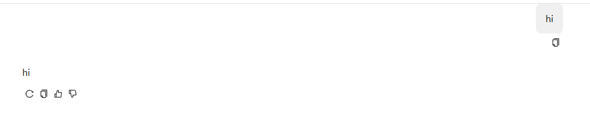

# 自定义

## 精简 直接发送消息
```java
package com.litongjava.ai.devops.bot.services;

import com.jfinal.kit.Kv;
import com.litongjava.llm.api.ChatAskService;
import com.litongjava.llm.consts.AiChatEventName;
import com.litongjava.llm.vo.ChatAskRequest;
import com.litongjava.model.body.RespBodyVo;
import com.litongjava.tio.core.ChannelContext;
import com.litongjava.tio.core.Tio;
import com.litongjava.tio.http.common.sse.SsePacket;
import com.litongjava.tio.utils.json.JsonUtils;

public class AiDevOptChatService implements ChatAskService {

  @Override
  public RespBodyVo index(ChannelContext channelContext, ChatAskRequest chatAskRequest) {
    SsePacket ssePacket = new SsePacket(AiChatEventName.delta, JsonUtils.toJson(Kv.by("content", "hi")));
    Tio.bSend(channelContext, ssePacket);
    return null;
  }
}

```

