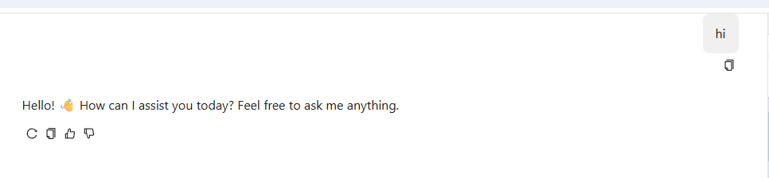

# 自定义 ChatAskService
本文将系统介绍如何在自定义 `ChatAskService` 的过程中，结合 `LlmChatHistoryService` 实现一套完整的对话业务逻辑，包括历史消息管理、上下文拼接、流式响应以及会话持久化等能力。整篇内容聚焦设计思路与实现流程，不涉及具体代码细节。

---
## 精简 直接发送消息
```java
package nexus.io.ai.devops.bot.services;

import com.jfinal.kit.Kv;
import nexus.io.llm.api.ChatAskService;
import nexus.io.llm.consts.AiChatEventName;
import nexus.io.llm.vo.ChatAskRequest;
import nexus.io.model.body.RespBodyVo;
import nexus.io.tio.core.ChannelContext;
import nexus.io.tio.core.Tio;
import nexus.io.tio.http.common.sse.SsePacket;
import nexus.io.tio.utils.json.JsonUtils;

public class AiDevOptChatService implements ChatAskService {

  @Override
  public RespBodyVo index(ChannelContext channelContext, ChatAskRequest chatAskRequest) {
    SsePacket ssePacket = new SsePacket(AiChatEventName.delta, JsonUtils.toJson(Kv.by("content", "hi")));
    Tio.bSend(channelContext, ssePacket);
    return null;
  }
}

```


## 问答示例

### 一、整体流程概览

一个完整的对话请求，从进入服务到返回结果，通常会经历以下几个阶段：

1. **接收请求参数**
2. **加载历史对话（可选）**
3. **构建上下文消息**
4. **记录当前用户问题**
5. **调用模型进行推理（支持流式）**
6. **实时推送模型输出**
7. **保存模型回复**
8. **关闭连接**

其中，`LlmChatHistoryService` 贯穿了“读取历史”和“写入历史”两个关键环节，是实现上下文对话能力的核心组件。

---

### 二、LlmChatHistoryService 的核心作用

`LlmChatHistoryService` 主要负责三类数据操作：

#### 1. 查询历史对话

用于构建上下文，使模型具备“记忆能力”。

典型作用包括：

* 获取某个 session 下的全部历史记录
* 按时间顺序还原对话上下文
* 过滤无效或非文本类型消息

#### 2. 保存用户消息

在用户发起请求时，将问题记录下来：

* 保证对话链完整
* 支持后续追溯与分析
* 为上下文拼接提供数据来源

#### 3. 保存模型回复

在模型输出完成后，将结果持久化：

* 形成完整问答对
* 支持多轮对话连续性
* 可用于训练或质量评估

---

### 三、如何基于历史实现上下文对话

#### 1. 判断是否启用历史

通常请求中会带有一个开关（如 `history_enabled`），用于控制是否使用历史上下文：

* 开启：加载历史并参与推理
* 关闭：仅基于当前输入进行回答

#### 2. 构建历史消息列表

从历史记录中提取有效内容，并转换为模型可识别的格式：

关键点：

* 仅保留文本类型消息
* 保证角色正确（user / assistant）
* 按时间顺序排列

#### 3. 拼接当前问题

将当前用户输入追加到历史消息末尾，形成完整上下文：

```
历史对话 + 当前问题 → 模型输入
```

这样模型就可以基于完整语境进行回答。

---

### 四、用户问题与模型回复的记录策略

#### 1. 用户问题记录时机

在调用模型之前记录用户问题：

优势：

* 即使模型失败，也能保留用户输入
* 支持问题追踪与重试机制

#### 2. 模型回复记录时机

在流式输出结束后统一保存：

注意点：

* 需要累积完整内容
* 避免中途写入导致数据不完整

---

### 五、流式响应与历史记录的结合

流式输出（Streaming）是提升用户体验的重要方式，但也带来一些设计上的注意事项：

#### 1. 实时输出 vs 最终存储

* 实时输出：逐段返回内容给前端
* 最终存储：在流结束后一次性保存完整结果

#### 2. 内容累积机制

需要在服务端维护一个“内容缓冲区”：

* 每次接收到模型增量输出时追加
* 最终用于保存完整回复

#### 3. 异常处理

在流式过程中可能出现：

* 网络中断
* 模型异常
* 客户端断开

需要确保：

* 能正常结束连接
* 尽量保证历史数据一致性

---

### 六、Session 机制设计

`session_id` 是串联整个对话历史的关键：

#### 作用：

* 区分不同用户或不同会话
* 实现多轮对话隔离
* 支持上下文连续性
* 每个独立对话使用唯一 session_id
* 前端负责传递 session_id
* 后端基于 session_id 查询历史


### 代码

```java
package nexus.io.ai.devops.bot.services;

import java.util.ArrayList;
import java.util.List;

import com.jfinal.kit.Kv;
import nexus.io.agent.model.LlmChatHistory;
import nexus.io.chat.PlatformInput;
import nexus.io.chat.UniChatClient;
import nexus.io.chat.UniChatEventListener;
import nexus.io.chat.UniChatMessage;
import nexus.io.chat.UniChatRequest;
import nexus.io.chat.UniChatResponse;
import nexus.io.consts.ModelPlatformName;
import nexus.io.gitee.GiteeModels;
import nexus.io.jfinal.aop.Aop;
import nexus.io.llm.api.ChatAskService;
import nexus.io.llm.consts.AgentMessageType;
import nexus.io.llm.consts.AiChatEventName;
import nexus.io.llm.service.LlmChatHistoryService;
import nexus.io.llm.vo.ChatAskRequest;
import nexus.io.model.body.RespBodyVo;
import nexus.io.openai.chat.ChatResponseDelta;
import nexus.io.tio.core.ChannelContext;
import nexus.io.tio.core.Tio;
import nexus.io.tio.http.common.sse.SsePacket;
import nexus.io.tio.http.server.util.SseEmitter;
import nexus.io.tio.utils.hutool.StrUtil;
import nexus.io.tio.utils.json.JsonUtils;
import nexus.io.tio.utils.snowflake.SnowflakeIdUtils;

import lombok.extern.slf4j.Slf4j;
import okhttp3.Response;
import okhttp3.sse.EventSource;

@Slf4j
public class AiDevOptChatService implements ChatAskService {

  private LlmChatHistoryService llmChatHistoryService = Aop.get(LlmChatHistoryService.class);

  @Override
  public RespBodyVo index(ChannelContext channelContext, ChatAskRequest chatAskRequest) {
    boolean stream = chatAskRequest.isStream();
    Long sessionId = chatAskRequest.getSession_id();
    boolean history_enabled = chatAskRequest.isHistory_enabled();
    // 1.查询历史
    List<LlmChatHistory> histories = null;
    if (history_enabled) {
      try {
        histories = llmChatHistoryService.getHistory(sessionId);
      } catch (Exception e) {
        log.error(e.getMessage(), e);
        String error = e.getMessage();
        if (stream) {
          SsePacket ssePacket = new SsePacket(AiChatEventName.error, error);
          Tio.bSend(channelContext, ssePacket);
          SseEmitter.closeSeeConnection(channelContext);
        }
        return RespBodyVo.fail(error);
      }
    }

    boolean isFirstQuestion = false;
    List<UniChatMessage> historyMessage = new ArrayList<>();

    if (histories == null || histories.size() < 1) {
      isFirstQuestion = true;
    } else {
      for (LlmChatHistory history : histories) {
        String messageType = history.getStr("type");
        String role = history.getRole();
        String content = history.getContent();

        if (AgentMessageType.TEXT.equals(messageType)) {
          if (StrUtil.notBlank(content)) {
            historyMessage.add(new UniChatMessage(role, content));
          }
        }
      }
    }

    List<UniChatMessage> messages = chatAskRequest.getMessages();
    String inputQestion = null;

    if (messages != null && messages.size() > 0) {
      inputQestion = messages.remove(0).getContent();
    }

    // 2.记录问题
    // save to the user question to db
    long questionId = SnowflakeIdUtils.id();
    try {
      llmChatHistoryService.saveUser(questionId, sessionId, inputQestion);
    } catch (Exception e) {
      log.error(e.getMessage(), e);
    }

    if (stream) {
      Kv kv = Kv.by("question_id", questionId);
      SsePacket packet = new SsePacket(AiChatEventName.message_id, JsonUtils.toJson(kv));
      Tio.bSend(channelContext, packet);
    }

    long answerId = SnowflakeIdUtils.id();

    String model = GiteeModels.DEEPSEEK_V3_1;
    // 1. 指定平台与模型
    PlatformInput platform = new PlatformInput(ModelPlatformName.GITEE, model);

    // 2. 构造消息
    List<UniChatMessage> messges = new ArrayList<>();
    if (!isFirstQuestion) {
      messges.addAll(historyMessage);
    }
    messges.add(UniChatMessage.buildUser(inputQestion));

    // 3. 构造统一请求
    UniChatRequest uniChatRequest = new UniChatRequest(platform);
    uniChatRequest.setMessages(messges);

    // 4. 注册流式事件监听器
    UniChatEventListener listener = new UniChatEventListener() {

      private final StringBuilder completionContent = new StringBuilder();
      private boolean continueSend = true;

      @Override
      public void onOpen(EventSource eventSource, Response response) {
      }

      @Override
      public void onData(UniChatResponse chatResposne) {
        // 流式增量内容从 delta 中获取
        ChatResponseDelta delta = chatResposne.getDelta();
        if (delta != null) {
          String chunk = delta.getContent();
          if (chunk != null && !chunk.isEmpty() && continueSend) {
            completionContent.append(chunk);
            Kv kv = Kv.by("content", chunk);
            SsePacket p = new SsePacket(AiChatEventName.delta, JsonUtils.toJson(kv));
            sendPacket(p);
          }
        }
      }

      @Override
      public void onFailure(EventSource eventSource, Throwable t, Response response) {
        // TODO Auto-generated method stub
        finish(eventSource);
      }

      @Override
      public void onClosed(EventSource eventSource) {
        // 关闭 SSE 连接
        finish(eventSource);
      }

      private void finish(EventSource eventSource) {
        llmChatHistoryService.saveAssistant(answerId, sessionId, model, completionContent.toString());
        // 2. 通知前端 message_id
        Kv kv = Kv.by("answer_id", answerId);
        Tio.bSend(channelContext, new SsePacket(AiChatEventName.message_id, JsonUtils.toJson(kv)));
        SseEmitter.closeSeeConnection(channelContext);
      }

      /** 三次重试发送 SSE，遇断就放弃 */
      private void sendPacket(SsePacket packet) {
        if (!continueSend)
          return;
        if (!Tio.bSend(channelContext, packet)) {
          if (!Tio.bSend(channelContext, packet)) {
            if (!Tio.bSend(channelContext, packet)) {
              continueSend = false;
            }
          }
        }
      }
    };

    // 6. 发起流式请求
    try {
      UniChatClient.stream(uniChatRequest, listener);
    } catch (Exception e) {
      log.error(e.getMessage(), e);
      String error = e.getMessage();
      if (stream) {
        SsePacket ssePacket = new SsePacket(AiChatEventName.error, "Error:" + error);
        Tio.bSend(channelContext, ssePacket);
        SseEmitter.closeSeeConnection(channelContext);
      }
      return RespBodyVo.fail(error);
    }

    return null;
  }
}

```
