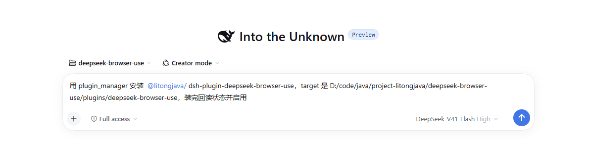
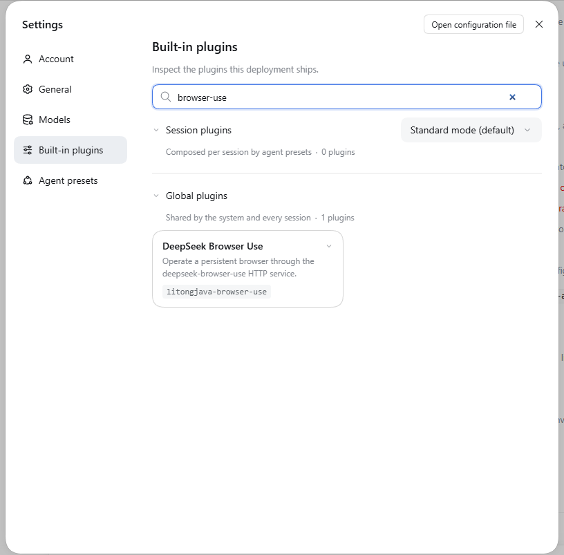

# 把 dsh-plugin-deepseek-browser-use 构建并安装到 DeepSeek Harness

前三篇已经说明插件入口、HTTP、工具和会话管理。这一篇把源码变成可安装的插件，并确认目标 Harness 真正用上了它。操作以当前插件 0.2.0、Harness 0.2.0-rc.2 为基线。

下面的命令是给读者在自己的开发机和目标 Harness 中执行的安装步骤；文档中的调用样例不表示你的宿主已经安装成功。

## 1. 先理解四个容易混淆的名字

| 名称 | 当前值 | 作用 |
| --- | --- | --- |
| npm 包名 | `@litongjava/dsh-plugin-deepseek-browser-use` | Loader 找到要加载的模块 |
| 入口导出的 `name` | `litongjava-browser-use` | 插件自身名称 |
| patch 中的 `id` | `litongjava-browser-use` | 配置中的插件实例标识 |
| 工具名 | `dsb_health`、`dsb_state` 等 | 模型实际调用的能力 |

这几个名字出现在不同层次。改工具名不等于修改包名；源码目录名也不自动成为安装器要加载的模块名。

## 2. 安装器如何从 package.json 找到入口

当前包中的关键声明如下，是 `package.json` 的**节选**，不要用它覆盖完整文件：

```json
{
  "name": "@litongjava/dsh-plugin-deepseek-browser-use",
  "version": "0.2.0",
  "type": "module",
  "exports": {
    ".": "./dist/index.js",
    "./client": "./dist/client.js",
    "./package.json": "./package.json",
    "./locale/*.json": "./locale/*.json"
  },
  "types": "./dist/index.d.ts",
  "files": [
    "dist", "locale", "cordis.patch.yml", "scripts/backend.ps1", "README.md"
  ],
  "dsh": { "bundle": { "patch": "./cordis.patch.yml" } },
  "scripts": {
    "build": "tsc -p tsconfig.json",
    "test": "npm run build && node --test test/*.test.mjs",
    "prepack": "npm run build"
  }
}
```

安装器通过 `dsh.bundle.patch` 读取启用配置；Loader 根据包名和 `exports` 加载 `dist/index.js`；然后调用插件的 `apply` 注册工具。所以“有源码”“有编译产物”“配置里有插件”“运行时已加载”是四个需要分别检查的状态。

## 3. 初次联调先选择外部服务模式

为了把插件安装问题和 Java 自动部署问题分开，第一次开发联调建议使用已经启动的服务。将插件目录中的 `cordis.patch.yml` 配置为：

```yaml
- insert:
    - id: litongjava-browser-use
      name: '@litongjava/dsh-plugin-deepseek-browser-use'
      config:
        baseUrl: http://127.0.0.1:10049
        browser: chrome
        headless: false
        timeoutMs: 60000
        maxTextChars: 24000
        maxResponseBytes: 16777216
        backendAutoStart: false
```

`insert` 插入插件配置，`name` 对应 npm 包名，`config` 进入 `apply` 的配置校验。这里的 `backendAutoStart:false` 是教学联调选择；仓库随包 patch 默认是 true。确认插件工作后可按 [35](./35.md) 切换自动管理。

直接改包内 `cordis.patch.yml` 只适合开发期：这份教学配置会随 `npm pack` 一起进入交付物；已安装实例应改 Harness 的用户 patch 层或配置入口，见 [33](./33.md)。

注意两个默认值不同：`src/index.ts` 的裸 Config 中 `backendAutoStart` 默认 false，而随包 patch 显式设置 true。最终行为要看目标宿主实际加载的配置。

`baseUrl` 从 Harness 后端主机访问。浏览器 UI 在你的笔记本上，不代表 Harness 后端的 localhost 也指向笔记本。远程服务和代理路径应使用外部模式。

## 4. 理解正式入口的完整装配

以下是当前 `src/index.ts` **完整代码**：

```typescript
import type { Context } from '@deepseek-ai/cordis';
import Schema from '@deepseek-ai/schemastery';
import { BrowserClient } from './client.js';
import { BrowserSessions } from './sessions.js';
import { createTools } from './tools.js';
import { BackendManager, defaultRepoDir, validateBackendOptions } from './backend.js';
import type {} from '@deepseek-ai/dsh-tools';
import type {} from '@deepseek-ai/dsh-agent';

export const name = 'litongjava-browser-use';
export const inject = ['tools', 'agents'];
export interface Config {
  baseUrl: string; browser: 'auto' | 'chrome' | 'chromium' | 'edge' | 'firefox'; headless: boolean; timeoutMs: number;
  maxTextChars: number; maxResponseBytes: number; maxUploadBytes: number;
  backendAutoStart: boolean; backendAutoUpdate: boolean; backendInstallDependencies: boolean;
  backendRepoDir: string; backendRepository: 'gitee' | 'github'; backendStartupTimeoutMs: number;
}
export const Config = Schema.object({
  baseUrl: Schema.string().default('http://127.0.0.1:10049'),
  browser: Schema.union(['auto', 'chrome', 'chromium', 'edge', 'firefox']).default('chrome'),
  headless: Schema.boolean().default(false),
  timeoutMs: Schema.number().step(1).min(1).max(2147483647).default(60000),
  maxTextChars: Schema.number().step(1).min(1000).default(24000),
  maxResponseBytes: Schema.number().step(1).min(1024).default(16777216),
  maxUploadBytes: Schema.number().step(1).min(1).default(8388608),
  backendAutoStart: Schema.boolean().default(false),
  backendAutoUpdate: Schema.boolean().default(true),
  backendInstallDependencies: Schema.boolean().default(true),
  backendRepoDir: Schema.string().default(defaultRepoDir()),
  backendRepository: Schema.union(['gitee', 'github']).default('gitee'),
  backendStartupTimeoutMs: Schema.number().step(1).min(1000).max(2147483647).default(120000),
});

/** Host-side tools and optional Windows backend bootstrap. Backend lifetime is independent of individual sessions. */
export function apply(ctx: Context, input: Partial<Config> = {}): void {
  const config = Config(input) as Config;
  const backend = new BackendManager({ baseUrl: config.baseUrl, repoDir: config.backendRepoDir, repository: config.backendRepository,
    autoUpdate: config.backendAutoUpdate, installDependencies: config.backendInstallDependencies, startupTimeoutMs: config.backendStartupTimeoutMs });
  if (config.backendAutoStart) {
    validateBackendOptions(backend.options);
    backend.begin('start');
  }
  const client = new BrowserClient({ ...config, ...(config.backendAutoStart ? { ensureBackend: signal => backend.ensure(signal) } : {}) });
  const sessions = new BrowserSessions(client, { browser: config.browser, headless: config.headless });
  ctx.effect(() => () => sessions.dispose(), 'deepseek-browser-use.sessions');
  for (const tool of createTools(ctx, client, sessions, config)) ctx.tools.register(tool);
  ctx.tools.register({
    name: 'dsb_backend',
    description: 'Manage the local Windows browser backend: install missing Git/JDK/Maven, clone, fast-forward update, build, start, or restart an idle owned server. Operations run in the background. Poll status for progress and errors. status inspects the current operation; inspect refreshes server health. Existing browser sessions are never forcibly restarted.',
    parameters: { type: 'object', properties: { action: { type: 'string', enum: ['status', 'inspect', 'prepare', 'start', 'update', 'restart'] } }, required: ['action'], additionalProperties: false },
    output: { schema: { type: 'object', additionalProperties: true }, render: (_args, value) => [{ type: 'text', text: JSON.stringify(value) }] },
    async execute(raw, exec) {
      exec.signal.throwIfAborted();
      if (!exec.agent || ctx.agents.get(exec.agent.id) !== exec.agent) throw new Error('Backend management requires a live Harness Agent');
      const args = raw as { action?: string };
      if (!args || Object.keys(args).some(key => key !== 'action') || !['status', 'inspect', 'prepare', 'start', 'update', 'restart'].includes(args.action ?? '')) throw new Error('Invalid backend action');
      if (args.action === 'status') return backend.status();
      return backend.begin(args.action === 'inspect' ? 'status' : args.action as 'prepare' | 'start' | 'update' | 'restart');
    },
  });
}
```

入口先校验配置，再创建 `BackendManager`。只有启用自动启动时才调用 `backend.begin('start')` 并向 HTTP 客户端传入 `ensureBackend`。普通浏览器工具由 `createTools` 批量注册，`dsb_backend` 是入口额外注册的管理工具。

因此原版共有 14 个普通工具加 1 个后端管理工具；如果完成基础篇的 `dsb_title` 练习，会再多一个。工具数量应以你实际注册的源码和宿主回读为准。

`dsb_backend` 的执行函数也校验活跃 Agent、取消信号和参数。管理操作先返回后台状态，随后轮询 status；它不会在一次工具调用里把长时间下载、构建、启动的全部日志塞进结果。自动管理实现详见 [35](./35.md)。

## 5. 编译、测试和检查打包清单

在插件目录执行：

```powershell
npm ci --ignore-scripts --legacy-peer-deps
npm test
npm pack --dry-run
npm pack
```

每一步的成功标准不同：

| 操作 | 检查什么 |
| --- | --- |
| `npm ci` | 按锁文件取得开发依赖，不更改版本选择 |
| `npm test` | TypeScript 构建，以及协议、会话、工具运行时和后端管理测试 |
| `npm pack --dry-run` | `dist/index.js`、其他 dist 模块、locale、patch 和后端脚本是否进入包 |
| `npm pack` | 生成可分发的 `.tgz`；0.2.0 文件名为 `litongjava-dsh-plugin-deepseek-browser-use-0.2.0.tgz` |

如果保留了入门篇的 `src/tutorial-hello.ts`，它会被编译进 `dist`，但正式入口不会注册这个工具。发布前应把个人练习放到单独练习分支或移出交付内容，再检查包清单。

开发时修改 `.ts` 后必须重新 build。宿主运行的是打包后的 `.js`，不是你编辑器里的 TypeScript；仅修改源码或重新保存 patch 都不能替代这个步骤。

## 6. 先确认 HTTP 服务，再安装插件

外部服务模式先按 [02](./02.md) 启动 Java，然后从 **Harness 所在主机** 检查：

```powershell
Invoke-RestMethod -Uri 'http://127.0.0.1:10049/playwright/health'
```

应获得合法的健康响应。端口不通时先修复服务地址、启动或网络问题；安装 TypeScript 包不会自动解决外部服务模式下的 Java 启动问题。

接下来在目标 DeepSeek Harness 的 GUI 侧边栏 **Plugins（插件）** 页点 Install 并填入该目录，或在会话中请智能体调用它自己的 `plugin_manager`，参数如下（`plugin_manager` 的每个动作都要求 danger-full-access 权限或本次调用单独获批，受限会话里会被直接拒绝）：

```json
{
  "action": "install_bundle",
  "target": "deepseek-browser-use/plugins/deepseek-browser-use"
}
```

也可以在会话里直接用一句自然语言描述意图，让智能体翻译成上面的工具调用。下图是在 **Creator mode**、权限为 **Full access** 的会话中安装本插件的实际输入；目录换成你机器上的绝对路径即可：



两个前提在截图里可以直接看到，缺一个都可能装不上：

- **Creator mode**：这是 Harness 的智能体模式，只有在这个模式下智能体才会拿到插件工具链（`plugin_manager`、`cordis_inspect_*`）。普通对话模式里它看不到 `plugin_manager`，只能由你在插件页手工安装。
- **Full access**：即权限预设 `danger-full-access`，它的审批策略是 `never`，所以调用不会被审批弹窗拦住。`plugin_manager` 的每个动作都要求 danger-full-access 权限或本次调用单独获批；权限不足时调用会被直接拒绝，而不是排队等待授权。

这是 **Harness 的工具调用参数，不是 PowerShell 命令，也不是网页中的 JavaScript**。目标目录必须是 Harness 后端可访问的**绝对路径**（上面为通用起见省略了本机盘符前缀），且已有编译产物。上面的目录安装方式用于本地开发；`npm pack` 生成包用于交付检查和分发，不需要为了测试这个目录先发布到 npm。

阅读管理器返回的安装、激活和错误信息。如果返回 `restart-required`，按提示重启目标 Harness，再检查工具。尤其是替换已安装包的 JavaScript 时，不要假设 Loader 已重新载入内存中的模块。如果安装因依赖的构建脚本被拦下而停在待批状态，需要你明确同意这些脚本后重试（GUI 上是 Allow these scripts and retry）。

### 6.1 回读安装状态

目录安装返回 `changed:true`、`application:applied` 时，表示包已经解析并按 `dsh.bundle.patch` 写入配置，但这还不是“工具能用”的证据。下面是本机实际安装该插件后回读到的结果，可以作为比对的样板：

```text
packageResult.output: dependencies: + @litongjava/dsh-plugin-deepseek-browser-use
                     link:D:/code/java/project-litongjava/deepseek-browser-use/plugins/deepseek-browser-use

list_bundles:  name       @litongjava/dsh-plugin-deepseek-browser-use
               version    0.2.0
               installed  true
               enabled    true
               rows       [{ rowId: litongjava-browser-use,
                             moduleName: @litongjava/dsh-plugin-deepseek-browser-use,
                             entryId: include:litongjava-browser-use }]

list_plugins:  entryId       include:litongjava-browser-use
               enabled       true
               fiberPhase    active        ← 已激活，不是只写了配置
```

回读要按这个顺序看，缺一层都不能算装好：

| 层级 | 检查结果 | 说明 |
| --- | --- | --- |
| 1. 依赖解析 | `dependencies: + ... link:<目录绝对路径>` | 本地目录安装会写成 `link:` 指向你的源码目录，不是从 npm 下载的副本 |
| 2. bundle 状态 | `installed:true`、`enabled:true` | 包已识别且未被禁用；`rows` 应正好列出 `litongjava-browser-use` |
| 3. 加载器条目 | `list_plugins` 出现 `include:litongjava-browser-use` | 对应 patch 中的 `id: litongjava-browser-use` |
| 4. 运行时激活 | 该条目 `fiberPhase` 为 `active` | 为 `null` 或缺失说明插件对象没有真正 `apply`，工具也不会注册 |
| 5. 工具注册 | 能查到 `dsb_*` 工具 | 最终证据：`dsb_health`、`dsb_navigate` 等出现在工具列表里 |

第 3、4 层需要查询运行中的 Harness，而不是只看安装返回值。在 Creator mode 会话里可以直接让智能体回读，也可以查询运行时的工具与配置目录来交叉验证。

GUI 里对应的是 **Settings → Built-in plugins（内置插件）**：在搜索框输入 `browser-use`，插件会出现在 **Global plugins（全局插件）** 分组下，显示名称 `DeepSeek Browser Use`、说明 “Operate a persistent browser through the deepseek-browser-use HTTP service.”，底部标签是 patch 里的实例 id `litongjava-browser-use`。本机安装后该页显示 “Shared by the system and every session · 1 plugins”：



这个页面能确认的正是上表第 3、4 层：插件已进入全局插件列表，说明加载器条目存在且已激活。它 **不能** 确认第 5 层（工具是否真的注册到当前会话）——插件列表是部署级视图，工具注册是会话级视图。搜索框里的关键字是 `browser-use`，不是包全名或工具名；找不到时先清空搜索框确认过滤条件，再检查安装与激活状态。

`link:` 安装有一个副作用要记住：宿主加载的是你源码目录里构建出的 `dist/*.js`。改完 `src` 只重建仓库还不够，必须让 Loader 重新加载模块（或按提示重启），否则运行中的仍是旧代码。

## 7. 用最短调用链验收

让目标 Harness 按顺序调用下面的工具；表中的 `{}` 是实际空参数对象：

| 顺序 | 工具 | 参数 | 观察点 |
| --- | --- | --- | --- |
| 1 | `dsb_health` | `{}` | HTTP 可达且响应正常，不创建浏览器任务 |
| 2 | `dsb_start` | `{}` | 创建或复用本会话任务 |
| 3 | `dsb_navigate` | `{"url":"https://example.com"}` | 成功导航到目标页面 |
| 4 | `dsb_state` | `{}` | 读到该页新状态和正文 |
| 5 | `dsb_command` | `{"method":"get_title"}` | 读取标题，确认当前页面 |
| 6 | `dsb_close` | `{}` | 只关闭本会话任务 |

如果做了 [30 篇](./30.md) 的 `dsb_title` 练习，第 5 步也可以换成 `dsb_title({})`。原版没有该工具；新工具找不到时，应检查源码是否添加、是否构建、是否安装到正确宿主、是否重新激活。

可直接给 Harness 这段任务说明：

```text
使用 dsb_ 工具检查浏览器插件。
先检查健康状态，再启动任务并打开 https://example.com。
读取页面状态和标题，报告每步结果，最后关闭本会话任务。
如果调用超时，先观察状态再决定下一步，不要盲目重复点击或提交。
```

不要只看到工具名字就宣称浏览器已接通，也不要把 HTTP smoke 通过当作 Web UI 图片已经显示。需要图片时另测 `dsb_screenshot({"view":true})`，确认当前模型支持图片、附件服务可用且 UI 实际显示。`view:true` 只依赖宿主提供的 attachments 与 llm 服务以及模型的 image 输入声明，与插件自身的配置项无关。

## 8. 修改后怎样再次交付

开发迭代按这个顺序执行：修改 `src` → `npm test` → 检查包内容 → 重新安装更新后的 bundle → 按管理器提示重启/激活 → 新会话回读验证。对外分发时使用新版本号，并同步锁文件中的包版本。

插件代码升级与 Java 后端源码更新是两条不同的路径：重新打包插件不会自动证明 Java 已更新；`dsb_backend update` 也不会升级 npm 插件。变更 Java 命令时还要更新 `commands.ts` 并验证两端一致性。

| 现象 | 优先检查 |
| --- | --- |
| 安装成功但没有 dsb_* | patch 是否启用、激活状态、是否需要重启 |
| 找不到 dist/index.js | 有没有 build，包清单是否包含 dist |
| peer dependency 不兼容 | 安装器只校验 `@deepseek-ai/dsh` 与 `@deepseek-ai/dsh-*`（`@deepseek-ai/cordis` 不参与），失败时返回 `incompatible-version` 并列出 name/version/runtimeVersion/peers；应适配版本，不能只删版本限制；确需放行时用 `list_version_exemptions`/`set_version_exemption`（需 acceptRisk）逐版本授权 |
| dsb_health 连接失败 | 从 Harness 后端检查地址和服务，不从 Web UI 机器推断 |
| task/job 归属错误 | 是否换了 Agent、拿了别的会话 job，或使用了过期上下文 |
| 工具结果提示 pending | 继续查询本会话 dsb_job，观察终态 |
| view=true 失败 | 模型 image 声明、当前路由、attachments 和 llm 服务 |
| 自动管理失败 | dsb_backend status 的错误和日志，见 [35](./35.md) |

## 9. 接下来怎样阅读原有三篇

你现在已经从插件入口走到了安装验收，可以把原有文章作为使用和维护手册：

- [33：安装、配置与使用](./33.md)：查完整配置项、工具参数和日常调用。
- [34：源码、生命周期与测试](./34.md)：从维护角度回顾整体边界和测试策略。
- [35：后端自动管理](./35.md)：进一步学习安装依赖、更新、构建和托管 Java 进程。

上一篇：[核心功能](./31.md)。下一篇：[原生浏览器插件：安装、配置与使用](./33.md)。
