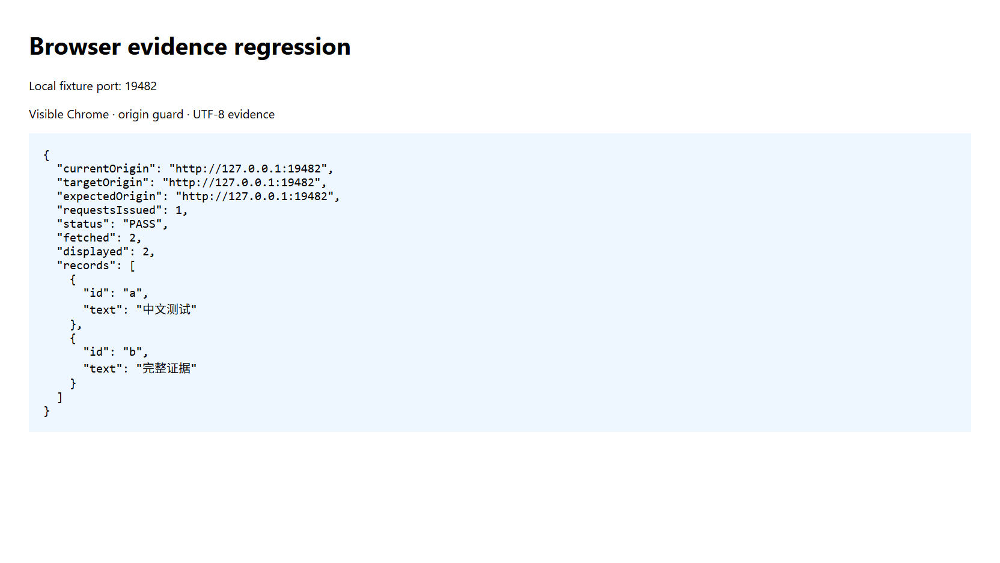

# 可靠的数据采集：上下文校验、UTF-8 留档与证据口径

浏览器自动化把可见页面、接口响应与调用留档连接起来。将动作执行、输出处理和业务结论分开记录，可以减少重复操作，并让分析结果可以追溯。本章只介绍通用采集能力，不包含具体应用的业务报告。

## 1. 使用明确的客户端入口

```powershell
dsb methods
dsb --id 1001 start --browser chrome --headful
dsb --id 1001 run go_to_url -p url=https://example.com --out navigation.json
dsb --id 1001 state --text-only
```

`methods` 是 CLI 子命令；协议方法使用 `dsb run list_methods`。任务 ID 使用数字，先确认教学 ID 没有被占用。已有登录态优先从页面的账号入口和受限内容确认，不需要导出整份 Cookie。

`--select data.text` 只接受一个字段路径，不是多字段查询语法。需要多个字段时用 `--out` 保存完整回执，再由读取程序投影。有关请求前校验和字面逗号键的兼容规则，见 [客户端](./37.md)。

### 输出结果和执行结果分开

字段存在与否只能在收到响应后判断。输出阶段退出码 3，并不表示浏览器动作未执行。先读取当前会话留档或 `dsb last`，必要时读取新的页面状态，不要重新发送点击或提交。对 `go_to_url` 同样适用：不必为了恢复输出再导航一次。

`--out` 保存完整响应且优先于 `--select`，不能用两者的组合断言投影路径存在。明确缺失的字段与值为 JSON null 的字段也要区分。

## 2. UTF-8 完整留档

```powershell
dsb --id 1001 state --out state.json
dsb --id 1001 js "@collect.js" --out records.json
```

客户端直接写入 UTF-8 JSON，不需要经过 shell 文本重定向。Windows PowerShell 的 `> 文件` 可能生成 UTF-16；`2>&1` 会把诊断和正文混合，不能再当作纯 JSON。读取时使用宿主提供的文本读取工具，明确以 UTF-8 解释客户端留档。

如果旧文件被识别为二进制，优先读取客户端原始留档，不要绕过读取工具或重新执行业务动作。不得通过寻找输出中第一个 `{` 或字符串截断来猜测 JSON 边界；数组响应、摘要和日志都可能破坏这种假设。终端展示可以精简，完整原文必须先保存。

## 3. 相对请求先检查文档上下文

页面内 `fetch("/api/records")` 相对当前文档的 `document.baseURI` 解析，不会自动找到另一个子域名。`credentials: "same-origin"` 控制凭据发送，不负责切换站点；不同端口也属于不同 origin。选定 iframe 时，应在同一个 frame 内执行校验和读取。

保存以下示例为 `collect.js`，把占位站点与接口替换为实际观察到的目标；先导航到目标页面，读取新状态，再执行：

```javascript
async () => {
  const expectedOrigin = "https://example.com";
  const target = new URL("/api/records", document.baseURI);
  if (location.origin !== expectedOrigin || target.origin !== expectedOrigin) {
    return {
      status: "ORIGIN_MISMATCH",
      currentOrigin: location.origin,
      targetOrigin: target.origin,
      expectedOrigin,
      requestsIssued: 0
    };
  }

  const response = await fetch(target.href, {
    credentials: "same-origin",
    redirect: "error"
  });
  if (!response.ok) {
    throw new Error("HTTP " + response.status);
  }
  const contentType = response.headers.get("content-type") || "";
  if (!contentType.includes("application/json")) {
    throw new Error("Expected JSON response; verify page and login state");
  }
  const payload = await response.json();
  if (!Array.isArray(payload.records)) {
    throw new Error("Expected records array");
  }
  return {
    status: "PASS",
    sourceUrl: target.href,
    fetchedAt: new Date().toISOString(),
    fetched: payload.records.length,
    displayed: payload.records.length,
    truncated: false,
    records: payload.records
  };
}
```

`Failed to fetch` 不是 CORS 的专用错误。先核对当前页、请求 URL、重定向和登录状态，再结合网络记录及控制台定位原因。无法确认时保留原始错误并标记原因待定，不把网络异常当作空结果。示例拒绝重定向；确有重定向需求时应单独检查目的地，而不是关闭浏览器安全机制。

## 4. 采集量不等于阅读量

建议每条数据保留稳定 ID、来源链接、发布时间、采集时间、完整文本和截断标记，并记录排序、分页、回复层级及退出原因。

| 口径 | 含义 |
| --- | --- |
| fetched | 接口取得的记录数 |
| displayed | 实际提交给分析者的记录数 |
| read | 分析者实际检查的记录数，采集脚本不能自动推断 |
| unique | 按稳定 ID 去重后的数量 |
| valid | 去除无关、营销、重复、纯表情等内容后纳入分析的数量 |
| truncated | 文本或展示被截断，需补读后才能声称全文已读 |

只取首批热评不能声称读完全部评论；一级评论与楼中楼回复应分别计数。广告、转述、未经证实的传言和自述体验分开标注。多条推广文案不能自动算作多份独立需求证据，点赞量也不等于付费意愿。匿名化引用应仍能追溯来源，不收集不必要的身份资料。

## 5. 有头浏览器验证记录

本轮在两个本地 HTTP origin 上使用真实 Chrome 验证，未访问或修改任何社交账号数据。测试页将断言结果写入 DOM，使人和工具能看到同一份结果。

| 用例 | 操作与结果 | 状态 |
| --- | --- | --- |
| 站点不匹配 | 当前端口 19481，预期 19482，返回 ORIGIN_MISMATCH，测试脚本请求数为 0 | PASS |
| 站点匹配 | 导航到 19482 后执行同一脚本，返回两条完整中文记录，fetched=displayed=2 | PASS |
| 中文留档 | 通过 --out 保存，并用宿主文本读取工具读取两条中文记录 | PASS |
| 多路径前置校验 | 独立构建的客户端拒绝导航命令中的 data.title,data.url，退出 3；随后读取 URL，浏览器仍在 19482 | PASS |
| 输出失败恢复 | 读取 URL 后选择不存在的字段，提示动作可能完成；使用同一留档的 last 取得完整响应 | PASS |
| 截图留证 | 截图回执确认 viewport、未降级；本地 OCR 识别 PASS 与中文内容 | PASS（视口证据） |



图像保存在 assets 目录。这是视口截图，不是整页证明；本轮模型无法直接读取图像，因此只以截图回执、DOM 和 OCR 检查证据，不声称完成视觉布局审核。本地夹具仅验证请求上下文和留档流程，不证明任何第三方网站接口稳定性或市场需求。
