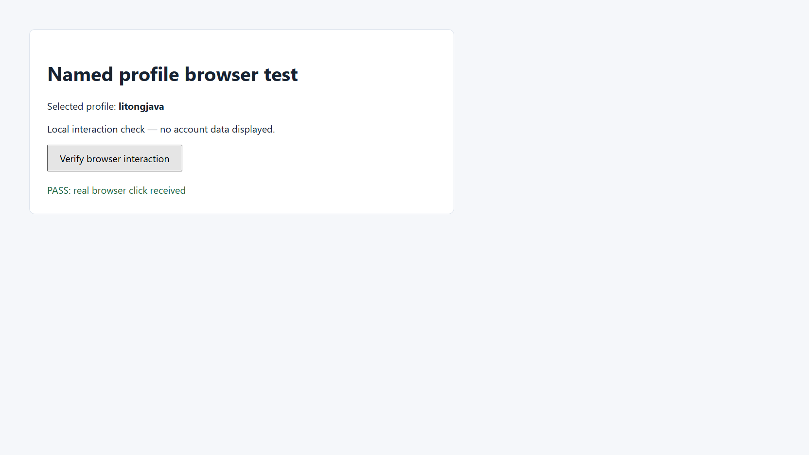

# 浏览器 profile：列表、克隆与选择

本文说明如何发现服务端的 Chrome profile、离线克隆为独立命名 profile，以及在启动时选择它。共享浏览器与登录态基础见 [05](./05.md)，客户端安装见 [37](./37.md)。

[[toc]]

## 一、先分清目录与名称

- `userDataDir`：用户数据根目录，里面通常有 `Local State` 和多个子 profile。
- `profileDirectory`：根目录内的子目录，如 `Default`、`Profile 5`，不是账号邮箱或 Chrome 界面显示名称。
- `profile`：服务管理的命名 profile，如 `litongjava`，不是任意本机 Chrome 子目录的别名。

命名根目录由服务端配置 `browser.profiles.dir` 指定，默认是 `~/.config/browseruse/profiles/named`。下文的 `~` 表示服务运行用户的主目录；路径占位符使用前须替换。连接远端服务时，列表、源路径和目标目录都属于**服务端机器**，不是运行 dsb 的客户端。

## 二、列出可发现的 profile

```powershell
dsb profiles
dsb profile list
# 等价的协议调用
dsb run list_profiles
# 仅投影列表；完整输出可能含本机路径，不直接公开
dsb profiles --select data.profiles
```

`profiles` 是 `profile list` 的别名，两者调用 `list_profiles`，请求不需要先创建浏览器任务：

```json
{"method":"list_profiles","params":{}}
```

返回的 `data.profiles` 是类型化对象数组，不是名称字符串数组。核心字段如下：

| 字段 | 类型 | 含义 |
| --- | --- | --- |
| `name` | string / null（空值可省略） | 命名托管项的选择名称；本机 Chrome 项通常为 `Default` 或 `Profile 5`，不能仅凭此字段当作命名 profile |
| `displayName` | string / null | 供人识别的显示名称，不是 `--profile` 的选择键；不应据此判断账号登录状态 |
| `userDataDir` | string | 服务端用户数据根目录 |
| `profileDirectory` | string | 实际子目录名称；命名克隆固定为 `Default` |
| `source` | string | `managed` 表示托管目录；`chrome` 表示本机 Chrome 目录 |
| `selectable` | boolean | 本次发现时是否通过目录与占用检查，不保证稍后启动成功 |
| `reason` | string / null | 不可选原因或提示；无内容时可能随空值省略配置而不输出 |

列表包含命名托管目录、服务端探测到的本机 Chrome 子目录，以及已存在且未重复列出的默认/配置托管根目录。后者的 `source` 是 `managed`，但 `name` 为 null，开启 `skipNull` 时该字段省略，需要用 `userDataDir` / `profileDirectory` 选择，不能传 `--profile`。只有 `source=managed` 且有命名选择键的项目才按该名称选择。它不是全盘扫描，也不代表每个列出的名称都能用 `--profile`。本机 Chrome 默认根目录即使 `selectable:true`，`reason` 仍可能建议先克隆，因为 Chrome 可能拒绝对系统默认目录开启远程调试。

## 三、离线克隆为 litongjava

先正常退出使用源目录的 Chrome，包括后台进程。不要强行删除锁文件来绕过检查，也不要关闭其他用户或任务的浏览器。确认源目录空闲后执行：

```powershell
dsb --timeout 900 profile clone --name litongjava --source-user-data-dir "<Chrome User Data>" --source-profile-directory Default
```

较大的 profile 建议使用 `--timeout 900`，将客户端等待时间设为 900 秒。客户端等待与服务端执行期限是两个独立限制：克隆使用服务端硬超时配置 `browser.command.hardTimeoutMs`（单位毫秒），仅调大 CLI 超时不会延长服务端期限；需要更长时间时应由管理员核对并调整服务端配置。超时不等于复制没有发生，应先检查响应、日志和目标是否存在，不要立即重复克隆或删除目标。

CLI 使用连字符参数，协议使用 camelCase：

```json
{
  "method": "clone_profile",
  "params": {
    "name": "litongjava",
    "sourceUserDataDir": "<Chrome User Data>",
    "sourceProfileDirectory": "Default"
  }
}
```

`name` 使用 1–64 个 ASCII 字母、数字、下划线或连字符，首字符必须为字母或数字。不要填路径、邮箱或 `..`。本例将所选 `Default` 复制为独立命名 profile `litongjava`：

```text
<命名根目录>/litongjava/
├── Local State          # 源文件存在时复制并调整 profile 元数据
└── Default/             # 克隆后的子目录仍叫 Default
    └── Preferences      # 存在时把 profile 显示名称改为 litongjava
```

“重命名为 litongjava”指**托管名称和 Chrome profile 显示名称**，并不是把子目录 `Default` 改名成 `litongjava`。选择 `Profile 5` 作为源时，克隆后的子目录也归一为 `Default`。

### 响应字段

| 字段路径 | 类型 | 含义 |
| --- | --- | --- |
| `data.profile` | profile 对象 | 克隆结果，字段与列表项一致 |
| `data.copiedFiles` | integer / 十进制字符串 | 复制文件数；当前响应配置将 long 输出为字符串 |
| `data.copiedBytes` | integer / 十进制字符串 | 复制字节数；当前响应配置将 long 输出为字符串，不代表最后目录的完整磁盘占用 |
| `data.warning` | string | 离线副本与加密凭据的限制说明，调用成功也应读取 |

不把复制计数当作“所有登录信息已经迁移”的证据。只复制所选子 profile 和根目录的 `Local State`，不是复制整个 Chrome 用户数据树；已知缓存目录（如 `Cache`、`Code Cache`、`GPUCache`、`CacheStorage`）和临时 `LOCK` 文件不迁移；根目录的锁标记则会阻止克隆。

### 安全边界

- 目标名称已存在时拒绝，不覆盖、不合并旧目录。
- 源目录正在使用或存在锁标记时拒绝；复制期间源发生变化也可能失败。
- 拒绝符号链接及不安全的路径；不通过链接跳到其它目录复制。源与目标不能相互包含。
- 离线克隆不会启动浏览器，也不会自动登录、导出明文密码或解密 Cookie。
- 加密 Cookie、已保存密码和网站会话可能无法在副本里继续使用，**不保证保留登录状态**；需要时交给用户重新登录。

## 四、启动时选择 profile

### 4.1 选择命名副本

```powershell
dsb --id 1001 start --browser chrome --headful --profile litongjava
```

对应协议参数：

```json
{"id":"1001","method":"start","params":{"browser":"chrome","headless":false,"profile":"litongjava"}}
```

1001 是示例任务 ID，使用前确认未被占用。名称从命名根目录解析；未知名称直接报错，不自动新建、不退回默认目录。

### 4.2 直接选择独立用户数据目录

若已有合适的非默认独立目录，可以不用命名副本：

```powershell
dsb --id 1001 start --browser chrome --headful --user-data-dir "<独立 User Data>" --profile-directory "Profile 5"
```

```json
{"id":"1001","method":"start","params":{"browser":"chrome","headless":false,"userDataDir":"<独立 User Data>","profileDirectory":"Profile 5"}}
```

`userDataDir` 指根目录，不是其下的 `Profile 5`。上述两种启动方式是替代方案，不能把 `profile` 与 `userDataDir` 或 `profileDirectory` 混在同一请求中。

### 4.3 浏览器、错误与共享任务

显式 profile 选择**仅支持 Chrome**；省略 `browser` 或使用 `auto` 时也按 Chrome 处理，不会回退到内置 Chromium。显式指定 Edge、Firefox 或 Chromium 与 profile 选择组合时应报错。目录缺失、名称未知、占用或启动失败都不能静默换一份 profile；旧的 `browser.chrome.profileFallback` 不改变这一规则。

一个服务进程仍只有一个共享浏览器，任务按页签隔离，不是按 profile 隔离。有任务运行时不能切换 profile。先用 `dsb tasks` 查看状态，**只关闭自己的任务**：

```powershell
dsb tasks
dsb --id 1001 close
```

其他任务由所属用户结束；不要为了切换 profile 使用 `shutdown` 清掉别人任务。等所有任务结束后再以新 profile 启动。若要并行运行不同 profile，使用不同服务实例、端口和互不重叠的用户数据目录。

## 五、默认目录限制不等于“不能复制”

Chrome 的 `DevTools remote debugging requires a non-default data directory` 限制针对系统默认用户数据目录。设置注册表策略 `RemoteDebuggingAllowed` 为允许，不等于解除这个目录限制。不要把修改注册表或降级 Chrome 当作解决步骤。

支持的路径是**非默认目录的独立副本**。复制可用与登录态可用是两件事：副本可以正常启动，Cookie 或保存的密码仍可能因加密机制、系统环境或站点会话规则而不可用。必要时在该独立 profile 中重新登录，再让后续任务复用；不能承诺复制后免登录。

### 身份与登录状态分别核验

`userProfile=false` 表示没有直接使用日常用户数据目录，并不表示网站未登录；命名副本也返回该值。`profileSeenBefore=true` 只表示目录先前存在，不能证明 Cookie 有效。先核对启动响应和 `chrome://version` 的 Profile Path，再以目标网站实际页面确认登录状态。不要为判断登录是否成功而导出 Cookie 或保存密码。

## 六、验证与证据

本次在 Windows 的本机 Chrome 中完成命令行与有头浏览器验收。测试页面为不含账号信息的本地交互页，账号登录状态没有作为验收前提，也未验证 Google 登录是否保留。

| 用例 | 实际断言 | 结果 |
| --- | --- | --- |
| 列出 profiles | 返回结构化 JSON 对象，显示名与 Chrome Local State 配置一致 | PASS |
| 克隆为 litongjava | 单次复制 3,352 个文件、747,743,151 字节；缓存与临时锁文件排除 | PASS |
| 源数据保护 | 复制前后 Local State、Preferences、Bookmarks 的 SHA-256 一致；副本书签与源书签一致 | PASS |
| 指定 profile 启动 | 回执为 chrome、headless=false、profile=litongjava、profileDirectory=Default；chrome://version 的 Profile Path 指向该副本 | PASS |
| 可见浏览器交互 | 打开本地测试页，原生点击按钮后 DOM 出现 PASS: real browser click received | PASS |
| 显式目录启动 | 结束原测试任务后，用 userDataDir/profileDirectory 启动同一副本，导航和点击成功 | PASS |
| 同名复用 | 第二任务复用相同 profile，关闭第二任务不影响第一任务 | PASS |
| 运行中切换 | 请求不同用户数据目录被拒绝，原任务及其页面保留 | PASS |
| 未知名称 | INVALID_ARGUMENT，started=false，不回退默认 profile | PASS |
| 重复目标 | 已存在的 litongjava 被拒绝，不覆盖 | PASS |
| 活跃源复制 | 正在运行的副本被拒绝作为克隆源，测试目标未创建 | PASS |
| 旧服务兼容保护 | 旧服务未声明 list_profiles 时 CLI 在发送 start 前拒绝 | PASS |
| Google 登录状态 | 没有登录验证或读取凭据 | NOT_RUN |

Go 测试及 go vet 通过。Java 的浏览器选择相关测试与 profile 测试通过；补充回归覆盖实际 JSON 输出、名称来源、长任务标记、参数校验和中断清理。构建使用 build 命令，跳过 GPG 签名。

截图为**视口证据**：截图回执 stage=complete、actualMode=viewport、capture_degraded=false。页面文本与点击结果已核验；截图文件已保存，但本轮模型不支持图像输入，未做视觉布局审查。该图只展示交互页，不是登录态证据，也不独立证明浏览器 profile 身份；身份由启动回执与 chrome://version 文本交叉核验。


