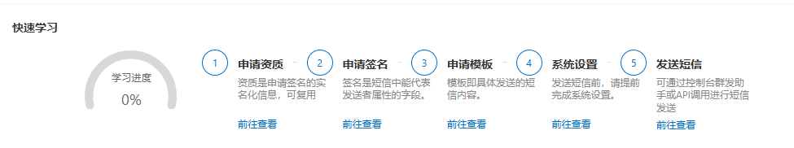
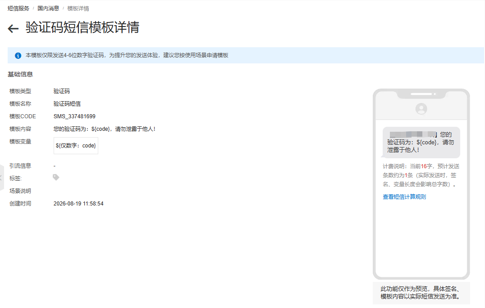
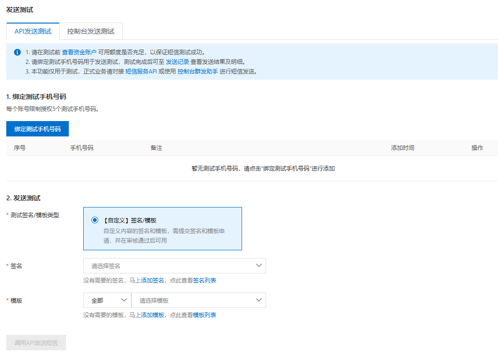
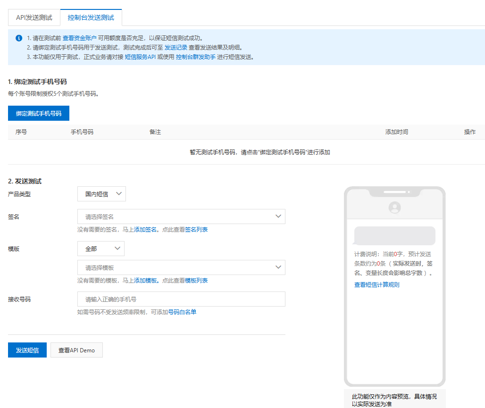
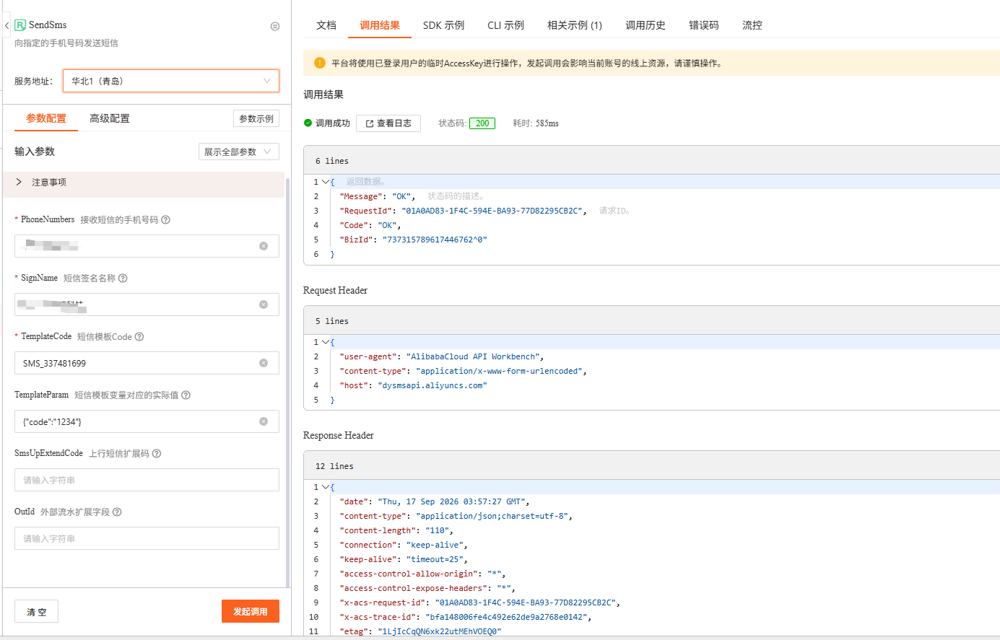

# 阿里云短信登录和注册

[[toc]]

## 1. 控制台准备与图片说明

### 申请资质、签名和模板

依次完成资质、短信签名、验证码模板和系统设置。短信签名、模板应审核通过，账户应有足够余额，调用身份应具有 `dysms:SendSms` 权限。



模板详情中确认模板 Code 和变量名。图中的 `${code}` 是模板变量，调用时通过 `TemplateParam` 填充；图中模板支持 4–6 位数字，本例生成 6 位数字。`1234` 只用于控制台演示，不是业务固定验证码。



### API 发送测试

在“发送测试 → API发送测试”页面按提示绑定自己控制的测试手机号，选择已通过审核的签名与验证码模板，然后进入 API 调试。图示测试入口要求绑定号码，不代表正式接口只能向此号码发送；正式业务把经过校验的用户手机号传入 `PhoneNumbers`，并遵守账号的实际发送权限与限额。



### 控制台发送测试

也可以使用“控制台发送测试”：选择国内短信、短信签名、模板和接收号码，填写模板变量后发送，并到发送记录查看结果。这里的预览不代表已发送。



### OpenAPI 调试参数与结果

| 参数 | 填写方式 |
| --- | --- |
| `PhoneNumbers` | 自己控制的测试手机号；正式请求使用用户提交且通过校验的手机号 |
| `SignName` | 审核通过的短信签名名称，通过配置读取 |
| `TemplateCode` | 审核通过的验证码模板 Code，通过配置读取 |
| `TemplateParam` | JSON 字符串，例如 `{"code":"1234"}`；业务发送时替换为随机验证码 |
| `OutId` | 可选，使用本地验证码记录 ID，便于关联排查 |



图中 HTTP 200 且业务 `Code=OK`，表示该次 API 请求已被接受。仅检查 HTTP 状态码不够，也不能把 `OK` 当作手机一定收到短信的证明。可以使用 `BizId` 查询发送明细，并结合手机实际收件结果判断送达。此图是已有控制台测试记录，不代表下方项目代码已经完成真实发送测试。

官方参考：[SendSms 参数与返回值](https://help.aliyun.com/zh/sms/developer-reference/api-dysmsapi-2017-05-25-sendsms)、[Java SDK 接入](https://help.aliyun.com/zh/sms/developer-reference/using-java-openapi-example)。

## 2. Maven 与 EnvUtils 配置

```xml
<dependency>
  <groupId>com.aliyun</groupId>
  <artifactId>dysmsapi20170525</artifactId>
  <version>4.6.0</version>
</dependency>
```

在部署环境或本地不提交的 `.env` 中配置。密钥不得放进前端、Git、接口响应或日志。独立程序读取前调用 `EnvUtils.load()`；框架启动已加载环境时无需重复调用。

```properties
SMS_PLATFORM=aliyun
ALIBABA_CLOUD_ACCESS_KEY_ID=
ALIBABA_CLOUD_ACCESS_KEY_SECRET=
ALIYUN_SMS_SIGN_NAME=填写已审核签名
ALIYUN_SMS_TEMPLATE_CODE=填写登录注册模板Code
ALIYUN_SMS_BIND_TEMPLATE_CODE=填写绑定手机号模板Code
ALIYUN_SMS_ENDPOINT=dysmsapi.aliyuncs.com
ALIYUN_SMS_REGION=cn-hangzhou
SMS_CODE_SECRET=填写至少32字符的独立随机密钥
SMS_CODE_VALID_SECONDS=300
SMS_PHONE_DAILY_LIMIT=10
SMS_IP_HOURLY_LIMIT=20
SMS_TOTAL_DAILY_LIMIT=100
AUTH_TOKEN_SECRET=填写至少32字符的登录Token签名密钥
```

`SMS_CODE_SECRET` 用于验证码摘要，和阿里云 AccessKey 用途不同。轮换摘要密钥会使未消费的旧验证码失效。配额应按实际业务调整；公网还应在网关配置频率限制和必要的人机校验。

## 3. 表结构与平台来源

`platform=aliyun` 表示该验证码实际由阿里云发送，腾讯云可写 `tencent`。验证码与用户账号来源分开；`code_type=2` 用于登录注册，`3` 用于绑定手机号，`verification_type=3` 则表示短信验证方式。

上一章的表足以表达服务商，但完整一次性校验还需要发送状态、失败次数和消费时间。本节给出 PostgreSQL 的完整结构，使用 HMAC 摘要代替明文验证码；不能直接套用上一章 MySQL 的 `TIMESTAMPDIFF`。如果已有旧表，仅 `CREATE TABLE IF NOT EXISTS` 不会升级字段，应先核对并手动迁移。框架启动不自动建表。

```sql
CREATE TABLE IF NOT EXISTS sys_sms_code (
  id BIGINT PRIMARY KEY,
  tenant_id BIGINT NOT NULL DEFAULT 0,
  platform VARCHAR(32) NOT NULL,
  area_code VARCHAR(8) NOT NULL DEFAULT '86',
  phone VARCHAR(20) NOT NULL,
  code_hash VARCHAR(64) NOT NULL,
  code_type INTEGER NOT NULL CHECK (code_type IN (2,3)),
  valid_seconds INTEGER NOT NULL CHECK (valid_seconds > 0),
  status VARCHAR(16) NOT NULL CHECK (status IN ('pending','sent','failed','consumed','superseded')),
  failed_attempts INTEGER NOT NULL DEFAULT 0,
  ip VARCHAR(64),
  request_id VARCHAR(128),
  biz_id VARCHAR(128),
  create_time TIMESTAMPTZ NOT NULL DEFAULT CURRENT_TIMESTAMP,
  sent_time TIMESTAMPTZ,
  consumed_time TIMESTAMPTZ,
  deleted SMALLINT NOT NULL DEFAULT 0
);
CREATE INDEX IF NOT EXISTS idx_sys_sms_phone ON sys_sms_code(tenant_id,phone,create_time DESC);
CREATE INDEX IF NOT EXISTS idx_sys_sms_ip ON sys_sms_code(tenant_id,ip,create_time DESC);
COMMENT ON COLUMN sys_sms_code.platform IS 'Actual SMS provider, e.g. aliyun or tencent';
COMMENT ON COLUMN sys_sms_code.code_hash IS 'HMAC-SHA256 bound to record ID, phone and purpose; never plaintext';
COMMENT ON COLUMN sys_sms_code.code_type IS '2 login/register, 3 phone binding';

```

发送前先提交 `pending` 记录作为限流预留，再调用外部服务。服务接受后改为 `sent`，失败或超时改为 `failed`；失败不退还限流额度。重发成功使同手机号同用途的旧记录失效。进程在发送后中断可能留下 `pending`，它不能用于登录，用户需要重新获取。

## 4. 阿里云发送适配器

以下类只负责调用阿里云。模板变量由 JSON 序列化生成，不拼接未经校验的文本；关闭自动重试，避免超时后重复发送。只向上返回请求 ID 和回执 ID。

```java
package com.example.auth.integration;

import com.aliyun.dysmsapi20170525.Client;
import com.aliyun.dysmsapi20170525.models.SendSmsRequest;
import com.aliyun.dysmsapi20170525.models.SendSmsResponse;
import com.aliyun.teaopenapi.models.Config;
import com.aliyun.teautil.models.RuntimeOptions;
import com.jfinal.kit.Kv;
import nexus.io.tio.boot.exception.BusinessException;
import nexus.io.tio.utils.environment.EnvUtils;
import nexus.io.tio.utils.json.Json;

public class AliyunSmsSender {
  private volatile Client client;

  public static String required(String name) {
    String value = EnvUtils.get(name);
    if (value == null || value.isBlank()) {
      throw new BusinessException(503, "短信配置缺失：" + name);
    }
    return value;
  }

  protected synchronized Client client() throws Exception {
    if (client == null) {
      Config config = new Config().setAccessKeyId(required("ALIBABA_CLOUD_ACCESS_KEY_ID"))
          .setAccessKeySecret(required("ALIBABA_CLOUD_ACCESS_KEY_SECRET"))
          .setEndpoint(EnvUtils.get("ALIYUN_SMS_ENDPOINT", "dysmsapi.aliyuncs.com"))
          .setRegionId(EnvUtils.get("ALIYUN_SMS_REGION", "cn-hangzhou"))
          .setConnectTimeout(5000).setReadTimeout(10000);
      client = new Client(config);
    }
    return client;
  }

  public Kv send(String phone, String code, long id, int purpose) {
    try {
      String templateKey = purpose == 3 ? "ALIYUN_SMS_BIND_TEMPLATE_CODE" : "ALIYUN_SMS_TEMPLATE_CODE";
      SendSmsRequest request = new SendSmsRequest().setPhoneNumbers(phone)
          .setSignName(required("ALIYUN_SMS_SIGN_NAME")).setTemplateCode(required(templateKey))
          .setTemplateParam(Json.getJson().toJson(Kv.by("code", code))).setOutId(Long.toString(id));
      RuntimeOptions options = new RuntimeOptions().setAutoretry(false);
      SendSmsResponse response = client().sendSmsWithOptions(request, options);
      if (response == null || response.getBody() == null || !"OK".equals(response.getBody().getCode())) {
        String errorCode = response == null || response.getBody() == null ? "EMPTY_RESPONSE" : response.getBody().getCode();
        throw new BusinessException(502, "短信发送未成功：" + errorCode);
      }
      return Kv.by("requestId", response.getBody().getRequestId()).set("bizId", response.getBody().getBizId());
    } catch (BusinessException e) {
      throw e;
    } catch (Exception e) {
      // SDK exception messages can contain request parameters or credentials.
      throw new BusinessException(502, "短信服务暂不可用，请稍后重试");
    }
  }
}

```

## 5. 验证码服务

只接受大陆 11 位手机号。验证码由 `SecureRandom` 生成，包含前导零时仍按字符串处理。数据库记录绑定手机号、用途、平台及有效期；同一验证码最多允许 5 次错误尝试。锁与事务使用 PostgreSQL `READ COMMITTED`，确保多个实例并发时只能成功消费一次。错误次数必须先提交，再抛业务异常，避免计数回滚。

```java
package com.example.auth.service;

import java.nio.charset.StandardCharsets;
import java.security.MessageDigest;
import java.security.SecureRandom;
import java.util.HexFormat;
import javax.crypto.Mac;
import javax.crypto.spec.SecretKeySpec;
import com.jfinal.kit.Kv;
import com.example.auth.integration.AliyunSmsSender;
import nexus.io.db.activerecord.Db;
import nexus.io.jfinal.aop.Aop;
import nexus.io.tio.boot.exception.BusinessException;
import nexus.io.tio.utils.environment.EnvUtils;
import nexus.io.tio.utils.snowflake.SnowflakeIdUtils;

public class SmsService {
  private final AliyunSmsSender sender = Aop.get(AliyunSmsSender.class);
  private final SecureRandom random = new SecureRandom();

  public static void validatePhone(String phone) {
    if (phone == null || !phone.matches("1[3-9][0-9]{9}")) {
      throw new BusinessException(400, "请输入中国大陆11位手机号码");
    }
  }

  private void lock(String value) {
    Db.query("select pg_advisory_xact_lock(hashtextextended(?,0))", "sms:" + value);
  }

  private int positive(String key, int fallback) {
    int value = EnvUtils.getInt(key, fallback);
    if (value <= 0) {
      throw new BusinessException(503, "短信限额配置无效");
    }
    return value;
  }

  private String hash(long id, String phone, int purpose, String code) {
    String secret = AliyunSmsSender.required("SMS_CODE_SECRET");
    if (secret.length() < 32) {
      throw new BusinessException(503, "SMS_CODE_SECRET 至少需要32个字符");
    }
    try {
      Mac mac = Mac.getInstance("HmacSHA256");
      mac.init(new SecretKeySpec(secret.getBytes(StandardCharsets.UTF_8), "HmacSHA256"));
      byte[] digest = mac.doFinal((id + ":" + phone + ":" + purpose + ":" + code).getBytes(StandardCharsets.UTF_8));
      return HexFormat.of().formatHex(digest);
    } catch (java.security.GeneralSecurityException e) {
      throw new IllegalStateException("Cannot hash verification code", e);
    }
  }

  public void send(String phone, int purpose, String ip) {
    validatePhone(phone);
    if (purpose != 2 && purpose != 3) {
      throw new BusinessException(400, "验证码用途不支持");
    }
    long id = SnowflakeIdUtils.id();
    String code = String.format(java.util.Locale.ROOT, "%06d", random.nextInt(1000000));
    String codeHash = hash(id, phone, purpose, code);
    int validSeconds = positive("SMS_CODE_VALID_SECONDS", 300);
    boolean reserved = Db.txResult(java.sql.Connection.TRANSACTION_READ_COMMITTED, () -> {
      // Short reservation transaction; network calls happen after it commits.
      lock("send-budget");
      lock(phone);
      long recent = Db.queryLong("select count(*) from sys_sms_code where tenant_id=0 and phone=? and create_time>now()-interval '60 seconds'", phone);
      long daily = Db.queryLong("select count(*) from sys_sms_code where tenant_id=0 and phone=? and create_time>now()-interval '24 hours'", phone);
      long total = Db.queryLong("select count(*) from sys_sms_code where tenant_id=0 and create_time>now()-interval '24 hours'");
      long ipCount = ip == null ? 0 : Db.queryLong("select count(*) from sys_sms_code where tenant_id=0 and ip=? and create_time>now()-interval '1 hour'", ip);
      if (recent > 0 || daily >= positive("SMS_PHONE_DAILY_LIMIT", 10)
          || total >= positive("SMS_TOTAL_DAILY_LIMIT", 100) || ipCount >= positive("SMS_IP_HOURLY_LIMIT", 20)) {
        return false;
      }
      Db.update("insert into sys_sms_code(id,platform,phone,code_hash,code_type,valid_seconds,status,ip) values (?,'aliyun',?,?,?,?,'pending',?)",
          id, phone, codeHash, purpose, validSeconds, ip);
      return true;
    });
    if (!reserved) {
      throw new BusinessException(429, "短信请求过于频繁，请稍后再试");
    }
    Kv receipt;
    try {
      receipt = sender.send(phone, code, id, purpose);
    } catch (RuntimeException e) {
      Db.update("update sys_sms_code set status='failed' where id=? and status='pending'", id);
      throw e;
    }
    Db.txResult(java.sql.Connection.TRANSACTION_READ_COMMITTED, () -> {
      lock(phone);
      Db.update("update sys_sms_code set status='superseded' where tenant_id=0 and phone=? and code_type=? and id<>? and status='sent'", phone, purpose, id);
      Db.update("update sys_sms_code set status='sent',sent_time=now(),request_id=?,biz_id=? where id=? and status='pending'",
          receipt.getStr("requestId"), receipt.getStr("bizId"), id);
      return id;
    });
  }

  public void verify(String phone, String code, int purpose) {
    validatePhone(phone);
    if (code == null || !code.matches("[0-9]{6}")) {
      throw new BusinessException(400, "请输入6位短信验证码");
    }
    boolean valid = Db.txResult(java.sql.Connection.TRANSACTION_READ_COMMITTED, () -> {
      lock(phone);
      Kv row = Db.findFirstMap("select * from sys_sms_code where tenant_id=0 and platform='aliyun' and phone=? and code_type=? and deleted=0 and status in ('sent','consumed','superseded') order by create_time desc,id desc limit 1 for update", phone, purpose);
      if (row == null || !"sent".equals(row.getStr("status")) || row.getInt("failed_attempts") >= 5) {
        return false;
      }
      boolean unexpired = Db.queryLong("select count(*) from sys_sms_code where id=? and sent_time + valid_seconds * interval '1 second' > now()", row.getLong("id")) == 1;
      if (!unexpired) {
        return false;
      }
      String provided = hash(row.getLong("id"), phone, purpose, code);
      if (!MessageDigest.isEqual(provided.getBytes(StandardCharsets.UTF_8), row.getStr("code_hash").getBytes(StandardCharsets.UTF_8))) {
        Db.update("update sys_sms_code set failed_attempts=failed_attempts+1 where id=?", row.getLong("id"));
        return false;
      }
      Db.update("update sys_sms_code set status='consumed',consumed_time=now() where id=?", row.getLong("id"));
      return true;
    });
    // Throw after commit so failed attempt counters are retained.
    if (!valid) {
      throw new BusinessException(400, "验证码无效、已使用或已过期，请重新获取");
    }
  }
}

```

## 6. 登录和自动注册

下面是可独立理解的最小账号示例。已有应用应复用自己的用户表、会话服务和拦截器，不重复创建账号体系。手机号的部分唯一索引只约束未删除用户。

```sql
CREATE TABLE app_sms_user (
  id BIGINT PRIMARY KEY,
  tenant_id BIGINT NOT NULL DEFAULT 0,
  phone VARCHAR(20) NOT NULL,
  deleted SMALLINT NOT NULL DEFAULT 0
);
CREATE UNIQUE INDEX uk_app_sms_user_phone
  ON app_sms_user(tenant_id,phone) WHERE deleted=0;
```

```java
package com.example.auth.service;

import com.jfinal.kit.Kv;
import com.example.auth.integration.AliyunSmsSender;
import nexus.io.db.activerecord.Db;
import nexus.io.jfinal.aop.Aop;
import nexus.io.model.body.RespBodyVo;
import nexus.io.tio.boot.exception.BusinessException;
import nexus.io.tio.utils.jwt.JwtUtils;
import nexus.io.tio.utils.snowflake.SnowflakeIdUtils;

public class SmsLoginService {
  private final SmsService sms = Aop.get(SmsService.class);

  public RespBodyVo send(String phone, String ip) {
    sms.send(phone, 2, ip);
    return RespBodyVo.ok(Kv.by("sent", true).set("retryAfter", 60));
  }

  public RespBodyVo login(String phone, String code) {
    String tokenSecret = AliyunSmsSender.required("AUTH_TOKEN_SECRET");
    if (tokenSecret.length() < 32) {
      throw new BusinessException(503, "Token secret is too short");
    }
    sms.verify(phone, code, 2);
    Long userId = Db.txResult(java.sql.Connection.TRANSACTION_READ_COMMITTED, () -> {
      Db.query("select pg_advisory_xact_lock(hashtextextended(?,0))", "account:" + phone);
      Long existing = Db.queryLong("select id from app_sms_user where tenant_id=0 and phone=? and deleted=0", phone);
      if (existing != null) {
        return existing;
      }
      long id = SnowflakeIdUtils.id();
      Db.update("insert into app_sms_user(id,phone) values (?,?)", id, phone);
      return id;
    });
    long expiresAt = java.time.Instant.now().getEpochSecond() + 3600;
    Kv claims = Kv.by("userId", userId.toString()).set("aud", "example-app").set("exp", expiresAt);
    String token = JwtUtils.createToken(tokenSecret, claims);
    Kv result = Kv.by("userId", userId.toString()).set("token", token).set("expiresAt", expiresAt);
    return RespBodyVo.ok(result);
  }
}
```

这里先消费验证码，再完成账号事务。如果账号写入或签发会话失败，验证码不会恢复，需要重新获取。账号部分唯一索引和身份锁共同保证重复请求不会创建多个有效账号。完整应用还需复用用户状态检查、会话撤销与鉴权逻辑；拦截器检查 JWT 签名、有效期、audience 和用户有效状态。

## 7. Handler 与路由

```java
package com.example.auth.handler;

import com.example.auth.service.SmsLoginService;
import com.example.auth.service.SmsService;
import nexus.io.jfinal.aop.Aop;
import nexus.io.model.body.RespBodyVo;
import nexus.io.tio.boot.http.TioRequestContext;
import nexus.io.tio.http.common.HttpRequest;
import nexus.io.tio.http.common.HttpResponse;
import nexus.io.tio.utils.validator.ParameterValidator;

public class SmsLoginHandler {
  private final SmsLoginService login = Aop.get(SmsLoginService.class);

  public HttpResponse send(HttpRequest request) {
    String phone = ParameterValidator.text(request.getRequestMap().get("phone"), "phone", 20);
    SmsService.validatePhone(phone);
    String ip = request.getClientIp();
    RespBodyVo result = login.send(phone, ip);
    return TioRequestContext.getResponse().respond(result);
  }

  public HttpResponse login(HttpRequest request) {
    String phone = ParameterValidator.text(request.getRequestMap().get("phone"), "phone", 20);
    String code = ParameterValidator.text(request.getRequestMap().get("code"), "code", 6);
    SmsService.validatePhone(phone);
    RespBodyVo result = login.login(phone, code);
    return TioRequestContext.getResponse().respond(result);
  }
}
```

配置类中直接创建 Handler，使用 `router.add(HttpMethod.POST, "/auth/sms/send", handler::send)` 和 `router.add(HttpMethod.POST, "/auth/sms/login", handler::login)` 挂载。路由按应用约定声明为公开，并启用统一异常响应；业务服务通过 Aop 初始化。客户端 IP 应来自可信连接或正确配置的可信代理，不能盲信任意转发头。

发送接口仅接收手机号，签名、模板和验证码由后端决定：

```http
POST /auth/sms/send
Content-Type: application/json

{"phone":"填写测试手机号"}
```

手机收到验证码后登录；不要把短信验证码返回给浏览器或让前端生成：

```http
POST /auth/sms/login
Content-Type: application/json

{"phone":"填写测试手机号","code":"收到的6位验证码"}
```

## 8. 测试与验收

隔离测试用替身发送器捕获随机验证码，不调用阿里云、不使用万能验证码。验证以下行为：发送失败不能登录；过期与错误验证码拒绝；5 次错误后锁定；不同手机号及用途不能混用；60 秒内重复发送被限制；重发后旧验证码失效；并发只消费一次；首次自动注册，后续复用用户。

真实联调需配置 AccessKey 并使用自己控制的号码，完成发送、实际收件、登录、再次使用拒绝和数据库记录核对。`Code=OK` 与真实收件分别验证，不把控制台截图或替身测试当作真实发送成功。
