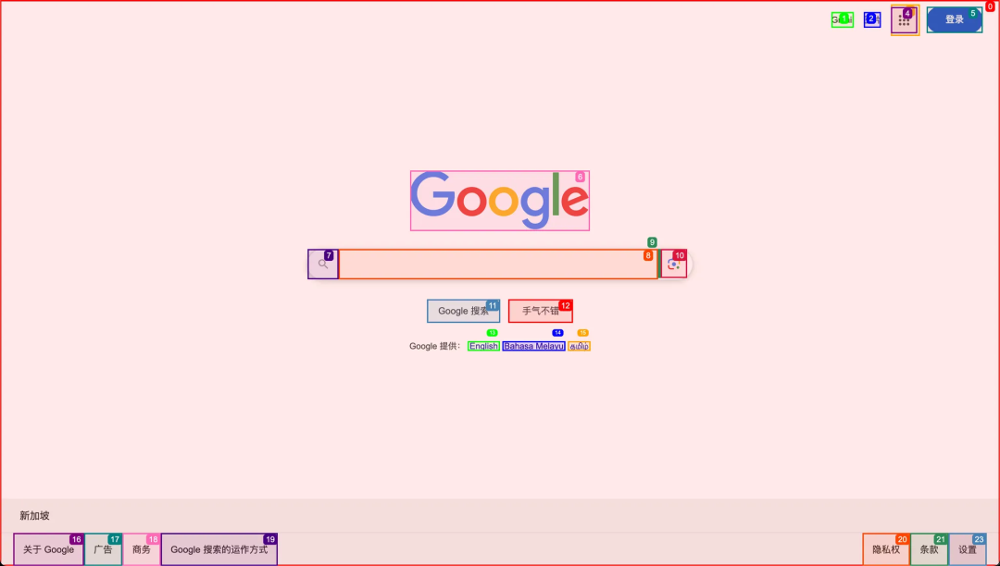
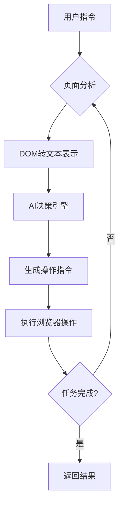

# AI Browser：基于用户指令的浏览器自动化系统

## 简介

本系统实现了智能化浏览器操作引擎，能够根据自然语言指令自动执行网页浏览任务。通过将网页元素结构化表示与AI决策模型相结合，系统能够理解用户意图并转化为具体浏览器操作，实现从简单搜索到复杂工作流（如在线购票）的自动化执行。

## 网页内容结构化处理

系统核心创新在于将复杂DOM结构转换为AI可理解的文本表示：

1. **DOM标记与提取**：
   - 注入脚本遍历页面DOM结构
   - 识别并标记所有可交互元素（输入框、按钮、链接等）
   - 为元素添加可视化高亮标识（如图示）
   

2. **结构化文本表示**：
```text
[Start of page]
[1]<a Gmail >Gmail/>
[2]<a 搜索图片 >图片/>
[3]<div />
[4]<a false;button;Google 应用/>
[5]<a 登录/>
[6]
[7]<div />
[8]<textarea 搜索;false;q;combobox;Google 搜索/>
[9]<div />
[10]<div 按图搜索;button/>
[11]<input button;Google 搜索;btnK;submit/>
[12]<input btnI; 手气不错 ;submit/>
[13]<a English/>
[14]<a Bahasa Melayu/>
[15]<a தமிழ்/>
[16]<a 关于 Google/>
[17]<a 广告/>
[18]<a 商务/>
[19]<a Google 搜索的运作方式/>
[20]<a 隐私权/>
[21]<a 条款/>
[22]<div false;button/>
[23]<div 设置/>
[End of page]
```
**关键特性**：
- 保留元素类型、文本内容、交互状态等核心信息
- 索引化组织确保操作精确性（如`[8]`对应搜索框）
- 精简格式优化AI处理效率
- 支持通过XPath定位页面元素执行操作

## 系统架构

### 主要功能模块

| 模块        | 职责描述                                                                 | 核心技术                     |
|-------------|--------------------------------------------------------------------------|------------------------------|
| **Agent**   | 决策中枢，管理任务上下文，生成操作指令序列                                | 状态机管理，LLM指令生成       |
| **Controller** | 连接AI决策与浏览器操作，解析并执行高级指令                              | 指令分发，异常处理            |
| **DOM**     | 网页结构处理与分析                                                       | Playwright, XPath, 跨域通信  |
| **Browser** | 浏览器实例管理，封装底层操作                                             | Playwright核心集成           |

### 模块详解

1. **Agent 决策引擎**
   - 维护任务执行状态机
   - 结合用户目标与页面状态生成下一步指令
   - 支持多步骤复杂任务编排（如"预订北京到上海的机票"）

2. **Controller 执行中枢**
   - 翻译AI指令为具体浏览器操作
   - 监控操作执行结果
   - 提供操作失败时的回退机制

3. **DOM 处理系统**
   - **buildDomTree.js**：注入脚本实现：
     * 可交互元素过滤
     * 可视化标记渲染
     * 元素特征提取
   - 提供DOM节点数据模型
   - 支持动态页面解析（SPA应用）

4. **Browser 核心引擎**
   - 基于Playwright封装：
     * 多标签页管理（创建/切换/关闭）
     * 智能导航与历史记录跟踪
     * 页面截图与PDF生成
     * 文件下载处理
   - 安全防护机制：
     * URL白名单检测
     * 跨域操作隔离

## 操作指令集

系统支持以下浏览器自动化操作：

| 指令名称                  | 参数                                                                                                | 功能描述                     |
|---------------------------|-----------------------------------------------------------------------------------------------------|------------------------------|
| **done**                  | `text`(结果描述), `success`(成功状态)                                                               | 标记任务完成                 |
| **search_google**         | `query`(搜索关键词)                                                                                 | 执行谷歌搜索                 |
| **go_to_url**             | `url`(目标地址)                                                                                     | 跳转至指定URL                |
| **go_back**               | -                                                                                                   | 返回上一页面                 |
| **wait**                  | `seconds`(等待秒数，默认3)                                                                          | 页面等待                     |
| **click_element_by_index**| `index`(元素索引), `xpath`(XPath定位)                                                               | 按索引点击元素               |
| **input_text**            | `index`(元素索引), `text`(输入内容), `xpath`(XPath定位)                                             | 向指定元素输入文本           |
| **save_pdf**              | -                                                                                                   | 当前页保存为PDF              |
| **switch_tab**            | `page_id`(标签页ID)                                                                                 | 切换浏览器标签页             |
| **open_tab**              | `url`(新标签页地址)                                                                                 | 打开新标签页                 |
| **close_tab**             | `page_id`(标签页ID)                                                                                 | 关闭指定标签页               |
| **extract_content**       | `goal`(提取目标), `should_strip_link_urls`(是否移除链接URL)                                         | 提取页面内容                 |
| **scroll_down**           | `amount`(滚动距离)                                                                                  | 向下滚动页面                 |
| **scroll_up**             | `amount`(滚动距离)                                                                                  | 向上滚动页面                 |
| **send_keys**             | `keys`(按键序列)                                                                                    | 发送键盘按键                 |
| **scroll_to_text**        | `text`(目标文本)                                                                                    | 滚动到指定文本位置           |
| **get_dropdown_options**  | `index`(下拉框索引)                                                                                 | 获取下拉选项列表             |
| **select_dropdown_option**| `index`(下拉框索引), `text`(选项文本)                                                               | 选择下拉框选项               |
| **drag_drop**             | `element_source`(源元素), `element_target`(目标元素), `steps`(步骤数), `delay_ms`(延迟毫秒数)等    | 元素拖拽操作                 |
| **ask_for_assistant**     | `query`(问题描述)                                                                                   | 请求人工协助                 |
| **upload_file**           | `index`(元素索引), `path`(文件路径)                                                                 | 文件上传操作                 |

**参数说明**：
- `should_strip_link_urls`（内容提取参数）：
  * `true`：仅保留链接文本（移除URL）
  * `false`：保留完整链接（文本+URL）
- 坐标参数采用`{x,y}`格式对象
- 拖拽操作支持元素定位和坐标定位双模式

## AI集成工作流

系统通过智能决策循环实现自动化操作：



**执行流程**：
1. 用户提交自然语言指令（如"查找最近的咖啡店"）
2. 系统获取当前页面结构化表示
3. AI模型综合以下信息生成操作指令：
   - 系统提示词（操作规范）
   - 页面元素文本表示
   - 用户原始指令
   - 历史操作上下文
4. Controller执行具体浏览器操作
5. 循环直至任务完成，返回最终结果

**典型应用场景**：
- 跨网站比价购物
- 定期数据采集
- 复杂表单自动填写
- 多步骤工作流执行（机票预订/酒店下单）
- 无障碍网页浏览辅助

本系统通过融合现代浏览器技术与大语言模型能力，实现了真正智能化的网页交互范式，为自动化测试、数据采集、智能助手等领域提供强大基础设施支持。