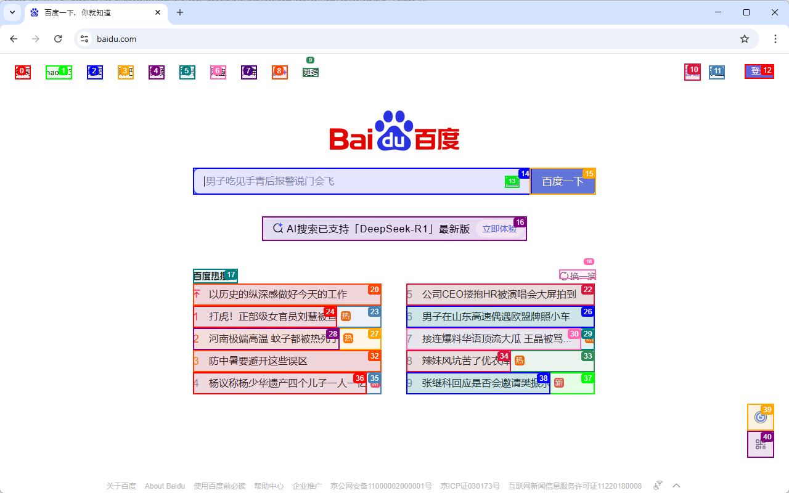

# dom构建- 将网页可点击元素提取与可视化

## 一、项目背景与目标

在自动化测试、智能 AI 代理交互等场景中，我们常常需要让机器“看懂”网页，将页面中的可点击元素提取出来并以结构化、可读的文本形式呈现，便于后续推理或自动化操作。本示例基于 Playwright 和一段自定义脚本，将任意网页的 DOM 树构建为 Java 对象，并输出所有可交互元素的文本化列表。

---

## 二、整体架构

1. **前端脚本（index.js）**

   * 深度遍历 DOM，生成包含每个节点属性、可见性、交互性、子节点引用等信息的 JSON 结构。
   * 为每个可交互元素（按钮、链接、输入框等）分配唯一的 `highlightIndex`，并可选标记“新元素”。

2. **Java 端解析**

   * **`DomService`**：在 Playwright `Page` 上注入并执行上述脚本，拿到原始 JSON，分两轮构建 Java 对象：

     1. **第一轮**：根据节点类型（元素/文本）创建对应的 `DOMElementNode` 或 `DOMTextNode`；
     2. **第二轮**：根据 JSON 中的子节点列表建立父子关系，最终获得根 `DOMElementNode`。
   * **`DOMState`**：持有根节点与从 `highlightIndex` 到节点实例的映射（`selectorMap`）。

3. **可视化输出**

   * 调用根节点的 `clickableElementsToString(...)`，以

     ```
     [index]<tag 属性拼接>节点文本/>
     ```

     的格式逐行输出，每行代表一个可点击元素，属性列表仅保留常用且非空字段。

---

## 三、核心类说明

### 1. `DOMBaseNode`（抽象基类）

* 字段：

  * `isVisible`（boolean）：节点在页面上是否可见。
  * `parent`：父级 `DOMElementNode` 引用。
* 方法：

  * `isVisible()`、`getParent()`、`setParent(...)`。

### 2. `DOMElementNode`（元素节点）

* 继承：`DOMBaseNode`
* 主要字段：

  * `tagName`、`xpath`、`attributes`（属性映射）；
  * `isInteractive`、`isTopElement`、`isInViewport`、`shadowRoot`；
  * `highlightIndex`（可点击元素唯一索引）、`isNew`（是否为新出现元素）；
  * `children`：子节点列表。
* 核心方法：

  * `getAllTextTillNextClickableElement(int maxDepth)`：收集从当前节点到下一个可点击元素之间的所有纯文本；
  * `clickableElementsToString(List<String> includeAttributes)`：遍历整个树，将所有标记了 `highlightIndex` 的元素按格式输出。

### 3. `DOMTextNode`（文本节点）

* 继承：`DOMBaseNode`
* 主要字段：`text`（节点内文字）、`type="TEXT_NODE"`；
* 方法：

  * `getText()`；
  * `hasParentWithHighlightIndex()`：判断当前文本是否属于某个已标记的可点击元素内部，以便过滤冗余。

### 4. `DOMState`

* 持有：

  * `DOMElementNode elementTree`：完整的元素节点树；
  * `Map<Integer, DOMElementNode> selectorMap`：索引到可点击节点的映射，方便按索引快速定位。

### 5. `DomService`

* 构造器加载并缓存 `index.js`；
* `getClickableElements(boolean highlightElements, int focusElement, int viewportExpansion)`：

  1. 将参数打包为 JS 对象，注入并执行构建脚本；
  2. 解析返回的 JSON Map → Java 节点；
  3. 建立父子关系；
  4. 返回 `DOMState`。

---
## 四 代码

### DOMElementNode
```java
package com.litongjava.ai.browser.dom.model;

import java.util.ArrayList;
import java.util.LinkedHashMap;
import java.util.List;
import java.util.Map;
import java.util.stream.Collectors;

import com.litongjava.tio.utils.collect.Lists;
import com.litongjava.tio.utils.hutool.StrUtil;

public class DOMElementNode extends DOMBaseNode {
  private final String tagName;
  private final String xpath;
  private final Map<String, String> attributes;
  private final List<DOMBaseNode> children = new ArrayList<>();

  private final boolean isInteractive;
  private final boolean isTopElement;
  private final boolean isInViewport;
  private final boolean shadowRoot;
  private final Integer highlightIndex;
  private final Boolean isNew;

  // （viewportInfo / pageCoordinates 按需补）
  public static final List<String> DEFAULT_INCLUDE_ATTRIBUTES = Lists.of("title", "type", "checked", "name", "role", "value",
      //
      "placeholder", "data-date-format", "alt", "aria-label", "aria-expanded", "data-state", "aria-checked");

  public DOMElementNode(String tagName, String xpath, Map<String, String> attributes, boolean isVisible, boolean
  //
  isInteractive, boolean isTopElement, boolean isInViewport, boolean shadowRoot, Integer highlightIndex, Boolean isNew) {
    super(isVisible);
    this.tagName = tagName;
    this.xpath = xpath;
    this.attributes = attributes;
    this.isInteractive = isInteractive;
    this.isTopElement = isTopElement;
    this.isInViewport = isInViewport;
    this.shadowRoot = shadowRoot;
    this.highlightIndex = highlightIndex;
    this.isNew = isNew;
  }

  public String getTagName() {
    return tagName;
  }

  public Integer getHighlightIndex() {
    return highlightIndex;
  }

  public boolean isInteractive() {
    return isInteractive;
  }

  public boolean isTopElement() {
    return isTopElement;
  }

  public boolean isInViewport() {
    return isInViewport;
  }

  public Boolean isNew() {
    return isNew;
  }

  public List<DOMBaseNode> getChildren() {
    return children;
  }

  public void addChild(DOMBaseNode child) {
    children.add(child);
    if (child instanceof DOMElementNode) {
      ((DOMElementNode) child).setParent(this);
    } else if (child instanceof DOMTextNode) {
      ((DOMTextNode) child).setParent(this);
    }
  }

  /**
   * 收集从 this 节点开始，直到下一个可点击元素前的所有文本
   */
  public String getAllTextTillNextClickableElement(int maxDepth) {
    StringBuilder sb = new StringBuilder();
    collectText(this, 0, maxDepth, sb);
    return sb.toString().trim();
  }

  private void collectText(DOMBaseNode node, int depth, int maxDepth, StringBuilder sb) {
    if (maxDepth != -1 && depth > maxDepth) {
      return;
    }
    if (node instanceof DOMElementNode) {
      DOMElementNode el = (DOMElementNode) node;
      if (el != this && el.getHighlightIndex() != null) {
        return;
      }
      for (DOMBaseNode c : el.getChildren()) {
        collectText(c, depth + 1, maxDepth, sb);
      }
    } else if (node instanceof DOMTextNode) {
      //sb.append(((DOMTextNode) node).getText()).append("\n");
      String text = ((DOMTextNode) node).getText();
      sb.append(text.trim()).append(" ");
    }
  }

  /**
   * 核心：把可点击元素按照 [index]<tag 属性拼接>文本/> 的格式输出
   */
  public String clickableElementsToString(List<String> includeAttributes) {
    if (includeAttributes == null) {
      includeAttributes = DEFAULT_INCLUDE_ATTRIBUTES;
    }

    List<String> out = new ArrayList<>();
    processNode(this, "", includeAttributes, out);
    return out.stream().collect(Collectors.joining("\n"));
  }

  private void processNode(DOMBaseNode node, String indent, List<String> includeAttributes, List<String> out) {
    if (node instanceof DOMElementNode) {
      DOMElementNode el = (DOMElementNode) node;
      if (el.getHighlightIndex() != null) {
        String text = el.getAllTextTillNextClickableElement(-1);
        String attrStr = buildAttributesHtml(el.attributes, includeAttributes, text);
        String indicator = Boolean.TRUE.equals(el.isNew()) ? "*[" + el.getHighlightIndex() + "]" : "[" + el.getHighlightIndex() + "]";
        String line = indent + indicator + "<" + el.tagName + (attrStr.isEmpty() ? "" : " " + attrStr)
            + (text.isEmpty() ? (attrStr.isEmpty() ? " " : "") + "/>" : (attrStr.isEmpty() ? " " : "") + ">" + text + "/>");
        out.add(line);
      }
      // 继续递归
      for (DOMBaseNode c : el.getChildren()) {
        processNode(c, indent + "\t", includeAttributes, out);
      }
    } else if (node instanceof DOMTextNode) {
      DOMTextNode txt = (DOMTextNode) node;
      if (txt.hasParentWithHighlightIndex())
        return;
      DOMElementNode p = txt.getParent();
      if (p != null && p.isVisible() && p.isTopElement()) {
        out.add(indent + txt.getText());
      }
    }
  }

  private String buildAttributesHtml(Map<String, String> attrs, List<String> includeAttributes, String text) {
    Map<String, String> keep = new LinkedHashMap<>();
    for (String k : includeAttributes) {
      if (attrs.containsKey(k) && StrUtil.isNotBlank(attrs.get(k))) {
        keep.put(k, cap(attrs.get(k), 15));
      }
    }
    // “去重”“剔除与文本相同的属性” 等…可按需补
    return keep.entrySet().stream().map(e -> e.getKey() + "='" + e.getValue() + "'").collect(Collectors.joining(" "));
  }

  private static String cap(String s, int max) {
    return s.length() > max ? s.substring(0, max) + "..." : s;
  }
}

```
### DOMBaseNode
```java
package com.litongjava.ai.browser.dom.model;

public abstract class DOMBaseNode {
  protected boolean isVisible;
  protected DOMElementNode parent;

  public DOMBaseNode(boolean isVisible) {
    this.isVisible = isVisible;
  }

  public boolean isVisible() {
    return isVisible;
  }

  public DOMElementNode getParent() {
    return parent;
  }

  public void setParent(DOMElementNode parent) {
    this.parent = parent;
  }
}

```
### DOMTextNode
```java
package com.litongjava.ai.browser.dom.model;

public class DOMTextNode extends DOMBaseNode {
  private final String text;
  private final String type = "TEXT_NODE";

  public DOMTextNode(String text, boolean isVisible) {
    super(isVisible);
    this.text = text;
  }

  public String getText() {
    return text;
  }

  public boolean hasParentWithHighlightIndex() {
    DOMElementNode cur = parent;
    while (cur != null) {
      if (cur.getHighlightIndex() != null)
        return true;
      cur = cur.getParent();
    }
    return false;
  }

  public boolean isParentInViewport() {
    return parent != null && parent.isInViewport();
  }

  public boolean isParentTopElement() {
    return parent != null && parent.isTopElement();
  }
}

```
### DOMState
```java
package com.litongjava.ai.browser.dom.model;

import java.util.Map;

public class DOMState {
  private final DOMElementNode elementTree;
  private final Map<Integer, DOMElementNode> selectorMap;

  public DOMState(DOMElementNode tree, Map<Integer, DOMElementNode> sel) {
    this.elementTree = tree;
    this.selectorMap = sel;
  }

  public DOMElementNode getElementTree() {
    return elementTree;
  }

  public Map<Integer, DOMElementNode> getSelectorMap() {
    return selectorMap;
  }
}
```
### DomService
```java
package com.litongjava.ai.browser.dom.service;

import java.net.URL;
import java.util.HashMap;
import java.util.List;
import java.util.Map;
import java.util.Map.Entry;
import java.util.Set;

import com.litongjava.ai.browser.dom.model.DOMBaseNode;
import com.litongjava.ai.browser.dom.model.DOMElementNode;
import com.litongjava.ai.browser.dom.model.DOMState;
import com.litongjava.ai.browser.dom.model.DOMTextNode;
import com.litongjava.tio.utils.hutool.FileUtil;
import com.litongjava.tio.utils.hutool.ResourceUtil;
import com.microsoft.playwright.Page;

import lombok.extern.slf4j.Slf4j;

@Slf4j
public class DomService {
  private final Page page;
  private final String buildScript;

  public DomService(Page page) {
    this.page = page;
    // 从 resources 加载 index.js
    String js_path = "dom/dom_tree/index.js";
    URL url = ResourceUtil.getResource(js_path);
    if (url == null) {
      throw new RuntimeException("not found index.js");
    }
    StringBuilder stringBuilder = FileUtil.readString(url);
    this.buildScript = stringBuilder.toString();
  }

  public DOMState getClickableElements(boolean highlightElements, int focusElement, int viewportExpansion) {
    // 构造 JS 参数
    Map<String, Object> args = new HashMap<>();
    args.put("doHighlightElements", highlightElements);
    args.put("focusHighlightIndex", focusElement);
    args.put("viewportExpansion", viewportExpansion);
    args.put("debugMode", log.isDebugEnabled());

    // 在页面上下文执行：注入脚本 + 调用 buildDomTree(args)
    String evalScript = "const buildDomTree = " + buildScript + ";\n" + "return buildDomTree(args);";

    @SuppressWarnings("unchecked")
    Map<String, Object> evalPage = (Map<String, Object>) page.evaluate("(args) => {\n" + evalScript + "\n" + "}", args);

    // 拿到 map 和 rootId
    @SuppressWarnings("unchecked")
    Map<String, Map<String, Object>> jsNodeMap = (Map<String, Map<String, Object>>) evalPage.get("map");
    Object object = evalPage.get("rootId");
    String rootId = object.toString();

    // 第一次遍历：构建所有节点（不设 parent/children）
    Map<String, DOMBaseNode> nodeMap = new HashMap<>();
    Map<Integer, DOMElementNode> selectorMap = new HashMap<>();

    Set<Entry<String, Map<String, Object>>> entrySet = jsNodeMap.entrySet();
    for (Entry<String, Map<String, Object>> entry : entrySet) {
      String id = entry.getKey();
      Map<String, Object> nd = entry.getValue();
      String type = (String) nd.get("type");

      if ("TEXT_NODE".equals(type)) {
        // 文本节点
        String text = (String) nd.get("text");
        boolean isVis = Boolean.TRUE.equals(nd.get("isVisible"));
        nodeMap.put(id, new DOMTextNode(text, isVis));
        continue;
      }

      // 元素节点
      String tag = (String) nd.get("tagName");
      String xpath = (String) nd.get("xpath");
      @SuppressWarnings("unchecked")
      Map<String, String> attrs = (Map<String, String>) nd.get("attributes");
      boolean isVis = Boolean.TRUE.equals(nd.get("isVisible"));
      boolean isInt = Boolean.TRUE.equals(nd.get("isInteractive"));
      boolean isTop = Boolean.TRUE.equals(nd.get("isTopElement"));
      boolean inVP = Boolean.TRUE.equals(nd.get("isInViewport"));
      boolean sr = Boolean.TRUE.equals(nd.get("shadowRoot"));
      Integer hi = nd.get("highlightIndex") != null ? ((Number) nd.get("highlightIndex")).intValue() : null;
      Boolean isNew = (Boolean) nd.get("isNew");

      DOMElementNode el = new DOMElementNode(tag, xpath, attrs, isVis, isInt, isTop, inVP, sr, hi, isNew);
      nodeMap.put(id, el);
      if (hi != null) {
        selectorMap.put(hi, el);
      }

    }

    // 第二次遍历：建立 parent–children 关系
    for (Entry<String, Map<String, Object>> entry : entrySet) {
      String id = entry.getKey();
      Map<String, Object> raw = entry.getValue();
      if (!(nodeMap.get(id) instanceof DOMElementNode)) {
        continue;
      }

      DOMElementNode el = (DOMElementNode) nodeMap.get(id);
      @SuppressWarnings("unchecked")
      List<Object> childList = (List<Object>) raw.get("children");
      if (childList == null) {
        continue;
      }
      for (Object o : childList) {
        String cid = o.toString();
        DOMBaseNode child = nodeMap.get(cid);
        if (child != null) {
          el.addChild(child);
        }

      }
    }

    // 拿到根节点
    DOMElementNode root = (DOMElementNode) nodeMap.get(rootId);
    return new DOMState(root, selectorMap);
  }
}
```
### DomServiceTest
```java
package com.litongjava.ai.browser.dom.service;

import org.junit.Test;

import com.litongjava.ai.browser.dom.model.DOMState;
import com.microsoft.playwright.Browser;
import com.microsoft.playwright.BrowserContext;
import com.microsoft.playwright.BrowserType;
import com.microsoft.playwright.Page;
import com.microsoft.playwright.Playwright;

public class DomServiceTest {

  @Test
  public void test() {
    String url = "https://www.baidu.com";

    try (Playwright pw = Playwright.create()) {
      Browser browser = pw.chromium().launch(new BrowserType.LaunchOptions().setHeadless(false));
      BrowserContext ctx = browser.newContext();
      Page page = ctx.newPage();
      page.navigate(url);

      DomService svc = new DomService(page);
      DOMState state = svc.getClickableElements(true, -1, 0);

      System.out.println("[Start of page]");
      String out = state.getElementTree().clickableElementsToString(null);
      System.out.println(out);
      System.out.println("[End of page]");
    }
  }
}
```
## 测试
### input
images

### output
```
[Start of page]
				[0]<a >新闻/>
				[1]<a >hao123/>
				[2]<a >地图/>
				[3]<a >贴吧/>
				[4]<a >视频/>
				[5]<a >图片/>
				[6]<a >网盘/>
				[7]<a >文库/>
				[8]<a />
					[9]<a name='tj_briicon'>更多/>
				[10]<a />
				[11]<span >设置/>
				[12]<a name='tj_login'>登录/>
								[13]<span />
								[14]<input name='wd' placeholder='肖战连续两天请剧组喝冰饮'/>
								[15]<input type='submit' value='百度一下'/>
								[16]<a >AI搜索已支持「DeepSeek-R1」最新版 立即体验/>
									[17]<div > />
								[18]<a > 换一换/>
								[19]<li />
									[20]<a > 0 以历史的纵深感做好今天的工作/>
								[21]<li >新/>
									[22]<a > 5 亲叔叔炮轰宗馥莉：她从不与宗家往来/>
								[23]<li >热/>
									[24]<a > 1 打虎！正部级女官员刘慧被查/>
								[25]<li />
									[26]<a > 6 公司CEO搂抱HR被演唱会大屏拍到/>
								[27]<li >热/>
									[28]<a > 2 河南极端高温 蚊子都被热死了/>
								[29]<li />
									[30]<a > 7 男子在山东高速偶遇欧盟牌照小车/>
								[31]<li />
									[32]<a > 3 防中暑要避开这些误区/>
								[33]<li >热/>
									[34]<a > 8 接连爆料华语顶流大瓜 王晶被骂惨了/>
								[35]<li >新/>
									[36]<a > 4 杨议称杨少华遗产四个儿子一人一亿/>
								[37]<li >热/>
									[38]<a > 9 辣妹风坑苦了优衣库/>
			[39]<div >辅助模式/>
				[40]<div />
[End of page]
```