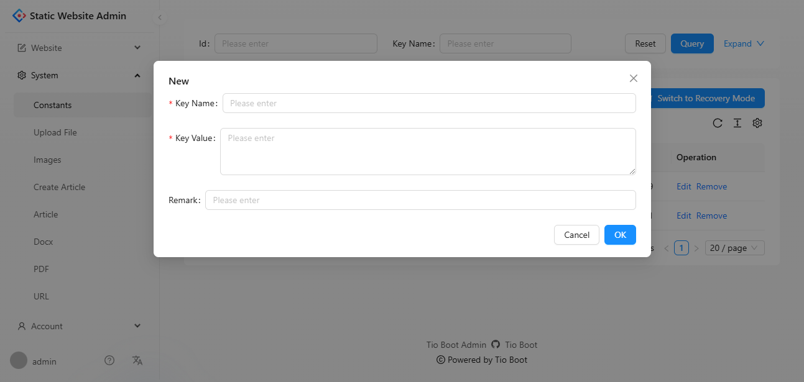
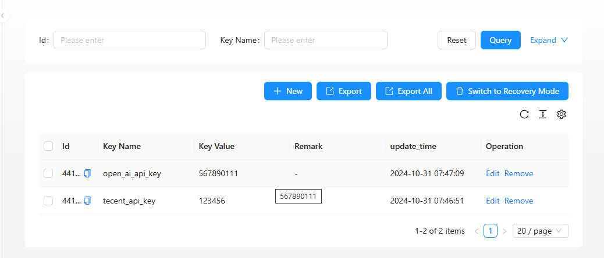
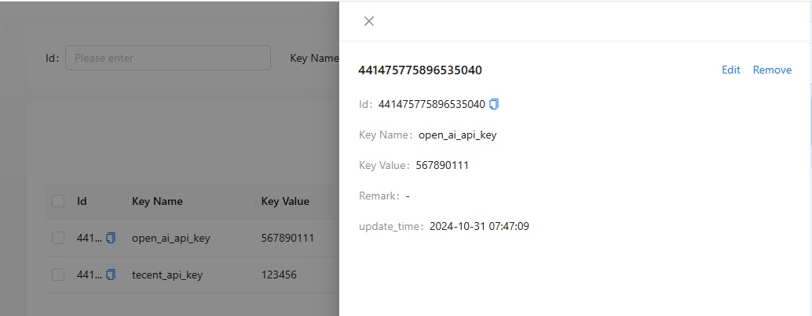

# 与前端集成

通过上述步骤，我们已经成功搭建了一个简单的后台管理系统的框架。`tio-boot-admin` 提供了丰富的功能接口，方便后续开发和扩展。接下来，需要配合前端项目进行界面开发和功能对接。

## tio-boot-admin-react

推荐使用 [`tio-boot-admin-react`](https://github.com/litongjava/tio-boot-admin-react) 作为前端解决方案，该项目基于 React 框架，提供了丰富的组件和示例，能够与 `tio-boot-admin` 无缝集成，帮助你快速构建现代化的后台管理界面。

tio-boot-admin-react 是基于 Ant Design Pro 开发的后台管理框架,tio-boot-admin-react=Ant Design Pro+api table

**Ant Design Pro = Ant Design + UmiJS + ProComponents** 的理解是正确的。这几个部分共同构成了 Ant Design Pro 的主要技术栈：

1. **Ant Design**：作为 UI 组件库，为 Ant Design Pro 提供了丰富的企业级 UI 组件（如按钮、表单、表格、菜单等），让用户界面更加美观、统一且专业。

2. **UmiJS**：作为底层框架，UmiJS 提供了路由管理、插件机制、构建优化、国际化等基础功能，支持 Ant Design Pro 的整体项目架构，简化了管理系统开发中的复杂逻辑。UmiJS 提供的插件和功能也提升了开发效率。

3. **ProComponents**：这是 Ant Design Pro 提供的一些高级 UI 组件（如 ProTable、ProForm、ProLayout 等），专为企业级应用设计，封装了复杂的业务场景和交互逻辑，便于快速开发。例如，ProTable 集成了分页、搜索、表单和表格等常见功能，减少了开发者的工作量。

### 总结

**Ant Design Pro = Ant Design + UmiJS + ProComponents** 是对的。这三个部分的结合让 Ant Design Pro 成为一个完整的、开箱即用的企业级管理系统开发模板，大大加速了后台管理系统的开发进程。

## 使用 tio-boot-admin-react

**前端集成步骤简述**：

1. **克隆前端项目**:
   ```bash
   git clone https://github.com/litongjava/tio-boot-admin-react.git
   ```
2. **安装依赖**:
   ```bash
   cd tio-boot-admin-react
   npm install
   ```
3. **配置接口地址**:
   根据后端 `server.context-path` 和端口号，配置前端项目中的 API 基础路径。

4. **启动前端**:
   ```bash
   npm start
   ```
5. **访问后台管理系统**:
   在浏览器中访问 `http://localhost:3000`（默认前端端口），即可看到与后端 `tio-boot-admin` 集成的后台管理界面。

通过以上步骤，你将拥有一个完整的后台管理系统，包括后端服务和前端界面，极大地提升开发效率和项目质量。

## 系统模块 - 配置管理

### 功能概述

本模块实现了系统配置项的管理功能，提供了增删查改等基础操作。通过 `ApiTable` 组件实现单表数据的管理，支持分页、搜索、创建等功能，适合在后台管理中使用。

#### 核心组件

本模块的主要组件包括：

- **`systemConstatnsColumn.tsx`**：定义了表格的列及其属性。
- **`systemConstantsIndex.tsx`**：配置页面的主文件，结合 `ApiTable` 实现单表数据管理。

### 代码结构

#### 1. 配置表格列 (`systemConstatnsColumn.tsx`)

该文件定义了表格中每一列的显示内容和表单验证规则。

```typescript
import { ProColumns } from "@ant-design/pro-components";

export const tio_boot_admin_system_constants_config_columns = (): ProColumns<any>[] => [
  {
    title: "Key Name",
    dataIndex: "key_name",
    formItemProps(form) {
      return {
        rules: [
          {
            required: true,
          },
        ],
      };
    },
  },
  {
    title: "Key Value",
    dataIndex: "key_value",
    valueType: "textarea",
    ellipsis: true,
    formItemProps(form) {
      return {
        rules: [
          {
            required: true,
          },
        ],
      };
    },
  },
  {
    title: "Remark",
    dataIndex: "remark",
  },
  {
    title: "update_time",
    dataIndex: "update_time",
    valueType: "dateTime",
    hideInSearch: true,
    hideInForm: true,
  },
  {
    key: "update_time",
    title: "update_time",
    dataIndex: "update_time_range",
    valueType: "dateTimeRange",
    hideInTable: true,
    hideInForm: true,
    hideInDescriptions: true,
  },
];
```

- **Key Name**：配置项的名称，必填字段。
- **Key Value**：配置项的值，显示为多行文本且必填。
- **Remark**：备注信息，允许用户填写附加说明。
- **Update Time**：更新时间，支持单项显示和时间范围搜索。

#### 2. 主页面配置 (`systemConstantsIndex.tsx`)

该文件将表格列配置与数据请求逻辑结合，形成完整的配置项管理页面。

```typescript
import React from "react";
import ApiTable from "@/components/common/ApiTable";
import { tio_boot_admin_system_constants_config_columns } from "@/pages/system/constants/systemConstatnsColumn";

export default () => {
  const from = "tio_boot_admin_system_constants_config";

  const beforePageRequest = (params: any, isRecoveryMode?: boolean) => {
    params.idType = "long";

    if (isRecoveryMode) {
      params.deleted = 1;
    } else {
      params.deleted = 0;
    }
    params.remarkOp = "ct";
    params.orderBy = "update_time";
    params.isAsc = "false";
    params.update_time_type = "string[]";
    params.update_time_to_type = "ISO8601";
    params.update_time_op = "bt";

    params.keyNameOp = "ct";
    params.keyValueOp = "ct";

    return params;
  };

  const beforeCreateRequest = (formValues: any) => {
    return {
      ...formValues,
      idType: "long",
    };
  };

  return (
    <ApiTable
      from={from}
      columns={tio_boot_admin_system_constants_config_columns()}
      beforePageRequest={beforePageRequest}
      beforeCreateRequest={beforeCreateRequest}
    />
  );
};
```

##### 参数说明

- **from**：数据来源的标识，用于指定表名或数据源。
- **beforePageRequest**：分页请求前的参数处理，包括字段名称的模糊查询和时间范围查询。
- **beforeCreateRequest**：创建请求前的参数处理，自动添加 `idType` 字段。

#### 核心组件 - ApiTable

`ApiTable` 是一个高度封装的单表管理组件，支持分页、搜索、排序等多项功能，极大简化了配置项管理的开发工作。

- **分页功能**：实现数据的分页加载。
- **模糊查询**：支持根据字段名称或内容的部分字符进行查询。
- **排序**：默认根据 `update_time` 字段降序排列。

### 功能演示

1. **创建配置项**

   - 点击「新建」按钮，弹出表单填写页面。

   

2. **查看和管理配置项**

   - 支持按条件分页查询，点击分页器切换页面。

   

3. **查看配置详情**

   - 点击记录进入详情页面，可查看配置项的详细信息。

   

## 总结

本模块提供了配置项的增删查改功能，代码结构简洁，基于 `ApiTable` 组件实现，支持模糊查询、时间范围搜索和排序功能。
