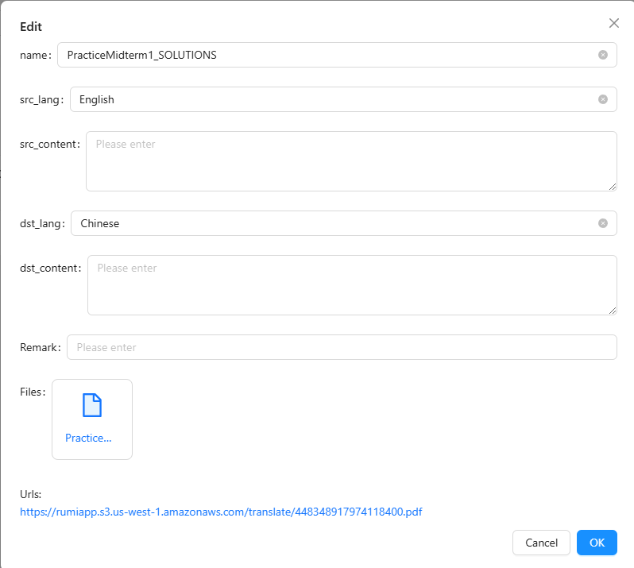
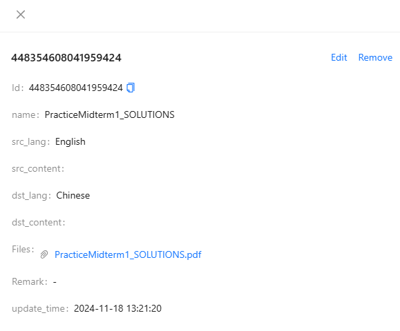

# 文件上传

## 简介

本文件介绍了如何使用 **Tio Boot Admin** 技术栈（前端使用 `tio-boot-admin-react`，后端使用 `tio-boot-admin`）实现一个基于文件表单的业务功能模块。本模块支持文件上传、下载、预览以及与数据库的集成管理。

---

## 数据表设计

### 文件信息表

`系统文件上传表`存储了文件上传的详细信息，如文件名、大小、MD5 值等。

创建tio_boot_admin_system_upload_file表,表略,参见https://www.tio-boot.com/zh/33_%E6%96%87%E4%BB%B6%E5%AD%98%E5%82%A8/01.html


---

## 文件上传到 S3

### Maven 依赖

在 `pom.xml` 中添加 AWS S3 SDK 的依赖，用于与 AWS S3 服务交互。

```xml
<dependency>
  <groupId>software.amazon.awssdk</groupId>
  <artifactId>s3</artifactId>
  <version>2.17.100</version> <!-- 请使用最新版本 -->
</dependency>
```

### 配置文件（`app.properties`）

```properties
AWS_S3_ACCESS_KEY_ID=your_access_key
AWS_S3_SECRET_ACCESS_KEY=your_secret_key
AWS_S3_REGION_NAME=us-west-1
AWS_S3_BUCKET_NAME=your_bucket_name
AWS_S3_BUCKET_DOMAIN=assets.myget.ai
```

---

## 后端功能实现

### 上传文件接口

#### 1. **判断文件是否已存在**

通过文件的 MD5 值判断是否重复上传。

- **请求方式**: `GET`
- **接口**: `/api/system/file/url?md5=<md5值>`
- **响应示例**:

```json
{ "data": null, "ok": false, "code": 0, "msg": null }
```

#### 2. **上传文件**

将文件上传到 S3，同时将文件信息存储到数据库。

- **请求方式**: `POST`
- **接口**: `/api/system/file/upload`
- **请求参数**:
  - `file`（二进制文件）
  - `category`（文件分类，如：`translate`）
- **响应示例**:

```json
{
  "data": {
    "id": "448348926798479360",
    "filename": "PracticeMidterm1_SOLUTIONS.pdf",
    "md5": "d87cce163277ca00097663d8e2a8af91",
    "url": "https://rumiapp.s3.us-west-1.amazonaws.com/translate/448348917974118400.pdf"
  },
  "ok": true,
  "code": 1,
  "msg": null
}
```

### Controller 配置

`SystemFileAwsS3Handler` 是一个集成的文件处理器，负责文件上传到 S3 和获取文件 URL。

#### 核心代码

```java
HttpRequestRouter r = TioBootServer.me().getRequestRouter();
if (r != null) {
  SystemFileAwsS3Handler systemUploadHandler = Aop.get(SystemFileAwsS3Handler.class);
  r.add("/api/system/file/upload", systemUploadHandler::upload);
  r.add("/api/system/file/url", systemUploadHandler::getUrl);
}
```

---

## 前端实现

### 表单列定义（`.tsx`）

```ts
import { ProColumns } from "@ant-design/pro-components";
import React from "react";
import { Upload } from "antd";

export const max_kb_document_translate_columns = (): ProColumns<any>[] => [
  {
    title: "name",
    dataIndex: "name",
    valueType: "text",
  },
  {
    title: "src_lang",
    dataIndex: "src_lang",
    valueType: "text",
  },
  {
    title: "src_content",
    dataIndex: "src_content",
    valueType: "textarea",
    ellipsis: true,
  },
  {
    title: "dst_lang",
    dataIndex: "dst_lang",
    valueType: "text",
  },
  {
    title: "dst_content",
    dataIndex: "dst_content",
    valueType: "textarea",
    ellipsis: true,
  },
  {
    title: "Files",
    dataIndex: "files",
    valueType: "text",
    hideInForm: true,
    search: false,
    render: (_, row) => (
      <Upload
        listType="text"
        fileList={row.files}
        showUploadList={{
          showRemoveIcon: false,
          showPreviewIcon: true,
        }}
      />
    ),
  },
  {
    title: "Remark",
    dataIndex: "remark",
  },
  {
    title: "update_time",
    dataIndex: "update_time",
    valueType: "dateTime",
    hideInSearch: true,
    hideInForm: true,
  },
  {
    key: "update_time",
    title: "update_time",
    dataIndex: "update_time_range",
    valueType: "dateTimeRange",
    hideInTable: true,
    hideInForm: true,
    hideInDescriptions: true,
  },
];
```

#### 文件字段

```ts
{
  title: "Files",
  dataIndex: "files",
  valueType: "text",
  hideInForm: true,
  search: false,
  render: (_, row) => (
    <Upload
      listType="text"
      fileList={row.files}
      showUploadList={{
        showRemoveIcon: false,
        showPreviewIcon: true,
      }}
    />
  ),
},
```

#### 图片字段

```ts
{
  title: "Files",
  dataIndex: "files",
  valueType: "text",
  hideInForm: true,
  search: false,
  render: (_, row) => (
    <UploadPreview
      listType="picture-circle"
      fileList={row.files}
    />
  ),
},
```

### 数据交互服务（`documentService.ts`）

```ts
export const beforeDocumentPageRequest = (params: any, isRecoveryMode?: boolean, containsUpload?: boolean) => {
  params.idType = "long";
  if (containsUpload) {
    params.json_fields = ["files"];
  }

  if (isRecoveryMode) {
    params.deleted = 1;
  } else {
    params.deleted = 0;
  }
  return params;
};
export const beforeDocumentCreateRequest = (formValues: any) => {
  return {
    ...formValues,
    idType: "long",
  };
};
```

### documentIndex.tsx

```java
import React from 'react';
import {max_kb_document_translate_columns} from "@/pages/website/document/documentColumn";
import ApiTable from "@/components/common/ApiTable";
import {beforeDocumentCreateRequest, beforeDocumentPageRequest} from "@/pages/website/document/documentService";

export default () => {
  const from = "max_kb_document_translate";
  return (
    <ApiTable
      from={from}
      columns={max_kb_document_translate_columns()}
      beforePageRequest={beforeDocumentPageRequest}
      beforeCreateRequest={beforeDocumentCreateRequest}
      containsUpload={true}
      maxFiles={1}
      uploadCategory="translate"
    />
  );
};

```

---

## 数据交互示例

### 分页查询

#### 请求

- **接口**: `GET /api/table/max_kb_document_translate/page`
- **Payload**:

```json
{
  "current": 1,
  "pageSize": 20,
  "idType": "long",
  "json_fields": ["files"],
  "deleted": 0
}
```

#### 响应

```json
{
  "data": {
    "total": 1,
    "list": [
      {
        "id": "448354608041959424",
        "name": "PracticeMidterm1_SOLUTIONS",
        "src_lang": "English",
        "dst_lang": "Chinese",
        "files": [
          {
            "uid": "rc-upload-1731970944784-2",
            "size": 250207,
            "name": "PracticeMidterm1_SOLUTIONS.pdf",
            "url": "https://rumiapp.s3.us-west-1.amazonaws.com/translate/448348917974118400.pdf",
            "status": "done"
          }
        ],
        "update_time": 1731972080828
      }
    ]
  },
  "ok": true,
  "code": 1,
  "msg": null
}
```

---

## 显示效果





## 总结

本文档展示了基于 **Tio Boot Admin** 的文件表单模块实现的完整流程，包括数据库设计、文件上传到 S3 的配置、后端接口开发以及前端表单组件的集成，适合在具有文件管理需求的业务场景中使用。
