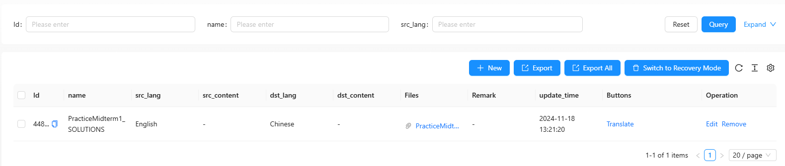

# 网络请求

## **简介**

本文将介绍如何使用 React 和 Ant Design 和 tio-boot-admin-react `ApiTable` 组件，在表格的列中添加一个操作按钮。点击按钮后触发网络请求，网络请求成功后刷新表格。同时展示了如何增加全局的按钮，实现类似功能。

## **功能目标**

1. **为表格每行添加一个按钮**：

   - 点击按钮后发送网络请求。
   - 请求成功后刷新表格内容。
   - 请求失败时显示错误提示。

2. **添加全局按钮**：

   - 在表格上方添加一个自定义按钮。
   - 点击按钮后触发网络请求，并在成功后刷新表格。

3. **使用 Ant Design 提供用户反馈**：
   - 通过 `message` 提示加载、成功或错误状态。

---

## **完整代码**

### **完整代码**

以下是实现上述功能的完整代码：

```tsx
import React, { useState } from "react";
import { max_kb_document_translate_columns } from "@/pages/website/document/documentColumn";
import ApiTable from "@/components/common/ApiTable";
import { beforeDocumentCreateRequest, beforeDocumentPageRequest } from "@/pages/website/document/documentService";
import { message } from "antd";
import { request } from "@umijs/max";

export default () => {
  const from = "max_kb_document_translate";

  const [messageApi, contextHolder] = message.useMessage();
  const [tableKey, setTableKey] = useState(Date.now()); // 用于强制刷新表格

  const onClickRequest = async (id: string) => {
    const hide = messageApi.loading("Translating...", 0); // 设置持续时间为 0，直到手动关闭
    try {
      const respVo = await request<API.Result>(`/api/document/translate/${id}`, { method: "GET" });
      hide(); // 手动关闭加载提示
      if (respVo.ok) {
        messageApi.success("Translation completed successfully!");
        setTableKey(Date.now());
      } else {
        messageApi.error(respVo.msg || "Translation failed. Please try again.");
      }
    } catch (error) {
      hide();
      messageApi.error(`Error: ${error || "Unexpected error occurred."}`);
    }
  };

  const editContentAndPreview = {
    title: "Buttons",
    valueType: "option",
    width: 200,
    render: (text: any, row: { id: string }) => [
      <a key={`translate-${row.id}`} onClick={() => onClickRequest(row.id)}>
        Translate
      </a>,
    ],
  };

  const columns = [...max_kb_document_translate_columns(), editContentAndPreview];

  return (
    <>
      {contextHolder}
      <ApiTable
        key={tableKey} // 每次 key 变化都会重新渲染表格
        from={from}
        columns={columns}
        beforePageRequest={beforeDocumentPageRequest}
        beforeCreateRequest={beforeDocumentCreateRequest}
        containsUpload={true}
        maxFiles={1}
        uploadCategory="translate"
      />
    </>
  );
};
```

---

### **代码讲解**

#### **1. 初始化状态和消息提示**

```tsx
const [messageApi, contextHolder] = message.useMessage();
const [tableKey, setTableKey] = useState(Date.now());
```

- `messageApi` 用于控制消息提示。
- `contextHolder` 确保消息提示能正常渲染。
- `tableKey` 是动态 `key`，每次更新 `tableKey` 都会触发表格重新渲染。

---

#### **2. 行按钮事件处理**

```tsx
const onClickRequest = async (id: string) => {
  const hide = messageApi.loading("Translating...", 0); // 设置持续时间为 0，直到手动关闭
  try {
    const respVo = await request<API.Result>(`/api/document/translate/${id}`, { method: "GET" });
    hide(); // 手动关闭加载提示
    if (respVo.ok) {
      messageApi.success("Translation completed successfully!");
      setTableKey(Date.now());
    } else {
      messageApi.error(respVo.msg || "Translation failed. Please try again.");
    }
  } catch (error) {
    hide();
    messageApi.error(`Error: ${error || "Unexpected error occurred."}`);
  }
};
```

- 当按钮被点击时，发送 GET 请求。
- 根据请求返回的 `respVo.ok` 判定成功或失败。
- 成功时更新 `tableKey`，触发表格刷新。

---

#### **3. 表格列配置**

```tsx
const editContentAndPreview = {
  title: "Buttons",
  valueType: "option",
  width: 200,
  render: (text: any, row: { id: string }) => [
    <a key={`translate-${row.id}`} onClick={() => onClickBatchRequest(row.id)}>
      Translate
    </a>,
  ],
};
```

- 增加一列 `Buttons`，为每行数据渲染“Translate”按钮。
- 按钮点击时调用 `onClickBatchRequest`，传入当前行的 `id`。

---

#### **4. 渲染表格**

```tsx
<ApiTable
  key={tableKey}
  from={from}
  columns={columns}
  beforePageRequest={beforeDocumentPageRequest}
  beforeCreateRequest={beforeDocumentCreateRequest}
  containsUpload={true}
  maxFiles={1}
  uploadCategory="translate"
/>
```

- 使用 `ApiTable` 渲染表格。
- 动态 `key` 确保每次更新时重新加载数据。

---

## 显示效果



## **总结**

通过以上代码实现，我们构建了一个功能完善的动态表格组件：

1. 为表格添加了行级操作按钮，支持每行触发独立的网络请求。
2. 增加全局操作按钮，实现整体控制。
3. 通过动态 `key` 实现表格数据的自动刷新。
4. 借助 Ant Design 的 `message` 提供用户友好的反馈。
