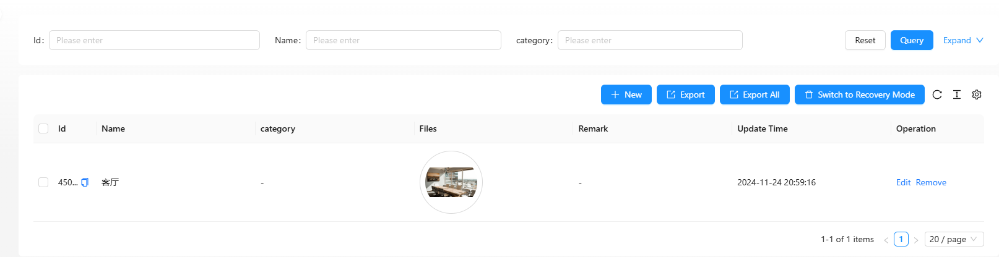

# 多图片管理

本文介绍如何使用 `tio-boot-admin` 和 `tio-boot-admin-react` 实现图片管理功能，包括数据库表的创建、后端文件上传配置以及前端页面的开发。

## 目录

1. [创建数据表](#创建数据表)
2. [配置后端支持文件上传](#配置后端支持文件上传)
3. [前端实现](#前端实现)
   - [定义表格列](#定义表格列)
   - [服务层处理](#服务层处理)
   - [页面组件](#页面组件)
   - [配置路由](#配置路由)
4. [显示效果](#显示效果)

## 创建数据表

首先，需要在数据库中创建用于存储图片信息的数据表。以下是创建 `tio_boot_admin_file_images` 表的 SQL 语句：

```sql
DROP TABLE IF EXISTS tio_boot_admin_file_images;

CREATE TABLE tio_boot_admin_file_images (
  id BIGINT PRIMARY KEY,
  name VARCHAR NOT NULL,
  category VARCHAR,
  files JSONB,
  remark VARCHAR,
  creator VARCHAR DEFAULT '',            -- 创建人
  create_time TIMESTAMP WITHOUT TIME ZONE NOT NULL DEFAULT CURRENT_TIMESTAMP, -- 创建时间
  updater VARCHAR DEFAULT '',            -- 更新人
  update_time TIMESTAMP WITHOUT TIME ZONE NOT NULL DEFAULT CURRENT_TIMESTAMP, -- 更新时间
  deleted SMALLINT NOT NULL DEFAULT 0,   -- 删除标记
  tenant_id BIGINT NOT NULL DEFAULT 0    -- 租户 ID
);
```

**说明：**

- `id`: 主键，类型为 `BIGINT`。
- `name`: 图片名称，不能为空。
- `category`: 图片分类。
- `files`: 存储图片文件信息，使用 `JSONB` 类型。
- `remark`: 备注信息。
- `creator` 和 `updater`: 分别记录创建人和更新人。
- `create_time` 和 `update_time`: 分别记录创建时间和更新时间，默认为当前时间。
- `deleted`: 删除标记，默认为 `0` 表示未删除。
- `tenant_id`: 租户 ID，默认为 `0`。

## 配置后端支持文件上传

**注：此部分内容省略。** 在实际应用中，需根据 `tio-boot-admin` 的文档配置后端文件上传支持，包括文件存储路径、上传接口等。

## 前端实现

前端部分使用 React 和 TypeScript，通过 `tio-boot-admin-react` 实现图片管理功能。

### 定义表格列

在 `imagesColumn.ts` 中定义表格的列信息：

```typescript
import React from "react";
import { ProColumns } from "@ant-design/pro-components";
import UploadPreview from "@/components/common/UploadPreview";

export const tio_boot_admin_file_images_columns = (): ProColumns<any>[] => [
  {
    title: "名称",
    dataIndex: "name",
    valueType: "text",
    formItemProps: {
      rules: [
        {
          required: true,
          message: "名称是必填项",
        },
      ],
    },
  },
  {
    title: "分类",
    dataIndex: "category",
    valueType: "text",
  },
  {
    title: "文件",
    dataIndex: "files",
    valueType: "text",
    hideInForm: true,
    search: false,
    render: (_, row) => <UploadPreview listType="picture-circle" fileList={row.files} />,
  },
  {
    title: "备注",
    dataIndex: "remark",
    valueType: "text",
  },
  {
    title: "更新时间",
    dataIndex: "update_time",
    valueType: "dateTime",
    hideInForm: true,
  },
];
```

**说明：**

- 每一列对应数据库中的字段，配置了显示标题、数据索引、数据类型等。
- `files` 列使用自定义的 `UploadPreview` 组件展示图片预览。
- 表单中 `name` 字段设置为必填项。

### 服务层处理

在 `imagesService.ts` 中定义请求参数的预处理函数：

```typescript
export const beforeImagePageRequest = (params: any, isRecoveryMode?: boolean, containsUpload?: boolean) => {
  params.idType = "long";
  if (containsUpload) {
    params.json_fields = ["files"];
  }

  params.deleted = isRecoveryMode ? 1 : 0;
  return params;
};

export const beforeImageCreateRequest = (formValues: any) => {
  return {
    ...formValues,
    idType: "long",
  };
};
```

**说明：**

- `beforeImagePageRequest`: 在页面请求前处理参数，设置 `idType`，根据是否包含上传文件调整 `json_fields`，以及根据是否处于恢复模式设置 `deleted` 标记。
- `beforeImageCreateRequest`: 在创建请求前处理表单值，添加 `idType` 字段。

### 页面组件

在 `imagesIndex.tsx` 中创建图片管理页面组件：

```typescript
import React from "react";
import ApiTable from "@/components/common/ApiTable";
import { tio_boot_admin_file_images_columns } from "@/pages/file/images/imagesColumn";
import { beforeImageCreateRequest, beforeImagePageRequest } from "@/pages/file/images/imagesService";

export default () => {
  const from = "tio_boot_admin_file_images";
  return (
    <ApiTable
      from={from}
      columns={tio_boot_admin_file_images_columns()}
      beforePageRequest={beforeImagePageRequest}
      beforeCreateRequest={beforeImageCreateRequest}
      containsUpload={true}
      maxFiles={1}
      uploadCategory="images"
    />
  );
};
```

**说明：**

- 使用 `ApiTable` 组件展示图片管理表格。
- 传入表格列、请求前处理函数以及上传相关的配置参数。

### 配置路由

在路由配置文件中添加图片管理页面的路由：

```typescript
export default [
  // 其他路由配置
  {
    path: "/file",
    name: "文件管理",
    icon: "FolderOutlined",
    hideInMenu: false,
    routes: [
      {
        path: "/file/images",
        name: "图片管理",
        hideInMenu: false,
        component: "./file/images/imagesIndex",
      },
    ],
  },
];
```

**说明：**

- 在 `/file` 路由下添加 `/file/images` 子路由，指向图片管理页面组件 `imagesIndex`。
- 设置路由的名称和图标，确保在菜单中正确显示。

## 显示效果

下图展示了图片管理页面的预期显示效果：



**说明：**

- 页面包含图片列表展示、图片预览、搜索和操作功能。
- 使用 `UploadPreview` 组件实现图片的圆形预览效果。

## 总结

通过以上步骤，您可以使用 `tio-boot-admin` 和 `tio-boot-admin-react` 快速搭建一个功能完善的图片管理系统。该系统支持图片的上传、分类、预览和管理，适用于多种业务场景。
如果有进一步的问题或需要更多功能扩展，建议参考相关文档或社区资源。
