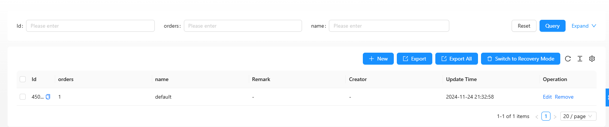
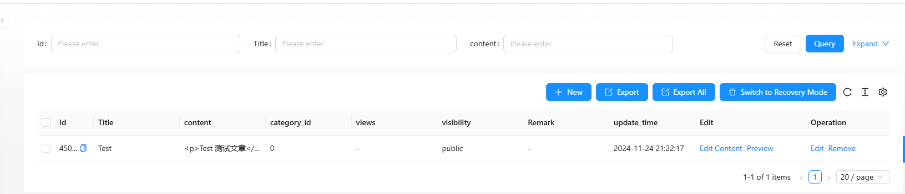
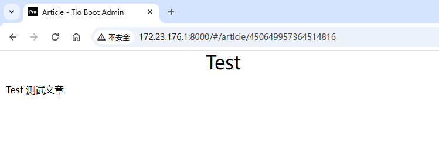
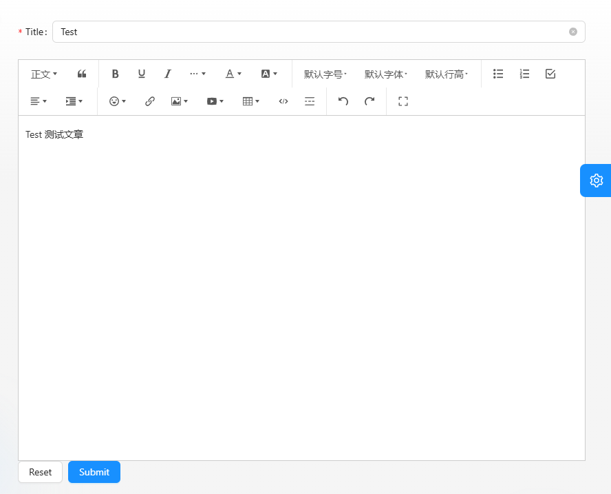

# 文章管理

在本文中，我们将展示如何使用 Tio Boot Admin 和 React 配合 WangEditor 来实现文章管理功能，包括文章的分类管理、创建、编辑、列表展示以及预览。以下是完整的实现步骤和代码示例。

## 数据表

为实现文章管理功能，需要设计两张数据表：文章分类表和文章表。

作者表

```sql
drop table if exists tio_boot_admin_article_author;
create table tio_boot_admin_article_author(
 "id" BIGINT PRIMARY KEY,
 "name" varchar(256),
 "dept" varchar(256),
 "files" JSONB,
  remark VARCHAR(256),
  creator VARCHAR(64) DEFAULT '',
  create_time TIMESTAMP WITH TIME ZONE NOT NULL DEFAULT CURRENT_TIMESTAMP,
  updater VARCHAR(64) DEFAULT '',
  update_time TIMESTAMP WITH TIME ZONE NOT NULL DEFAULT CURRENT_TIMESTAMP,
  deleted SMALLINT DEFAULT 0,
  tenant_id BIGINT NOT NULL DEFAULT 0
);
```

文章分类表

```sql
drop table if exists tio_boot_admin_article_category;
create table tio_boot_admin_article_category(
 "id" BIGINT PRIMARY KEY,
 "orders" int,
  name varchar,
  remark VARCHAR(256),
  creator VARCHAR(64) DEFAULT '',
  create_time TIMESTAMP WITH TIME ZONE NOT NULL DEFAULT CURRENT_TIMESTAMP,
  updater VARCHAR(64) DEFAULT '',
  update_time TIMESTAMP WITH TIME ZONE NOT NULL DEFAULT CURRENT_TIMESTAMP,
  deleted SMALLINT DEFAULT 0,
  tenant_id BIGINT NOT NULL DEFAULT 0
);
```

文章标签表

```sql
drop table if exists tio_boot_admin_article_tag;
create table tio_boot_admin_article_tag(
 "id" BIGINT PRIMARY KEY,
 "name" varchar(256),
  remark VARCHAR(256),
  creator VARCHAR(64) DEFAULT '',
  create_time TIMESTAMP WITH TIME ZONE NOT NULL DEFAULT CURRENT_TIMESTAMP,
  updater VARCHAR(64) DEFAULT '',
  update_time TIMESTAMP WITH TIME ZONE NOT NULL DEFAULT CURRENT_TIMESTAMP,
  deleted SMALLINT DEFAULT 0,
  tenant_id BIGINT NOT NULL DEFAULT 0
);
```

文章表

```sql
drop table if exists tio_boot_admin_article;
CREATE TABLE tio_boot_admin_article (
  "id" BIGINT PRIMARY KEY,
  category_id int default 0,
  title varchar,
  summary varchar,
  "draft" "bool",
  content TEXT,
  author bigint,
  tags jsonb,
  visibility VARCHAR(10) NOT NULL DEFAULT 'public', -- 'public' 或 'private'
  views int,
  files jsonb,
  "date" TIMESTAMP WITH TIME ZONE NOT NULL DEFAULT CURRENT_TIMESTAMP,
  "lastmod" TIMESTAMP WITH TIME ZONE NOT NULL DEFAULT CURRENT_TIMESTAMP,
  "embedding" VECTOR,
  "search_vector" TSVECTOR,
  remark VARCHAR(256),
  creator VARCHAR(64) DEFAULT '',
  create_time TIMESTAMP WITH TIME ZONE NOT NULL DEFAULT CURRENT_TIMESTAMP,
  updater VARCHAR(64) DEFAULT '',
  update_time TIMESTAMP WITH TIME ZONE NOT NULL DEFAULT CURRENT_TIMESTAMP,
  deleted SMALLINT DEFAULT 0,
  tenant_id BIGINT NOT NULL DEFAULT 0
);
```

```sql
CREATE OR REPLACE FUNCTION update_tio_boot_admin_article_search_vector() RETURNS trigger AS $$
BEGIN
  NEW.search_vector :=
    setweight(to_tsvector('english', coalesce(NEW.title, '')), 'A') ||
    setweight(to_tsvector('english', coalesce(NEW.content, '')), 'B');
  RETURN NEW;
END;
$$ LANGUAGE plpgsql;
```

```sql
CREATE TRIGGER trigger_update_tio_boot_admin_article_search_vector
BEFORE INSERT OR UPDATE ON tio_boot_admin_article
FOR EACH ROW EXECUTE FUNCTION update_tio_boot_admin_article_search_vector();


CREATE INDEX idx_tio_boot_admin_article_search_vector ON tio_boot_admin_article USING GIN (search_vector);
```

- tio_boot_admin_admin_token 略
- tio_boot_admin_system_constants_config 略
- tio_boot_admin_system_upload_file 略
- tio_boot_admin_system_users 略

## 访问日志

```sql
drop table if exists tio_boot_admin_article_access_log;
CREATE TABLE tio_boot_admin_article_access_log (
  id BIGINT NOT NULL primary key,
  channel_id BIGINT,
  ip VARCHAR,
  user_id VARCHAR,
  method varchar,
  uri VARCHAR,
  user_agent varchar,
  header text,
  body text,
  remark VARCHAR (256),
  creator VARCHAR (64) DEFAULT '',
  create_time TIMESTAMP WITHOUT TIME ZONE NOT NULL DEFAULT CURRENT_TIMESTAMP,
  updater VARCHAR (64) DEFAULT '',
  update_time TIMESTAMP WITHOUT TIME ZONE NOT NULL DEFAULT CURRENT_TIMESTAMP,
  deleted SMALLINT NOT NULL DEFAULT 0,
  tenant_id BIGINT NOT NULL DEFAULT 0
);
```

```java
package com.litongjava.tio.boot.admin.vo;

import lombok.AllArgsConstructor;
import lombok.Data;
import lombok.NoArgsConstructor;

@Data
@NoArgsConstructor
@AllArgsConstructor
public class AccessLogVo {
  public long id;
  public long channel_id;
  public String clientIp;
  public Object userId;
  public String method;
  public String uri;
  public String user_agent;
  public String header;
  public String body;
}

```

```java
package com.litongjava.tio.boot.admin.services;

import com.litongjava.db.activerecord.Db;
import com.litongjava.tio.boot.admin.vo.AccessLogVo;

public class DbArticleAccessLogService {
  public static final String sql = "INSERT INTO tio_boot_admin_article_access_log (id,channel_id,ip,user_id,method,uri,user_agent,header,body) values(?,?,?,?,?,?,?,?,?)";

  public void saveDb(AccessLogVo vo) {
    Db.updateBySql(sql, vo.id, vo.channel_id, vo.clientIp, vo.userId, vo.method, vo.uri, vo.user_agent, vo.header, vo.body);
  }
}
```

## 分类

文章分类模块用于管理分类信息，如排序、名称、备注等。

articleCategoryColumn.tsx

```tsx
import { ProColumns } from "@ant-design/pro-components";

export const articleCategoryColumns = (): ProColumns<any>[] => [
  { title: "orders", dataIndex: "orders", valueType: "text" },
  { title: "name", dataIndex: "name", valueType: "text" },
  { title: "Remark", dataIndex: "remark", valueType: "text" },
  { title: "Creator", dataIndex: "creator", valueType: "text", hideInForm: true },
  { title: "Update Time", dataIndex: "update_time", valueType: "dateTime", hideInSearch: true, hideInForm: true },
];
```

articleCategoryService.ts
定义分页、创建等服务的预处理逻辑

```tsx
import { listRequest } from "@/utils/apiTable";

export const articleCategoryBeforePageRequest = (params: any, isRecoveryMode?: boolean, containsUpload?: boolean) => {
  params.idType = "long";
  params.remarkOp = "ct";
  params.orderBy = "orders";
  params.update_time_type = "string[]";
  params.update_time_op = "bt";
  params.update_time_to_type = "ISO8601";
  if (containsUpload) {
    params.json_fields = ["files"];
  }

  if (isRecoveryMode) {
    params.deleted = 1;
  } else {
    params.deleted = 0;
  }

  params.nameOp = "ct";
  return params;
};

export const articleCategoryCreatePageRequest = (params: any, containsUpload?: boolean) => {
  params.ordersType = "int";
  if (containsUpload) {
    params.json_fields = ["files"];
  }
  return params;
};

export async function listArticleCategory(): Promise<API.Result> {
  return listRequest({ columns: "id,name", orderBy: "orders" }, "tio_boot_admin_article_category");
}
```

分类页面 articleCategoryIndex.tsx

使用 ApiTable 组件实现分类展示和管理：

```tsx
import React from "react";
import {
  articleCategoryBeforePageRequest,
  articleCategoryCreatePageRequest,
} from "@/pages/article/articleCategory/articleCategoryService";
import ApiTable from "@/components/common/ApiTable";
import { articleCategoryColumns } from "@/pages/article/articleCategory/articleCategoryColumn";

export default () => {
  const from = "tio_boot_admin_article_category";
  return (
    <ApiTable
      from={from}
      columns={articleCategoryColumns()}
      beforePageRequest={articleCategoryBeforePageRequest}
      beforeCreateRequest={articleCategoryCreatePageRequest}
    />
  );
};
```

显示效果


## 作者

authorColumn.tsx

```tsx
import { ProColumns } from "@ant-design/pro-components";
import UploadPreview from "@/components/common/UploadPreview";

export const tio_boot_admin_article_author_columns = (): ProColumns<any>[] => [
  {
    title: "Name",
    dataIndex: "name",
    formItemProps(form) {
      return {
        rules: [
          {
            required: true,
          },
        ],
      };
    },
  },
  {
    title: "Dept",
    dataIndex: "dept",
  },
  {
    title: "Files",
    dataIndex: "files",
    valueType: "text",
    hideInForm: true,
    search: false,
    render: (_, record) => <UploadPreview listType="picture-circle" fileList={record.files} />,
  },
  {
    title: "Remark",
    dataIndex: "remark",
  },
  {
    title: "update_time",
    dataIndex: "update_time",
    valueType: "dateTime",
    hideInSearch: true,
    hideInForm: true,
  },
  {
    key: "update_time",
    title: "update_time",
    dataIndex: "update_time_range",
    valueType: "dateTimeRange",
    hideInTable: true,
    hideInForm: true,
  },
];
```

authorIndex.tsx

```tsx
import React from "react";
import ApiTable from "@/components/common/ApiTable";
import { tio_boot_admin_article_author_columns } from "@/pages/article/author/authorColumn";

export default () => {
  const from = "tio_boot_admin_article_author";

  const beforePageRequest = (params: any, isRecoveryMode?: boolean, containsUpload?: boolean) => {
    params.idType = "long";
    if (containsUpload) {
      params.json_fields = ["files"];
    }
    params.deleted = isRecoveryMode ? 1 : 0;

    params.titleOp = "ct";
    params.contentOp = "ct";
    params.remarkOp = "ct";

    params.orderBy = "update_time";
    params.update_time_type = "string[]";
    params.update_time_op = "bt";
    params.isAsc = "false";

    return params;
  };
  const beforeCreateRequest = (formValues: any) => {
    return {
      ...formValues,
      idType: "long",
    };
  };

  return (
    <ApiTable
      from={from}
      columns={tio_boot_admin_article_author_columns()}
      beforePageRequest={beforePageRequest}
      beforeCreateRequest={beforeCreateRequest}
      containsUpload={true}
      uploadCategory={"author"}
    />
  );
};
```

authorService.ts

```ts
import { listRequest } from "@/utils/apiTable";

const tableName = "tio_boot_admin_article_author";

export async function listArticleAuthor(): Promise<API.Result> {
  return listRequest({ columns: "id,name", orderBy: "id" }, tableName);
}
```

## 标签

tagColumn.tsx;

```tsx
import { ProColumns } from "@ant-design/pro-components";

export const tio_boot_admin_article_tag_columns = (): ProColumns<any>[] => [
  {
    title: "Name",
    dataIndex: "name",
    formItemProps(form) {
      return {
        rules: [
          {
            required: true,
          },
        ],
      };
    },
  },
  {
    title: "Remark",
    dataIndex: "remark",
  },
  {
    title: "update_time",
    dataIndex: "update_time",
    valueType: "dateTime",
    hideInSearch: true,
    hideInForm: true,
  },
  {
    key: "update_time",
    title: "update_time",
    dataIndex: "update_time_range",
    valueType: "dateTimeRange",
    hideInTable: true,
    hideInForm: true,
  },
];
```

tagIndex.tsx

```tsx
import React from "react";
import ApiTable from "@/components/common/ApiTable";
import { tio_boot_admin_article_tag_columns } from "@/pages/article/tag/tagColumn";

export default () => {
  const from = "tio_boot_admin_article_tag";

  const beforePageRequest = (params: any, isRecoveryMode?: boolean, containsUpload?: boolean) => {
    params.idType = "long";
    if (containsUpload) {
      params.json_fields = ["files"];
    }
    params.deleted = isRecoveryMode ? 1 : 0;

    params.titleOp = "ct";
    params.contentOp = "ct";
    params.remarkOp = "ct";

    params.orderBy = "update_time";
    params.update_time_type = "string[]";
    params.update_time_op = "bt";
    params.isAsc = "false";

    return params;
  };
  const beforeCreateRequest = (formValues: any) => {
    return {
      ...formValues,
      idType: "long",
    };
  };

  return (
    <ApiTable
      from={from}
      columns={tio_boot_admin_article_tag_columns()}
      beforePageRequest={beforePageRequest}
      beforeCreateRequest={beforeCreateRequest}
    />
  );
};
```

tagService.ts

```ts
import { listRequest } from "@/utils/apiTable";

const tableName = "tio_boot_admin_article_tag";

export async function listArticleTag(): Promise<API.Result> {
  return listRequest({ columns: "id,name", orderBy: "id" }, tableName);
}
```

## 文章

文章模块用于管理文章内容的创建、编辑、列表展示和预览。

### 创建文章

articleService.ts
实现文章的创建和查询：

```tsx
import { createRequest, getRequest } from "@/utils/apiTable";

const tableName = "tio_boot_admin_article";

export async function createSystemArticle(data: any) {
  return createRequest(data, tableName);
}

export async function getArticleById(id: any) {
  return getRequest(id, { idType: "long" }, tableName);
}
```

createArticle.tsx
基于 Form 和 WangEditor 实现文章创建表单

```tsx
import CommonEditor from "@/components/common/CommonEditor";
import { createSystemArticle, getArticleById } from "@/pages/article/article/articleService";
import { Button, Form, Input, message } from "antd";
import React from "react";
// @ts-ignore
import { useParams } from "umi";

const CreateArticle: React.FC = () => {
  // 使用泛型确保类型正确
  const { id } = useParams<{ id: string }>();
  // 编辑器内容
  const [html, setHtml] = React.useState("");
  const [messageApi, contextHolder] = message.useMessage();
  const [form] = Form.useForm();
  // 使用 useEffect 来在组件挂载时获取文章内容
  // 组件挂载时根据 id 获取文章内容
  React.useEffect(() => {
    if (id && id !== ":id") {
      getArticleById(id)
        .then((response) => {
          console.log("response:{}", response);
          // 设置表单的初始值
          form.setFieldsValue({
            id: response.data.id,
            title: response.data.title,
          });
          setHtml(response.data.content);
        })
        .catch((err) => message.error("Failed to fetch article: " + err));
    }
  }, [id]);

  /**
   * 提交操作：提交后清空
   */
  const handleSubmit = async () => {
    try {
      const formValues = await form.validateFields();
      // 将富文本内容添加进 formValues
      formValues.content = html;

      const hide = messageApi.loading("submitting...");
      const response = await createSystemArticle(formValues);

      if (response.ok) {
        // 新增: 如果后端返回了 id，则设置到表单
        if (response.data && response.data.id) {
          form.setFieldsValue({ id: response.data.id });
          messageApi.success("update article successful");
        } else {
          messageApi.success("submit article successful");
        }
        // 提交成功后，清空
        setHtml("");
        form.resetFields();
      } else {
        messageApi.error("failed to create article");
      }
      hide();
    } catch (error) {
      messageApi.error("" + error);
    }
  };

  /**
   * 暂存操作：不清空
   */
  const handleTempSave = async () => {
    try {
      const formValues = await form.validateFields();
      formValues.content = html;

      const hide = messageApi.loading("Saving...");
      const response = await createSystemArticle(formValues);

      if (response.ok) {
        // 新增: 如果后端返回了 id，则设置到表单
        if (response.data && response.data.id) {
          form.setFieldsValue({ id: response.data.id });
          messageApi.success("update article successful");
        } else {
          messageApi.success("save article successful");
        }
      } else {
        messageApi.error("failed to save article");
      }
      hide();
    } catch (error) {
      messageApi.error("" + error);
    }
  };

  /**
   * 重置操作：清空
   */
  const handleReset = () => {
    form.resetFields();
    setHtml("");
  };

  return (
    <>
      {contextHolder}
      <Form
        layout="horizontal"
        form={form}
        // 注意：普通 antd Form 不支持 onFinish 属性直接写 handleSubmit，
        // 而是需要我们手动写 <Button onClick={handleSubmit}>。
      >
        {/* id 隐藏 */}
        <Form.Item name="id" label="id" hidden>
          <Input />
        </Form.Item>

        {/* title 必填 */}
        <Form.Item name="title" label="Title" rules={[{ required: true, message: "Please enter title!" }]}>
          <Input />
        </Form.Item>

        {/* 编辑器 */}
        <Form.Item label="">
          <CommonEditor value={html} onChange={(editor) => setHtml(editor.getHtml())} />
        </Form.Item>

        <Form.Item>
          {/* 暂存按钮 */}
          <Button type="default" onClick={handleTempSave} style={{ marginRight: 8 }}>
            Save
          </Button>

          {/* 提交按钮 */}
          <Button type="primary" onClick={handleSubmit} style={{ marginRight: 8 }}>
            Sbumit
          </Button>

          {/* 重置按钮 */}
          <Button type="dashed" onClick={handleReset}>
            Resst
          </Button>
        </Form.Item>
      </Form>
    </>
  );
};

export default CreateArticle;
```

### 文章列表

articleColumn.tsx
定义文章列表的表格列：

```tsx
import UploadPreview from "@/components/common/UploadPreview";
import { ProColumns } from "@ant-design/pro-components";

export const systemArticleListColumns = (): ProColumns<any>[] => [
  {
    title: "Title",
    dataIndex: "title",
    ellipsis: true,
    formItemProps(form) {
      return {
        rules: [
          {
            required: true,
          },
        ],
      };
    },
  },
  {
    title: "Summary",
    dataIndex: "summary",
    ellipsis: true,
  },
  {
    title: "Draft",
    dataIndex: "draft",
  },
  {
    title: "Visibility",
    dataIndex: "visibility",
    valueType: "select",
    fieldProps: {
      options: [
        { label: "public", value: "public" },
        { label: "private", value: "private" },
      ],
    },
  },
  {
    title: "Views",
    dataIndex: "views",
  },
  {
    title: "Files",
    dataIndex: "files",
    valueType: "text",
    hideInForm: true,
    search: false,
    render: (_, record) => <UploadPreview listType="picture-circle" fileList={record.files} />,
  },
  {
    title: "Date",
    dataIndex: "date",
    valueType: "dateTime",
    hideInSearch: true,
  },
  {
    key: "date",
    title: "Date",
    dataIndex: "date_range",
    valueType: "dateTimeRange",
    hideInTable: true,
    hideInForm: true,
  },
  {
    title: "Lastmod",
    dataIndex: "lastmod",
    valueType: "dateTime",
    hideInSearch: true,
  },
  {
    key: "lastmod",
    title: "Lastmod",
    dataIndex: "lastmod_range",
    valueType: "dateTimeRange",
    hideInTable: true,
    hideInForm: true,
  },
  {
    title: "Remark",
    dataIndex: "remark",
  },
  {
    title: "Update Time",
    dataIndex: "update_time",
    valueType: "dateTime",
    hideInSearch: true,
    hideInForm: true,
  },
  {
    key: "update_time",
    title: "Update Time",
    dataIndex: "update_time_range",
    valueType: "dateTimeRange",
    hideInTable: true,
    hideInForm: true,
  },
];
```

articleIndex.tsx 实现文章的列表展示和操作：

```tsx
import ApiTable from "@/components/common/ApiTable";
import { systemArticleListColumns } from "@/pages/article/article/articleColumn";
import { listArticleCategory } from "@/pages/article/articleCategory/articleCategoryService";
import { listArticleAuthor } from "@/pages/article/author/authorService";
import { listArticleTag } from "@/pages/article/tag/tagService";
import React from "react";
// @ts-ignore
import { useNavigate } from "umi";

export default () => {
  const from = "tio_boot_admin_article";
  let navigate = useNavigate();

  const beforePageRequest = (params: any, isRecoveryMode?: boolean) => {
    params.idType = "long";
    params.deleted = isRecoveryMode ? 1 : 0;

    params.titleOp = "ct";
    params.contentOp = "ct";
    params.remarkOp = "ct";

    params.orderBy = "update_time";
    params.update_time_type = "string[]";
    params.update_time_to_type = "ISO8601";
    params.date_type = "string[]";
    params.date_to_type = "ISO8601";
    params.lastmod_type = "string[]";
    params.lastmod_to_type = "ISO8601";
    params.update_time_op = "bt";
    params.isAsc = "false";

    return params;
  };
  const beforeCreateRequest = (formValues: any) => {
    return {
      ...formValues,
      idType: "long",
      date_to_type: "ISO8601",
      lastmod_to_type: "ISO8601",
    };
  };

  const editContentAndPreview = {
    title: "Edit",
    valueType: "option",
    width: 200,
    render: (text: any, record: any) => [
      <a key="editContent" onClick={() => navigate("/article/create/" + record.id, { replace: true })}>
        Edit Content
      </a>,
      <a key="preView" onClick={() => navigate("/article/" + record.id, { replace: true })}>
        Preview
      </a>,
    ],
  };

  const [articleCategoryOptions, setArticleCategoryOptions] = React.useState([]);
  const [articleAuthorOptions, setArticleAuthorOptions] = React.useState([]);
  const [articleTagOptions, setTagAuthorOptions] = React.useState([]);

  React.useEffect(() => {
    const getArticleCategoryOptions = async () => {
      listArticleCategory().then((respVo) => {
        if (respVo.ok) {
          let options = respVo.data.map((item: { name: string; id: string }) => ({
            label: item.name,
            value: item.id,
          }));
          setArticleCategoryOptions(options);
        } else {
          console.log("Failed to get article category");
        }
      });
      listArticleAuthor().then((respVo) => {
        if (respVo.ok) {
          let options = respVo.data.map((item: { name: string; id: string }) => ({
            label: item.name,
            value: item.id,
          }));
          setArticleAuthorOptions(options);
        } else {
          console.log("Failed to get article category");
        }
      });
      listArticleTag().then((respVo) => {
        if (respVo.ok) {
          let options = respVo.data.map((item: { name: string; id: string }) => ({
            label: item.name,
            value: item.id,
          }));
          setTagAuthorOptions(options);
        } else {
          console.log("Failed to get article category");
        }
      });
    };
    getArticleCategoryOptions();
  }, []);

  const categoryColumns = {
    title: "Category",
    dataIndex: "category_id",
    valueType: "select",
    fieldProps: {
      options: articleCategoryOptions,
    },
  };

  const authorColumns = {
    title: "Author",
    dataIndex: "author",
    valueType: "select",
    fieldProps: {
      options: articleAuthorOptions,
    },
  };

  const tagColumns = {
    title: "Tag",
    dataIndex: "tags",
    valueType: "select",
    fieldProps: {
      mode: "multiple",
      options: articleTagOptions,
    },
  };

  const columns = [...systemArticleListColumns(), categoryColumns, authorColumns, tagColumns, editContentAndPreview];

  return (
    <ApiTable
      from={from}
      columns={columns}
      beforePageRequest={beforePageRequest}
      beforeCreateRequest={beforeCreateRequest}
      containsUpload={true}
      uploadCategory={"images"}
    />
  );
};
```

显示效果




### 预览文章

为文章预览提供样式支持：
previewArticel.css

```css
.editor-content-view {
  /*border: 3px solid #ccc;*/
  border-radius: 5px;
  padding: 0 10px;
  margin-top: 20px;
  overflow-x: auto;
}

.editor-content-view p,
.editor-content-view li {
  white-space: pre-wrap; /* 保留空格 */
}

.editor-content-view blockquote {
  border-left: 8px solid #d0e5f2;
  padding: 10px 10px;
  margin: 10px 0;
  background-color: #f1f1f1;
}

.editor-content-view code {
  font-family: monospace;
  background-color: #eee;
  padding: 3px;
  border-radius: 3px;
}
.editor-content-view pre > code {
  display: block;
  padding: 10px;
}

.editor-content-view table {
  border-collapse: collapse;
}
.editor-content-view td,
.editor-content-view th {
  border: 1px solid #ccc;
  min-width: 50px;
  height: 20px;
}
.editor-content-view th {
  background-color: #f1f1f1;
}

.editor-content-view ul,
.editor-content-view ol {
  padding-left: 20px;
}

.editor-content-view input[type="checkbox"] {
  margin-right: 5px;
}
```

previewArticle.tsx
加载文章并渲染 HTML 内容：

```tsx
import React from "react";
import { getArticleById } from "@/pages/article/article/articleService";
import { message } from "antd";
// @ts-ignore
import { useParams } from "umi";
import "./previewArticel.css";
import "@wangeditor/editor/dist/css/style.css";

const PreviewArticle: React.FC = () => {
  const { id } = useParams<{ id: string }>();
  // 编辑器内容
  const [html, setHtml] = React.useState("");
  const [title, setTitle] = React.useState("");
  const [messageApi, contextHolder] = message.useMessage();
  // 使用 useEffect 来在组件挂载时获取文章内容
  React.useEffect(() => {
    if (id && id !== ":id") {
      getArticleById(id)
        .then((response) => {
          if (response.ok) {
            setTitle(response.data.title);
            setHtml(response.data.content);
          } else {
            messageApi.error("Failed to fetch article: " + id);
          }
        })
        .catch((err) => messageApi.error("Failed to fetch article: " + err));
    }
  }, [id]);

  return (
    <>
      {contextHolder}
      <h1 style={{ textAlign: "center" }}>{title}</h1>
      <div id="editor-content-view" className="editor-content-view" dangerouslySetInnerHTML={{ __html: html }} />
    </>
  );
};

export default PreviewArticle;
```

### 菜单

```tsx
  {
    path: '/article',
    name: 'article',
    icon: 'FileWordOutlined',
    routes: [
      {
        path: 'articleCategory',
        name: 'Article Category',
        component: './article/articleCategory/articleCategoryIndex',
      },
      {
        path: '/article/create/:id',
        name: 'Create Article',
        hideInMenu: false,
        component: './article/article/createArticle',
      },
      {
        path: '/article/article',
        name: 'Article',
        hideInMenu: false,
        component: './article/article/articleIndex',
      },
    ],
  },
  {
    path: '/article/:id',
    hideInMenu: true,
    layout: false,
    name: 'PreviewArticle',
    component: './article/article/previewArticle',
  },
```

## 总结

通过 Tio Boot Admin 与 React 的结合，配合 WangEditor，我们可以高效实现文章管理功能，包括分类、创建、展示和预览。这种方式结构清晰，易于扩展，适用于中小型 CMS 系统的开发需求。
