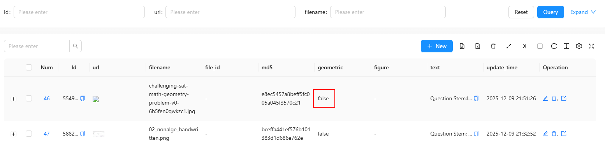
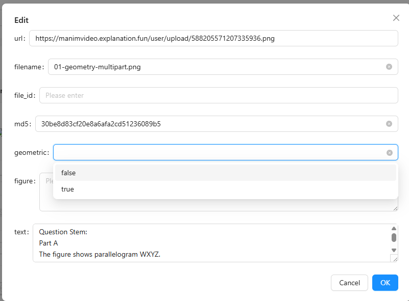

# 布尔值管理

本文介绍在 **tio-boot-admin** + **tio-boot-admin-react** 体系下，如何对**布尔值字段（Boolean）**进行统一、规范、可查询的管理与展示。

重点说明 **数据库设计、前端枚举映射、筛选能力与查询行为**，适用于业务中存在明确“是 / 否”“命中 / 未命中”“开启 / 关闭”语义的字段场景。

---

## 一、使用场景说明

布尔值字段在业务系统中非常常见，典型特征包括：

* 只有 **true / false** 两种取值
* 表示一种 **明确的业务状态**
* 经常需要 **作为筛选条件**
* 在列表页中需要 **可读性强的展示方式**

常见业务示例：

* 是否为几何题
* 是否命中某种规则
* 是否启用某个策略
* 是否解析成功
* 是否需要人工复核

本文以 `geometric`（是否为几何题）字段为例，说明完整的管理方案。

---

## 二、数据库层设计规范

### 1. 表结构示例

```sql
CREATE TABLE "public"."mv_file_parse_cache" (
  "id" int8 PRIMARY KEY,
  "url" varchar,
  "md5" varchar,
  "filename" varchar,
  "text" varchar,
  "geometric" bool,
  "figure" jsonb,
  "creator" varchar(64) DEFAULT '',
  "create_time" timestamptz NOT NULL DEFAULT CURRENT_TIMESTAMP,
  "updater" varchar(64) DEFAULT '',
  "update_time" timestamptz NOT NULL DEFAULT CURRENT_TIMESTAMP,
  "deleted" int2 DEFAULT 0,
  "tenant_id" int8 NOT NULL DEFAULT 0
);
```

### 2. 布尔字段设计说明

| 字段名       | 类型   | 说明         |
| --------- | ---- | ---------- |
| geometric | bool | 是否命中几何解析逻辑 |

设计原则：

* 使用数据库原生 `bool` 类型
* 不使用 `int / char / varchar` 代替
* 语义必须**明确、不可歧义**
* 字段命名建议使用 **形容词 / 判断式**

推荐命名方式：

* `is_xxx`
* `has_xxx`
* `xxx_enabled`
* `xxx_matched`

---

## 三、前端布尔值枚举映射

### 1. 为什么需要枚举映射

直接展示 `true / false` 存在以下问题：

* 可读性差
* 不利于业务人员理解
* 筛选项不可控

因此推荐统一通过 **valueEnum** 管理布尔值。

---

### 2. 布尔值枚举定义

```ts
const trueFalseEnum = {
  false: { text: 'false' },
  true: { text: 'true' },
};
```

说明：

* key 必须是 **布尔值**
* text 为列表和筛选项展示文本
* 可根据业务需要替换为：

  * 是 / 否
  * 命中 / 未命中
  * 开启 / 关闭

---

## 四、ProColumns 中的布尔字段配置

### 1. 列配置示例

```ts
const trueFalseEnum = {
  false: {text: 'false',},
  true: {text: 'true'},
}

{
  title: 'geometric',
  dataIndex: 'geometric',
  valueType: 'select',
  valueEnum: trueFalseEnum,
}
```

### 2. 配置说明

| 配置项                 | 作用        |
| ------------------- | --------- |
| valueType: 'select' | 启用下拉筛选    |
| valueEnum           | 定义布尔值映射关系 |
| dataIndex           | 对应数据库字段   |

效果：

* 表格中显示为可读文本
* 查询区自动生成下拉筛选
* 查询参数自动传递布尔值

---

## 五、完整列配置示例（上下文）

```ts
import { ProColumns } from '@ant-design/pro-components';

const trueFalseEnum = {
  false: { text: 'false' },
  true: { text: 'true' },
};

export const mv_file_parse_cache_column = (): ProColumns<any>[] => [
  {
    title: 'url',
    dataIndex: 'url',
    valueType: 'image',
  },
  {
    title: 'filename',
    dataIndex: 'filename',
    valueType: 'text',
  },
  {
    title: 'file_id',
    dataIndex: 'file_id',
    valueType: 'text',
  },
  {
    title: 'md5',
    dataIndex: 'md5',
    valueType: 'text',
  },
  {
    title: 'geometric',
    dataIndex: 'geometric',
    valueType: 'select',
    valueEnum: trueFalseEnum,
  },
  {
    title: 'figure',
    dataIndex: 'figure',
    valueType: 'textarea',
    ellipsis: true,
    copyable: true,
  },
  {
    title: 'text',
    dataIndex: 'text',
    valueType: 'textarea',
    ellipsis: true,
    copyable: true,
  },
  {
    title: 'update_time',
    dataIndex: 'update_time',
    valueType: 'dateTime',
    hideInSearch: true,
    hideInForm: true,
  },
  {
    key: 'update_time',
    title: 'update_time',
    dataIndex: 'update_time_range',
    valueType: 'dateTimeRange',
    hideInTable: true,
    hideInForm: true,
    hideInDescriptions: true,
  },
];

```

```tsx
import ApiTable from '@/components/common/ApiTable';
import { mv_file_parse_cache_column } from '@/pages/app/mv_file_parse_cache/mv_file_parse_cache_column';

export default () => {
  const from = 'mv_file_parse_cache';
  const beforePageRequest = (params: any, isRecoveryMode?: boolean) => {
    params.idType = 'long';

    if (isRecoveryMode) {
      params.deleted = 1;
    } else {
      params.deleted = 0;
    }
    params.orderBy = 'update_time';
    params.isAsc = 'false';
    params.update_time_op = 'bt';
    params.topicOp = 'ct';
    params.codeOp = 'ct';
    //防止后端自动计算Json fields
    params.json_fields = ['files'];
    return params;
  };

  const beforeCreateRequest = (formValues: any) => {
    return {
      ...formValues,
      idType: 'long',
    };
  };
  return (
    <ApiTable
      from={from}
      columns={mv_file_parse_cache_column()}
      beforePageRequest={beforePageRequest}
      beforeCreateRequest={beforeCreateRequest}
    />
  );
};
```

说明：

* 布尔值字段可与 JSON、文本字段并存
* 不影响分页、排序、复制等通用能力
* 查询条件会自动拼接到后端请求参数中

---

## 六、查询行为与后端兼容性

### 1. 前端请求行为

当选择 `geometric = true` 时，请求参数示例：

```json
{
  "geometric": true
}
```

当选择 `geometric = false` 时：

```json
{
  "geometric": false
}
```

### 2. 后端处理建议

* 使用等值匹配
* 不要对 bool 字段做模糊查询
* 不要自动转字符串

推荐 SQL 行为：

```sql
where geometric = true
```

---


## 七、后端返回数据示例（布尔值字段）

以下示例为 `mv_file_parse_cache` 表对应接口返回的**单条真实数据结构**，重点关注 `geometric` 布尔值字段在返回结果中的表现形式。

```json
{
  "tenant_id": "0",
  "figure": null,
  "creator": "",
  "create_time": "2025-12-09 21:51:26.773198",
  "url": "https://manimvideo.explanation.fun/user/upload/554975181403471872.jpg",
  "updater": "",
  "update_time": "2025-12-09 21:51:26.773198",
  "filename": "challenging-sat-math-geometry-problem-v0-6h5fen0qwkzc1.jpg",
  "deleted": 0,
  "geometric": false,
  "id": "554975187514572800",
  "text": "...",
  "md5": "e8ec5457a8beff5fc005a045f3570c21"
}
```

### 字段重点说明

| 字段名       | 值     | 说明                             |
| --------- | ----- | ------------------------------ |
| geometric | false | 明确表示该记录**未命中几何解析逻辑**           |
| figure    | null  | 因 `geometric = false`，无结构化图形结果 |
| text      | "..." | 普通文本解析结果                       |
| deleted   | 0     | 逻辑未删除                          |

### 关键结论

* `geometric` 在接口中以 **标准 JSON 布尔值** 返回
* 前端 `valueEnum` 中的 `false` 能被正确匹配
* 当 `geometric = false` 时：

  * `figure` 允许为 `null`
  * 不影响列表展示与筛选
* 前后端 **无需做任何类型转换**

---

## 八、布尔值字段的实际业务语义建议

结合数据示例，建议对布尔值字段形成如下业务约定：

* `true`
  表示：

  * 命中规则
  * 启用状态
  * 成功识别
  * 有后续结构化数据

* `false`
  表示：

  * 未命中规则
  * 不启用
  * 普通处理路径
  * 允许关联字段为空（如 `figure = null`）

这种设计可以有效避免：

* 使用 `null / 0 / 1` 混合表达状态
* 前端判断逻辑复杂化
* 查询条件歧义

## 九、显示示例





## 十、方案总结

该布尔值管理方案具备以下特点：

* 数据库层语义清晰
* 前端展示统一、可读
* 自动支持筛选与查询
* 与 tio-boot-admin 通用 CRUD 完全兼容
* 适用于规则判断类、状态类字段

**结论**：
凡是业务中存在明确“是 / 否”判断的字段，都应使用此布尔值管理模式，避免使用整型或字符串替代。