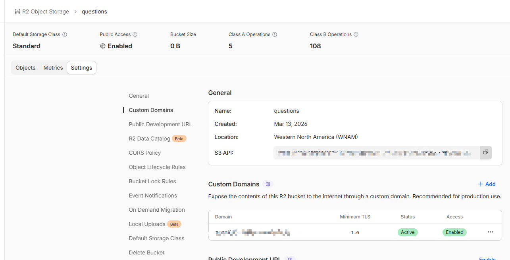

# 存储到 Cloudflare R2

[[toc]]

本文介绍如何：

1. 创建 Cloudflare R2 Bucket
2. 绑定自定义域名
3. 获取 AccountId
4. 配置 CORS
5. 创建 R2 API Token
6. 配置环境变量
7. 使用 **Java S3 SDK** 上传文件到 R2

---

## 一、创建 R2 Bucket

进入 Cloudflare 控制台：

```
https://dash.cloudflare.com/
```

依次进入：

```
Storage & Database
    → R2 Object Storage
        → Create Bucket
```

输入 Bucket 名称，例如：

```
questions
```

创建完成后即可进入 bucket 页面。

---

## 二、绑定自定义域名

进入 Bucket 后：

```
Settings → Custom Domains
```

点击：

```
Add
```

绑定你的域名，例如：

```
r2.example.com
```

绑定成功后，你就可以通过该域名访问对象。

图片示例：



---

## 三、获取 AccountId

在 Bucket 页面中可以看到 **S3 API** 地址：

例如：

```
https://xxxx.r2.cloudflarestorage.com/questions
```

其中：

```
xxxx
```

就是你的：

```
AccountId
```

---

## 四、配置 CORS Policy

进入：

```
Settings → CORS Policy
```

设置如下：

```json
[
  {
    "AllowedOrigins": [
      "*"
    ],
    "AllowedMethods": [
      "GET"
    ]
  }
]
```

说明：

| 字段             | 作用      |
| -------------- | ------- |
| AllowedOrigins | 允许访问的域名 |
| AllowedMethods | 允许的方法   |

如果需要上传，可增加：

```
PUT
POST
```

---

## 五、创建 R2 API Token

### 1 打开 API Token 页面

进入：

```
R2 Object Storage → Manage R2 API tokens
```

或者直接访问：

```
https://dash.cloudflare.com/?to=/:account/r2/api-tokens
```

---

### 2 创建 Token

点击：

```
Create API Token
```

填写：

#### Token name

```
r2-java-sdk
```

#### Permissions

选择：

```
Object Read & Write
```

#### Bucket

可以选择：

```
Apply to all buckets
```

或者指定：

```
questions
```

---

### 3 获取 Access Key

创建成功后会得到两个值：

```
Access Key ID
Secret Access Key
```

示例：

```
Access Key ID: 0a1b2c3d4e5f6g7h
Secret Access Key: 9JmK2f9S3...
```

注意：

```
Secret Access Key 只会显示一次
```

务必保存。

---

## 六、配置环境变量

在项目中添加：

```
.env
```

示例：

```env
R2_BUCKET_DOMAIN=
R2_BUCKET_NAME=questions
R2_ACCESS_KEY_ID=xx
R2_SECRET_ACCESS_KEY=xx
R2_ACCOUNT_ID=xx
```

字段说明：

| 变量                   | 说明                   |
| -------------------- | -------------------- |
| R2_BUCKET_DOMAIN     | 自定义访问域名              |
| R2_BUCKET_NAME       | bucket 名称            |
| R2_ACCESS_KEY_ID     | API Token AccessKey  |
| R2_SECRET_ACCESS_KEY | API Token Secret     |
| R2_ACCOUNT_ID        | Cloudflare AccountId |

---

## 七、Java 工具类

Cloudflare R2 兼容 **S3 API**，因此可以使用 **AWS S3 SDK**。

下面是完整工具类：

```java
package com.litongjava.tio.boot.admin.utils.storage;

import java.io.File;
import java.net.URI;
import java.net.URLEncoder;
import java.nio.charset.StandardCharsets;
import java.time.Duration;

import com.litongjava.tio.utils.environment.EnvUtils;
import com.litongjava.tio.utils.http.ContentTypeUtils;
import com.litongjava.tio.utils.hutool.FilenameUtils;

import software.amazon.awssdk.auth.credentials.AwsBasicCredentials;
import software.amazon.awssdk.auth.credentials.AwsCredentialsProvider;
import software.amazon.awssdk.auth.credentials.StaticCredentialsProvider;
import software.amazon.awssdk.core.sync.RequestBody;
import software.amazon.awssdk.http.apache.ApacheHttpClient;
import software.amazon.awssdk.regions.Region;
import software.amazon.awssdk.services.s3.S3Configuration;
import software.amazon.awssdk.services.s3.S3Client;
import software.amazon.awssdk.services.s3.S3ClientBuilder;
import software.amazon.awssdk.services.s3.model.GetObjectRequest;
import software.amazon.awssdk.services.s3.model.PutObjectRequest;
import software.amazon.awssdk.services.s3.model.PutObjectResponse;
import software.amazon.awssdk.services.s3.presigner.S3Presigner;
import software.amazon.awssdk.services.s3.presigner.model.GetObjectPresignRequest;
import software.amazon.awssdk.services.s3.presigner.model.PresignedGetObjectRequest;

/**
 * Cloudflare R2 工具类：S3 兼容，方法风格对齐 AwsS3Utils
 *
 * 建议环境变量：
 * - R2_BUCKET_NAME
 * - R2_ACCESS_KEY_ID
 * - R2_SECRET_ACCESS_KEY
 * - R2_ACCOUNT_ID（可选：不传则用 R2_ENDPOINT）
 * - R2_ENDPOINT（可选：形如 https://<accountid>.r2.cloudflarestorage.com）
 * - R2_REGION（可选：建议 "auto"）
 * - R2_BUCKET_DOMAIN（可选：公开访问域名/CDN 域名）
 */
public class CloudflareR2Utils {

  // 若你有自己的公开域名（CDN/自定义域名），优先用它拼接公开 URL
  public static final String domain = EnvUtils.getStr("R2_BUCKET_DOMAIN");

  public static final String bucketName = EnvUtils.getStr("R2_BUCKET_NAME");
  public static final String accessKeyId = EnvUtils.getStr("R2_ACCESS_KEY_ID");
  public static final String secretAccessKey = EnvUtils.getStr("R2_SECRET_ACCESS_KEY");

  public static final String accountId = EnvUtils.getStr("R2_ACCOUNT_ID");
  public static final String endpoint = EnvUtils.getStr("R2_ENDPOINT"); // 可直接配置完整 endpoint
  public static final String regionName = EnvUtils.getStr("R2_REGION"); // 建议 auto

  public static final Duration DEFAULT_PRESIGN_EXPIRES = Duration.ofMinutes(30);

  // -------------------------
  // Upload
  // -------------------------

  public static PutObjectResponse upload(S3Client client, String bucketName, String targetName, byte[] fileContent,
      String suffix) {
    try {
      String contentType = ContentTypeUtils.getContentType(suffix);
      PutObjectRequest putOb = PutObjectRequest.builder().bucket(bucketName).key(targetName).contentType(contentType)
          .build();

      return client.putObject(putOb, RequestBody.fromBytes(fileContent));
    } catch (Exception e) {
      throw new RuntimeException(e);
    }
  }

  public static PutObjectResponse upload(S3Client client, String targetName, File file) {
    String name = file.getName();
    String suffix = FilenameUtils.getSuffix(name);
    String contentType = ContentTypeUtils.getContentType(suffix);
    try {
      PutObjectRequest putOb = PutObjectRequest.builder().bucket(bucketName).key(targetName).contentType(contentType)
          .build();

      return client.putObject(putOb, RequestBody.fromFile(file));
    } catch (Exception e) {
      throw new RuntimeException(e);
    }
  }

  public static PutObjectResponse upload(S3Client client, String bucketName, String targetName, File file) {
    String name = file.getName();
    String suffix = FilenameUtils.getSuffix(name);
    String contentType = ContentTypeUtils.getContentType(suffix);
    try {
      PutObjectRequest putOb = PutObjectRequest.builder().bucket(bucketName).key(targetName).contentType(contentType)
          .build();

      return client.putObject(putOb, RequestBody.fromFile(file));
    } catch (Exception e) {
      throw new RuntimeException(e);
    }
  }

  // -------------------------
  // Public URL (仅当对象公开/域名放行时可用)
  // -------------------------

  public static String getUrl(String targetUri) {
    return getUrl(bucketName, targetUri);
  }

  public static String getUrl(String bucketName, String targetUri) {
    if (domain != null && domain.length() > 0) {
      return "https://" + domain + "/" + targetUri;
    }
    // R2 默认 endpoint 不包含 bucket 子域名；如果你没配置 domain，返回 endpoint + /bucket/key 这种路径形式
    // 注意：该 URL 不一定“公开可访问”，仅作为展示/记录用；私有桶请用预签名 URL
    String ep = resolveEndpoint();
    String base = ep.endsWith("/") ? ep.substring(0, ep.length() - 1) : ep;
    return base + "/" + bucketName + "/" + targetUri;
  }

  // -------------------------
  // Presigned Download URL (私有 bucket 推荐用这个)
  // -------------------------

  public static String getPresignedDownloadUrl(String targetUri) {
    return getPresignedDownloadUrl(bucketName, targetUri, DEFAULT_PRESIGN_EXPIRES, null, null);
  }

  public static String getPresignedDownloadUrl(String bucket, String targetUri) {
    return getPresignedDownloadUrl(bucket, targetUri, DEFAULT_PRESIGN_EXPIRES, null, null);
  }

  public static String getPresignedDownloadUrl(String regionName, String bucket, String targetUri) {
    return getPresignedDownloadUrl(regionName, bucket, targetUri, DEFAULT_PRESIGN_EXPIRES, null, null);
  }

  public static String getPresignedDownloadUrl(String regionName, String bucket, String targetUri,
      String downloadFilename) {
    String suffix = FilenameUtils.getSuffix(downloadFilename);
    String contentType = ContentTypeUtils.getContentType(suffix);
    return getPresignedDownloadUrl(regionName, bucket, targetUri, DEFAULT_PRESIGN_EXPIRES, downloadFilename,
        contentType);
  }

  public static String getPresignedDownloadUrl(String bucket, String key, Duration expires, String downloadFilename,
      String contentType) {
    String region = resolveRegion();
    return getPresignedDownloadUrl(region, bucket, key, expires, downloadFilename, contentType);
  }

  /**
   * 生成可下载的预签名 GET URL
   *
   * @param bucket           bucket name
   * @param key              object key
   * @param expires          过期时间
   * @param downloadFilename 下载保存的文件名（可选）
   * @param contentType      响应 Content-Type（可选）
   */
  public static String getPresignedDownloadUrl(String regionName, String bucket, String key, Duration expires,
      String downloadFilename, String contentType) {

    if (expires == null) {
      expires = DEFAULT_PRESIGN_EXPIRES;
    }

    try (S3Presigner presigner = buildPresigner(regionName)) {

      GetObjectRequest.Builder getReq = GetObjectRequest.builder().bucket(bucket).key(key);

      if (downloadFilename != null && downloadFilename.length() > 0) {
        String safe = downloadFilename.replace("\"", "");
        String encoded = URLEncoder.encode(downloadFilename, StandardCharsets.UTF_8).replace("+", "%20");
        String disposition = "attachment; filename=\"" + safe + "\"; filename*=UTF-8''" + encoded;
        getReq.responseContentDisposition(disposition);
      } else {
        getReq.responseContentDisposition("attachment");
      }

      if (contentType != null && contentType.length() > 0) {
        getReq.responseContentType(contentType);
      }

      GetObjectPresignRequest presignRequest = GetObjectPresignRequest.builder().signatureDuration(expires)
          .getObjectRequest(getReq.build()).build();

      PresignedGetObjectRequest presigned = presigner.presignGetObject(presignRequest);
      return presigned.url().toString();

    } catch (Exception e) {
      throw new RuntimeException(e);
    }
  }

  // -------------------------
  // Client / Presigner builders
  // -------------------------

  public static S3Client buildClient() {
    validateConfig();

    S3ClientBuilder builder = S3Client.builder();

    builder.region(Region.of(resolveRegion()));
    builder.endpointOverride(URI.create(resolveEndpoint()));
    builder.credentialsProvider(resolveCredentialsProvider());

    // R2 常见建议：path-style + 关闭 chunked encoding
    builder.serviceConfiguration(
        S3Configuration.builder().pathStyleAccessEnabled(true).chunkedEncodingEnabled(false).build());

    // 显式指定 HTTP client（可选，但更可控）
    builder.httpClient(ApacheHttpClient.builder().build());

    return builder.build();
  }

  public static S3Presigner buildPresigner() {
    String region = resolveRegion();
    return buildPresigner(region);
  }

  public static S3Presigner buildPresigner(String regionName) {
    validateConfig();

    return S3Presigner.builder().region(Region.of(regionName)).endpointOverride(URI.create(resolveEndpoint()))
        .credentialsProvider(resolveCredentialsProvider()).build();
  }

  private static AwsCredentialsProvider resolveCredentialsProvider() {
    AwsBasicCredentials creds = AwsBasicCredentials.create(accessKeyId, secretAccessKey);
    return StaticCredentialsProvider.create(creds);
  }

  private static String resolveEndpoint() {
    if (endpoint != null && endpoint.length() > 0) {
      return endpoint;
    }
    if (accountId != null && accountId.length() > 0) {
      return "https://" + accountId + ".r2.cloudflarestorage.com";
    }
    throw new IllegalStateException("R2_ENDPOINT or R2_ACCOUNT_ID is empty");
  }

  private static String resolveRegion() {
    if (regionName != null && regionName.length() > 0) {
      return regionName;
    }
    // R2 常用 region = "auto"
    return "auto";
  }

  private static void validateConfig() {
    if (bucketName == null || bucketName.length() == 0) {
      throw new IllegalStateException("R2_BUCKET_NAME is empty");
    }
    if (accessKeyId == null || accessKeyId.length() == 0 || secretAccessKey == null || secretAccessKey.length() == 0) {
      throw new IllegalStateException("R2_ACCESS_KEY_ID / R2_SECRET_ACCESS_KEY is empty");
    }
    // endpoint/accountId 在 resolveEndpoint() 里校验
  }

  public static String getBucketName() {
    return bucketName;
  }

  public static String getRegionName() {
    return regionName;
  }

}
```
---

## 八、上传测试代码

```java
package com.litongjava.kit.upload;

import java.io.File;

import com.litongjava.tio.boot.admin.utils.CloudflareR2Utils;
import com.litongjava.tio.utils.environment.EnvUtils;
import com.litongjava.tio.utils.hutool.FilenameUtils;

import software.amazon.awssdk.services.s3.S3Client;

public class CloudflareR2UtilsTestUpload {

  public static void main(String[] args) {

    EnvUtils.load();

    // 1 创建 client
    try (S3Client client = CloudflareR2Utils.buildClient()) {

      // 2 本地文件
      String pathname = "output_images/charts/question_ (1)_chart_39427bac79e5402689352c7f8ce62ebd.png";
      String filename = FilenameUtils.getFilename(pathname);
      File file = new File(pathname);

      // 3 R2中的存储路径
      String key = "question/charts/" + filename;

      // 4 上传
      CloudflareR2Utils.upload(client, key, file);

      // 5 获取访问URL
      String url = CloudflareR2Utils.getUrl(key);

      System.out.println("访问地址: " + url);
    }
  }
}
```

---

## 九、访问文件

如果你配置了：

```
R2_BUCKET_DOMAIN
```

访问地址格式为：

```
https://domain/key
```

例如：

```
https://cdn.example.com/question/charts/demo.png
```

如果没有配置自定义域名：

```
https://accountid.r2.cloudflarestorage.com/bucket/key
```

---

## 十、推荐最佳实践

建议：

### 1 使用自定义域名

优点：

* CDN缓存
* 更稳定
* 可绑定 HTTPS

---

### 2 私有 Bucket 使用预签名 URL

调用：

```
getPresignedDownloadUrl()
```

避免文件被公开访问。

---
