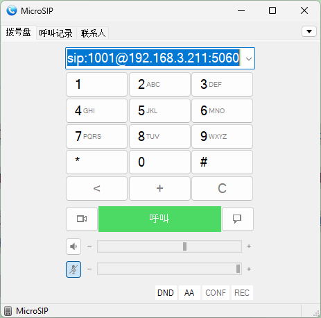

## SIP 通话测试说明

本文档说明如何在 **Windows、macOS 和 Android** 平台上使用 SIP 软电话客户端进行基本的通话测试。测试目标是验证客户端是否能够通过指定的 SIP 地址发起呼叫。

测试使用示例地址：

```
sip:1001@192.168.3.211:5060
```

该地址表示：

* 用户：`1001`
* 服务器：`192.168.3.211`
* 端口：`5060`
* 协议：`SIP`

---

# 一、Windows 平台测试

Windows 平台使用 **MicroSIP** 进行测试。该软件体积小、配置简单，常用于 SIP 功能验证和调试。

## 1. 安装 MicroSIP

下载并安装 MicroSIP。

安装完成后启动软件。

---

## 2. 配置 SIP 账户（如需要）

如果需要注册到 SIP 服务器，可在：

```
Menu → Accounts → Add
```

填写：

```
Account name: test
SIP server: 192.168.3.211
Username: 1001
Password: xxxx
```

如果只是进行简单呼叫测试，也可以直接拨号。

---

## 3. 进行呼叫测试

在 MicroSIP 的拨号框中输入：

```
sip:1001@192.168.3.211:5060
```

点击 **Call** 即可发起 SIP 呼叫。

---

## 4. 测试截图



---

# 二、macOS 平台测试

macOS 平台可以使用 **Linphone** 或 **Telephone** 进行测试。

本文以 Linphone 为例。

---

## 1. 安装 Linphone

下载并安装 Linphone（macOS 版本）。

启动应用。

---

## 2. 添加 SIP 账户

进入：

```
Preferences → Accounts → Add
```

选择 **Use SIP account**，填写：

```
SIP Address: sip:1001@192.168.3.211
Username: 1001
Domain: 192.168.3.211
Password: xxxx
Port: 5060
```

保存配置。

---

## 3. 进行呼叫测试

在拨号界面输入：

```
sip:1001@192.168.3.211:5060
```

点击呼叫按钮即可测试 SIP 通话。

---

# 三、Android 平台测试

Android 平台可以使用 **Zoiper** 或 **Linphone** 进行测试。

这里以 Linphone 为例。

---

## 1. 安装应用

从应用商店安装 **Linphone**。

启动应用。

---

## 2. 添加 SIP 账户

进入：

```
Settings → Accounts → Add account
```

选择 **Use SIP account**。

填写：

```
Username: 1001
Domain: 192.168.3.211
Password: xxxx
Port: 5060
transport:UDP
关闭ICE
关闭NVPF
```

保存账户。

---

## 3. 进行呼叫测试

在拨号界面输入：

```
sip:1001@192.168.3.211:5060
```

点击呼叫按钮即可进行 SIP 通话测试。

---

# 四、总结

通过以上步骤，可以在不同平台完成 SIP 通话测试：

| 平台      | 客户端                  |
| ------- | -------------------- |
| Windows | MicroSIP             |
| macOS   | Linphone / Telephone |
| Android | Linphone / Zoiper    |

测试流程基本一致：

1. 安装 SIP 客户端
2. 添加 SIP 账户（如需要）
3. 输入 SIP 地址
4. 发起呼叫测试

这样即可验证 SIP 服务是否能够正常通信。
